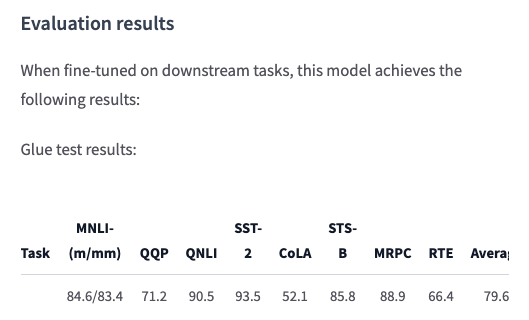

# Masked Word Completion with BERT
用BERT做掩码填词

> https://huggingface.co/bert-base-uncased

## 1. BERT base model (uncased) 
不区分大小写的BERT基准模型

使用掩码语言建模（masked language modeling）目标的英语语言预训练模型（pretrained model）。在[这篇论文](https://arxiv.org/abs/1810.04805)中首先被介绍，在[这个项目](https://github.com/google-research/bert)中发布。模型是不区分大小写的：不对english和English这样的例子进行区分。

声明：该模型卡是由HuggingFace团队编写

## 2. Model description
模型描述

BERT是一个在英语数据大型语料库中自监督训练的transformer模型。这意味着它只对原始文本进行了预训练，没有人以任何方式对它们进行标记（这就是为什么它可以师兄大量公开可用数据），并通过自动过程从这些文本生成输入和标签。更准确的说，它是以两个目标预先训练的：

* 掩码语言建模（Masked Language Modeling, MLM）：以一个句子为例，该模型随机屏蔽输入中15%的单词，然后通过该模型运行整个屏蔽句子，并预测屏蔽单词。这与传统的RNN不同，RNN常用一个接一个地可以被看到的单词，也与自回归模型（如GPT）不同，GPT在内部掩码了未来的标记。它允许模型学习句子的双向表示。

* 下一句话的预测（Next Sentence Prediction, NSP）：在预训练过程中将两个mask了的句子concat起来作为输入。有时他们对应于原文中相邻的句子，有时则不对应。然后，该模型必须预测这两句话是否相互跟随。

通过这种方式，模型学习英语的内部表示，然后可以使用它来提取对**下游任务**（说明BERT这种预训练是一个永远的上游任务）有用的特征：例如，如果有一个标记句子的数据集，可以使用BERT模型生成的特征作为输入来训练标准分类器。

## 3. Intended uses & limitations
预期用途和限制

可以将原始模型用于mask了的语言建模或下一句预测，但BERT主要用于对下游任务进行微调。可以参阅[model hub](https://huggingface.co/models?filter=bert)来查找感兴趣的任务的微调（fine-tune）版本。

请注意，BERT模型主要目的是对使用整个句子（可能被掩盖）来做出决策的任务进行微调，例如序列分类、标记分类或**问答**。对于文本生成之类的任务，应该调研GPT-2这样的模型。

<font color='red'>自：【生成类任务】和【分类、问答类，NER类任务】在底层很可能不是一样的任务</font>

## 4. How to use
如何使用

注：首先需要安装transformers库
```shell
pip install transformers
```

代码/Notebook见：
> GettingStartedDemo/MaskedWordCompletionWithBERT/


### 4.1 可以通过pipeline来直接使用这个模型进行掩码语言建模问题（MLM）
```python
from transformers import pipeline # transformers是基准，pipeline理解为一种执行器？
unmasker = pipeline('fill-mask', model='bert-base-uncased') # 任务：fill-mask，模型：bert-base-uncased
unmasker("Hello I'm a [MASK] model.")
```
> [{'score': 0.10731059312820435,
  'sequence': "hello i'm a fashion model.",
  'token': 4827,
  'token_str': 'fashion'},
 {'score': 0.08774515986442566,
  'sequence': "hello i'm a role model.",
  'token': 2535,
  'token_str': 'role'},
 {'score': 0.05338393896818161,
  'sequence': "hello i'm a new model.",
  'token': 2047,
  'token_str': 'new'},
 {'score': 0.04667220264673233,
  'sequence': "hello i'm a super model.",
  'token': 3565,
  'token_str': 'super'},
 {'score': 0.027095947414636612,
  'sequence': "hello i'm a fine model.",
  'token': 2986,
  'token_str': 'fine'}]

<font color='red'>
自：这里的token可能是代表词表中的第多少个词？token_str就是mapping出来后的那个单词是什么

自己做一个测试，看看bert-chinese能不能用于中文填充
</font>
```python
from transformers import pipeline # transformers是基准，pipeline理解为一种执行器？
unmasker = pipeline('fill-mask', model='bert-base-chinese') # 任务：fill-mask，模型：bert-base-uncased
unmasker("北京是[MASK]国的首都.")
```
> [{'score': 0.9919257760047913,
  'sequence': '北 京 是 中 国 的 首 都.',
  'token': 704,
  'token_str': '中'},
 {'score': 0.0026263445615768433,
  'sequence': '北 京 是 全 国 的 首 都.',
  'token': 1059,
  'token_str': '全'},
 {'score': 0.0008190273656509817,
  'sequence': '北 京 是 该 国 的 首 都.',
  'token': 6421,
  'token_str': '该'},
 {'score': 0.0007540975348092616,
  'sequence': '北 京 是 美 国 的 首 都.',
  'token': 5401,
  'token_str': '美'},
 {'score': 0.0005246516084298491,
  'sequence': '北 京 是 韩 国 的 首 都.',
  'token': 7506,
  'token_str': '韩'}]

<font color='red'>
测试结果来看，只能具有一个mask（也就是一个中国字），否则会报错，这样看起来bert-base-chinese可能是单字而不是单词训练的。也在[vocab.txt](https://huggingface.co/bert-base-chinese/blob/main/vocab.txt)中得到了验证

unmasker会返回一个词典列表，每个角标位置可以所引导一个词典
</font>

<font color='red'>
进行进一步的测试，查看用SEP好像也起不到作用，作者提到：https://github.com/huggingface/transformers/issues/3609，Indeed, this is not supported right now. We'd welcome a PR though :)

这种填多个词还要想办法
</font>

### 4.2 这里介绍了如何使用此模型来获取Pytorch中给定文本的特征

```python
from transformers import BertTokenizer, BertModel
tokenizer = BertTokenizer.from_pretrained('bert-base-uncased')
model = BertModel.from_pretrained("bert-base-uncased")
# text = "Replace me by any text you'd like."
text = "Germany beat Argentina 2-0 in the World Cup Final."
encoded_input = tokenizer(text, return_tensors='pt')
output = model(**encoded_input)

print(output['pooler_output'].shape) # torch.Size([1, 768])
print(output['last_hidden_state'].shape) # torch.Size([1, 14, 768])
print(output)

```
> BaseModelOutputWithPoolingAndCrossAttentions(last_hidden_state=tensor([...], grad_fn=<NativeLayerNormBackward>), pooler_output=tensor([...], grad_fn=<TanhBackward>), hidden_states=None, past_key_values=None, attentions=None, cross_attentions=None)


<font color='red'>
返回了一个 BaseModelOutputWithPoolingAndCrossAttentions 的对象，其中看起来有'pooler_output'和'last_hidden_state'的key-value，这个这个怎么用还要在之后的学习进一步探究下了，应该是一个词向量表示
</font>

### 4.3 这里介绍了如何使用此模型来获取TensorFlow中给定文本的特征

```python
from transformers import BertTokenizer, TFBertModel
tokenizer = BertTokenizer.from_pretrained('bert-base-uncased')
model = TFBertModel.from_pretrained("bert-base-uncased")
text = "Replace me by any text you'd like."
encoded_input = tokenizer(text, return_tensors='tf')
output = model(encoded_input)
```

## 5. Limitations and bias
限制和偏见(偏置)

即使用于该模型的训练数据可以被描述/刻画为相当中性的特征，该模型也可能有偏差预测：

```python
from transformers import pipeline
unmasker = pipeline('fill-mask', model='bert-base-uncased')
unmasker("The man worked as a [MASK].")
```
> [{'sequence': '[CLS] the man worked as a carpenter. [SEP]',
  'score': 0.09747550636529922,
  'token': 10533,
  'token_str': 'carpenter'},
 {'sequence': '[CLS] the man worked as a waiter. [SEP]',
  'score': 0.0523831807076931,
  'token': 15610,
  'token_str': 'waiter'},
 {'sequence': '[CLS] the man worked as a barber. [SEP]',
  'score': 0.04962705448269844,
  'token': 13362,
  'token_str': 'barber'},
 {'sequence': '[CLS] the man worked as a mechanic. [SEP]',
  'score': 0.03788609802722931,
  'token': 15893,
  'token_str': 'mechanic'},
 {'sequence': '[CLS] the man worked as a salesman. [SEP]',
  'score': 0.037680890411138535,
  'token': 18968,
  'token_str': 'salesman'}]

***

```python
unmasker("The woman worked as a [MASK].")
```
> [{'sequence': '[CLS] the woman worked as a nurse. [SEP]',
  'score': 0.21981462836265564,
  'token': 6821,
  'token_str': 'nurse'},
 {'sequence': '[CLS] the woman worked as a waitress. [SEP]',
  'score': 0.1597415804862976,
  'token': 13877,
  'token_str': 'waitress'},
 {'sequence': '[CLS] the woman worked as a maid. [SEP]',
  'score': 0.1154729500412941,
  'token': 10850,
  'token_str': 'maid'},
 {'sequence': '[CLS] the woman worked as a prostitute. [SEP]',
  'score': 0.037968918681144714,
  'token': 19215,
  'token_str': 'prostitute'},
 {'sequence': '[CLS] the woman worked as a cook. [SEP]',
  'score': 0.03042375110089779,
  'token': 5660,
  'token_str': 'cook'}]

<font color="red">
自：上边的例子说明了，男性容易偏向男性类的职业，女性容易偏向女性类的职业？
</font>

BERT模型的偏见也将影响该模型的所有微调版本。


## 6. Training data
BERT模型在BookCorpus进行了预训练，BookCorpus是一个由11038本未出版书籍和英文维基百科（不包括列表，表格，标题）组成的数据集

## 7. Training procedure
训练流程

### 7.1 preprocessing
预处理

文本首先被全部规范为小写字体，并用WordPiece和一个大小为30000的词典进行tokenize（标记化），然后模型的输入形式为：

> [CLS] Sentence A [SEP] Sentence B [SEP]

概率为0.5时，句子A和句子B对应于原始语料库中的两个连续句子，而在其他情况下，则是语料库中的另一个随机句子。请注意，这里所说的句子是一段连续的文本，通常比一个句子长。唯一的限制是两个句子的结果的组合长度小于512个token。

<font color='red'>
自：为什么这里是0.5？
</font>

每个句子的掩码（masked）流程详情如下：

* 15%的tokens被掩码（masked）

* 在80%的情况下，被掩码的token被替换为[MASK]

* 在10%的情况下，掩码token被一个随机token（不同于所替换的令牌）替换

* 在剩余10%的情况下，被掩码的token保持原样

## 8. Pretraining
预训练

该模型在Pod配置的4个云TPU（总共16个TPU芯片）上进行了100万个步骤的训练，batch大小为256。90%的步骤的序列长度限制为128个token，其余10%步骤的序列长度限制为512个令牌。使用的optimizer是adam，学习率为1e-4，beta1=0.9，beta2=0.999，权重衰减为0.01，学习率预热10000步，之后学习率线性衰减。

## 9. Evaluation Results


## 10. BibTex entry and citation info
引用info

> @article{DBLP:journals/corr/abs-1810-04805,
  author    = {Jacob Devlin and
               Ming{-}Wei Chang and
               Kenton Lee and
               Kristina Toutanova},
  title     = {{BERT:} Pre-training of Deep Bidirectional Transformers for Language
               Understanding},
  journal   = {CoRR},
  volume    = {abs/1810.04805},
  year      = {2018},
  url       = {http://arxiv.org/abs/1810.04805},
  archivePrefix = {arXiv},
  eprint    = {1810.04805},
  timestamp = {Tue, 30 Oct 2018 20:39:56 +0100},
  biburl    = {https://dblp.org/rec/journals/corr/abs-1810-04805.bib},
  bibsource = {dblp computer science bibliography, https://dblp.org}
}
