# 1.10 End-of-chapter quiz

这一章涵盖了很多领域！如果你没有掌握所有的细节，不要担心；下一章将帮助您了解引擎盖下的工作原理。

不过，首先，让我们测试一下您在本章学到的知识！

## 1.10.1 自己选择

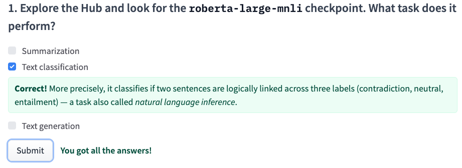

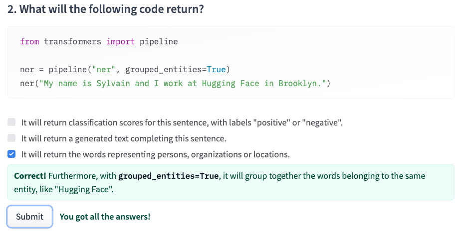

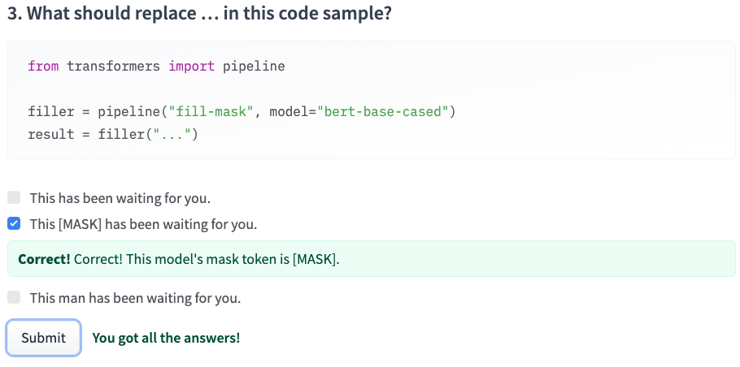

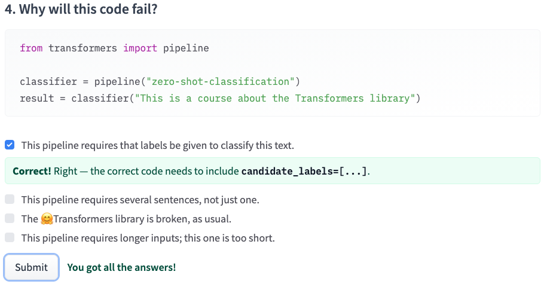

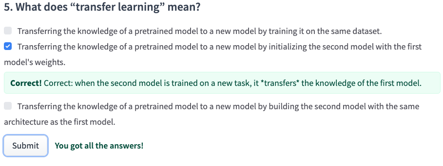

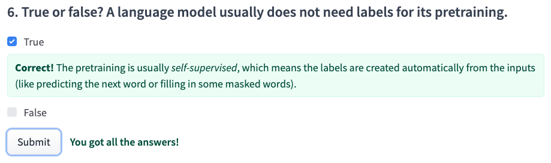

这里首次选择错了，注意model = arch + weights，也就是说对于第一个选项，building = blueprints + materials
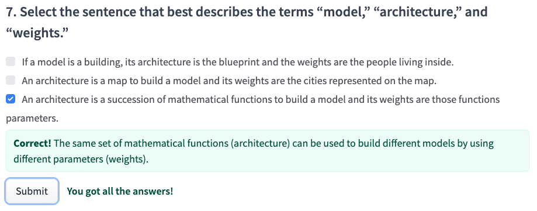

这里首次也选择错了，如果是给定一个prompts来生成，那就是decoder model，典型的GPT-2。而如果是翻译类，文本摘要类，则是encoder-decoder
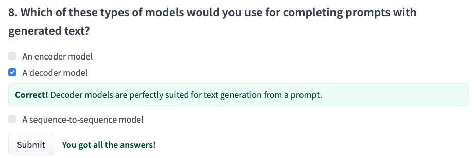

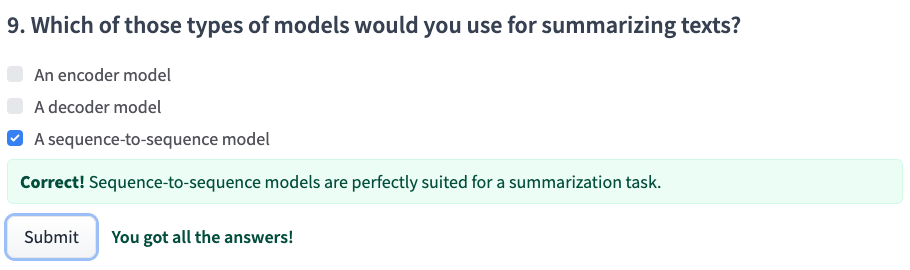

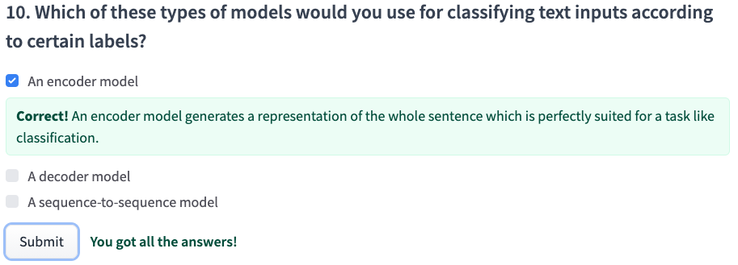

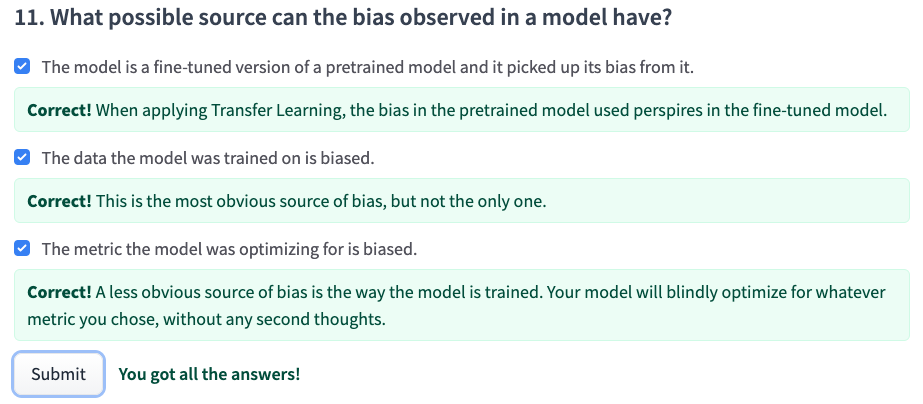

## 1.10.2 全部题目的正确/错误原因
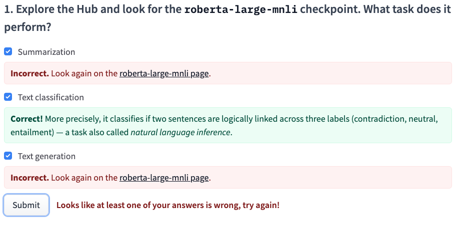

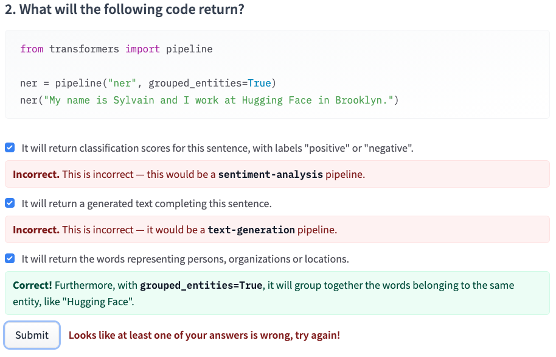

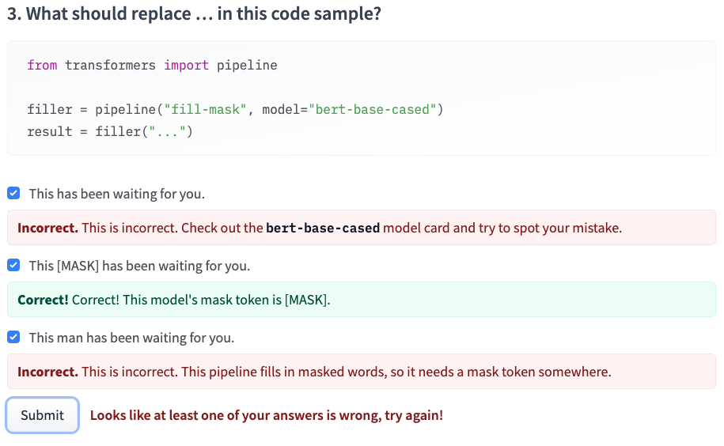

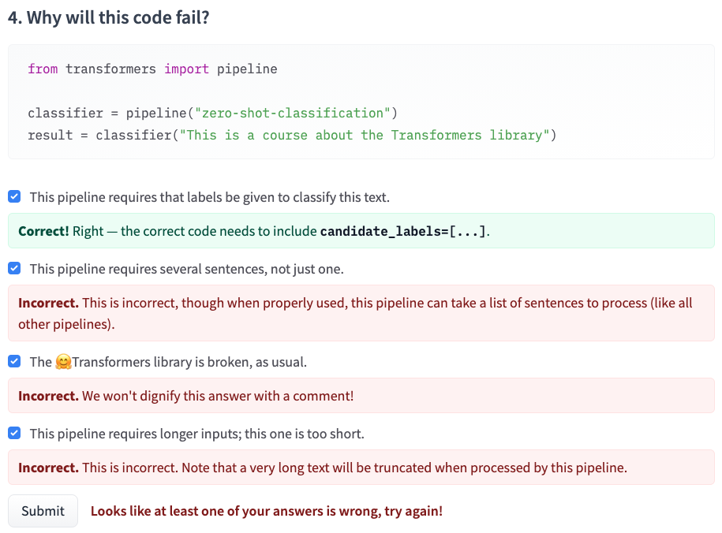

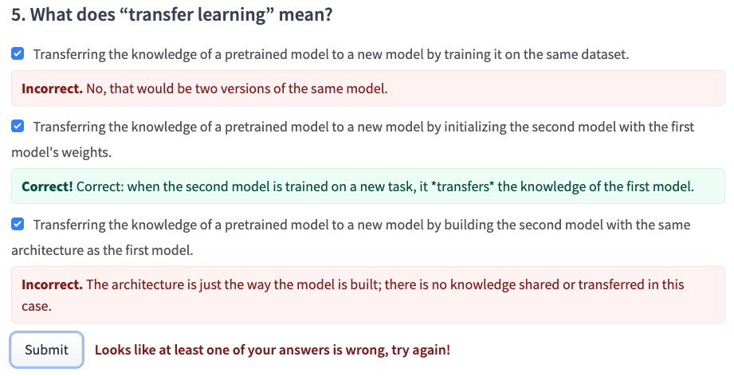

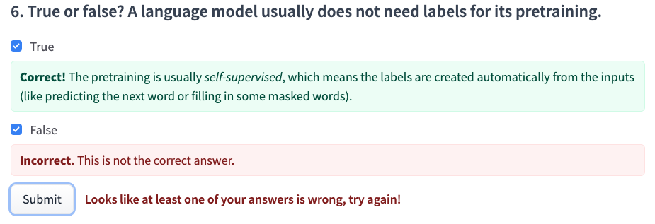

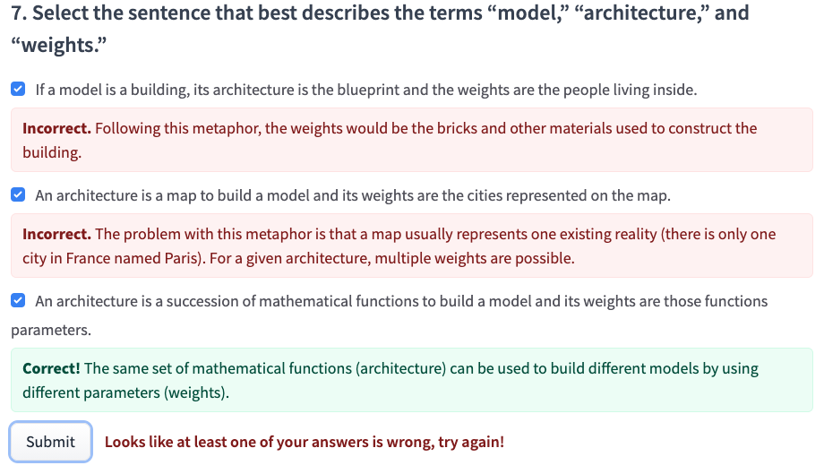

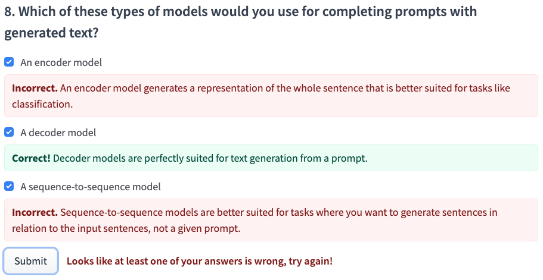

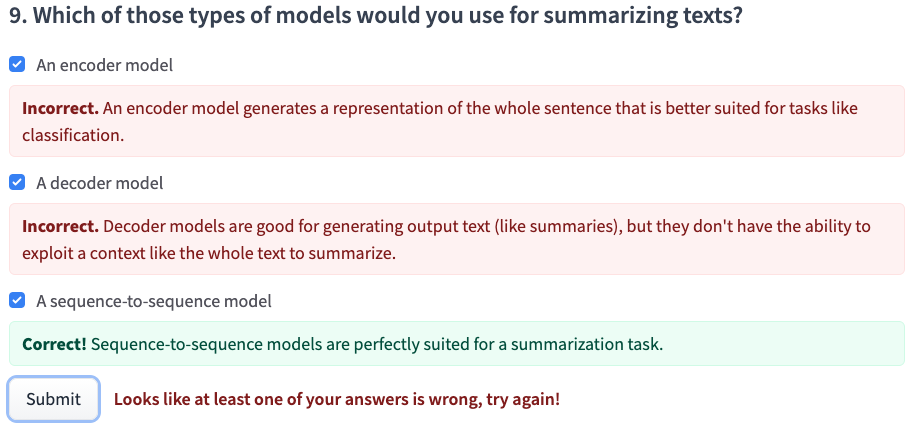

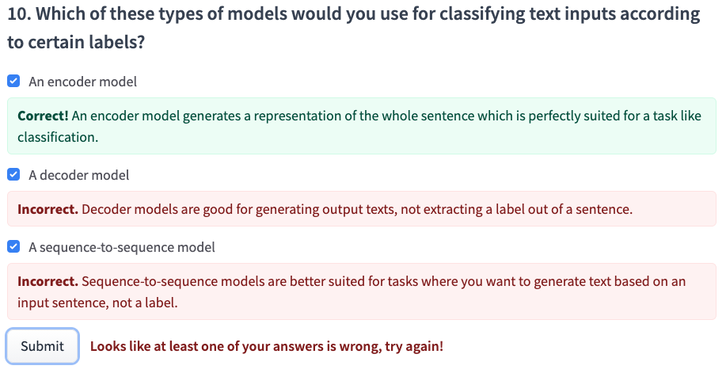

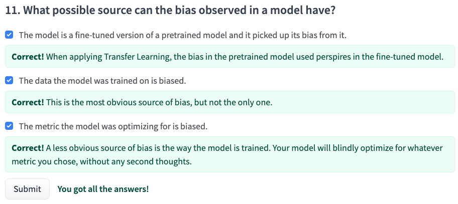

