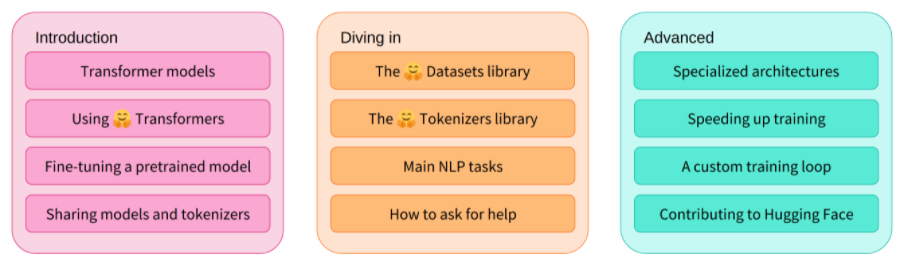

## 1. Transformer models

### 1.1 Introduction

#### 1.1.1 Welcom
本课程将教学如何使用[Hugging Face🤗](https://huggingface.co/)生态系统中的库进行自然语言处理（Natural Language Processing, NLP），主要包括：
* [🤗Transformers](https://github.com/huggingface/transformers)
* [🤗Datasets](https://github.com/huggingface/datasets)
* [🤗Tokenizers](https://github.com/huggingface/tokenizers)
* [🤗Accelerate](https://github.com/huggingface/accelerate)
* [🤗Hugging Face Hub](https://huggingface.co/models)

### 1.1.2 What to expect?
本课程的简要概述（截止2021.8可能只发布了Introduction）：

Introduction部分包括：对Transformer models的介绍、使用Hugging Face Transformers、在预训练模型的基础上进行fine-tune、分享模型和词符化器（tokenizers）

Diving in部分包括：The Hugging Face Datasets library、The Hugging Face Tokenizers library、主要的NLP任务、如何寻求帮助

Advanced部分包括：专用体系结构、加速训练、自定义训练循环、contributing to Hugging Face

第1章至第4章介绍了Hugging Face Transformers library的主要理论。本部分课程结束时，您将熟悉Transformer模型的工作原理，并将之道如何使用Hugging Face Hub中的模型，在数据集上对其进行微调，以及在Hub上共享结果。

第5章至第8章在深入到经典NLP问题前，教授Hugging Face Datasets和Hugging Face Tokenizers。在本部分结束时，将能够自己解决常见的NLP问题。

第9章至第12章更深入，展示了专门的体系结构（内存效率、长序列等），并教您如何为更奇特的用例编写自定义对象。在本部分结束时，您将准备好解决复杂的NLP问题，并为解决这些问题contribute到Hugging Face Transformers上。

该课程：
* 需要对Python程序设计语言有一定了解；
* 最好在介绍性的深度学习课程之后进行，例如针对编码人员的实用深度学习或由deeplearning.ai开发的课程
* 不期望有PyTorch或TensorFlow方面的知识，尽管熟悉其中任何一种都会有所帮助

在本章节中，将学习到：

* 如何使用pipeline function来解决类似于文本生成（text generation）和分类（classification）的任务；
* About the Transformer architecture
* 如何区分编码器、解码器，和编码器-解码器体系结构和用例
