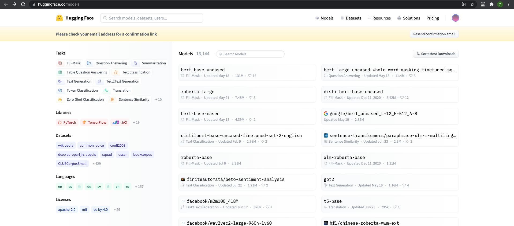
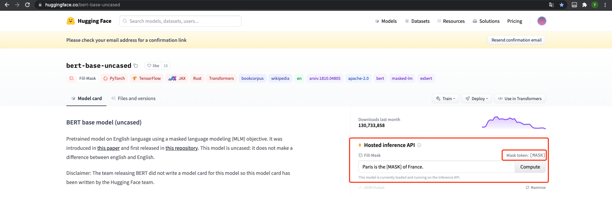

# 1.3 Transformers, what can they do

代码见：
> 

在本节中，我们将了解Transformer模型可以做什么，并使用Hugging Face Transformers库：the **pipeline**

## 1.3.1 Transformers are everywhere!

这个[Hugging Face Transformers library](https://github.com/huggingface/transformers)提供了创建和使用这些共享模型的功能。[模型中心](https://huggingface.co/models)包含数千个预训练模型，任何人都可以下载和使用。您还可以将自己的模型上传到中心。

在深入探讨Transformer模型如何在引擎盖下工作之前，让我们看几个例子，看看如何使用它们来解决一些有趣的NLP问题。

## 1.3.2 Working with pipelines

Hugging Face Transformers库中最基本的对象是**pipeline**。它将一个模型与其必要的预处理和后处理步骤连接起来（自：可能因此被称为pipeline），允许我们直接输入任何文本并获取一个可理解的答案，几个简单的demo如下：

```python
from transformers import pipeline

classifier = pipeline("sentiment-analysis")
classifier("I've been waiting for a HuggingFace course my whole life.")

>>> [{'label': 'POSITIVE', 'score': 0.959804892539978}]
```

以列表的方式传入多句话如下：
```python
classifier([
    "I've been waiting for a HuggingFace course my whole life.", 
    "I hate this so much!"
])
>>> [{'label': 'POSITIVE', 'score': 0.959804892539978},
    {'label': 'NEGATIVE', 'score': 0.9994558095932007}]
```

By default, this pipeline selects a particular pretrained model that has been fine-tuned for sentiment analysis in English. The model is downloaded and cached when you create the **classifier** object. If you rerun the command, the cached model will be used instead and there is no need to download the model again.

默认情况下，这个pipeline将选择一个特定的预训练模型，该模型已经为英语情绪分析进行了微调训练。创建分类器对象**classifier** object的时候，将下载并缓存模型。如果重新运行该命令，则将使用缓存的模型，无需再次下载该模型。

将某些文本传递到管道时，需要执行三个主要步骤：

1. 文本被预处理为模型可以理解的格式。
2. 预处理的输入被传递到模型。
3. 模型的预测是后处理（post processed）的，因此用户可以理解他们。


目前可用的一些**pipeline**包括：

* feature-extraction(get the vector representation of a text)
* fill-mask
* NER(named entity recognition)
* question-answering
* sentiment-analysis
* summarization
* text-generation
* translation
* zero-shot-classification 零样本文本分类

看一看其中的几个任务：

## 1.3.3 Zero-shot classification
零样本文本分类

我们将从处理一个更具挑战性的任务开始，在这个任务中， 我们需要对未标记的文本进行分类。这是现实项目中的常见场景，因为注释文本通常非常耗时，并且需要领域专家的专业知识。对于这个用例，**zero-shot-classification pipeline**非常强大：允许指定用于分类的标签，因此不必依赖预训练模型的标签。您已经了解了该模型如何使用这两个标签将句子分类为肯定或否定，但它也可以使用您喜欢的任何其他标签集对文本进行分类。demo如下：

```python
from transformers import pipeline

classifier = pipeline("zero-shot-classification")
classifier(
    "This is a course about the Transformers library",
    candidate_labels=["education", "politics", "business"],
)

>>> {'labels': ['education', 'business', 'politics'],
    'scores': [0.844597339630127, 0.11197546869516373, 0.04342721030116081],
    'sequence': 'This is a course about the Transformers library'}
```

```python
from transformers import pipeline

classifier = pipeline("zero-shot-classification")
classifier(
    "China beat Brasil in the World Cup",
    candidate_labels=["soccer", "basketball", "volleyball"],
)

>>> {'labels': ['soccer', 'basketball', 'volleyball'],
    'scores': [0.628226637840271, 0.211250439286232, 0.16052287817001343],
    'sequence': 'China beat Brasil in the World Cup'}
```


中文自尝试，泛化性可能还是差了些：
```python
from transformers import pipeline

classifier = pipeline("zero-shot-classification")
classifier(
    "中国在世界杯亚洲区预选赛中战胜了叙利亚队",
    candidate_labels=["足球", "篮球", "乒乓球"],
)

>>> {'labels': ['篮球', '乒乓球', '足球'],
    'scores': [0.37458935379981995, 0.3438330292701721, 0.2815776467323303],
    'sequence': '中国在世界杯亚洲区预选赛中战胜了叙利亚队'}

```

```python
from transformers import pipeline

classifier = pipeline("zero-shot-classification")
classifier(
    "皇家马德里足球俱乐部在联赛中战胜了巴塞罗那足球俱乐部",
    candidate_labels=["足球", "篮球", "乒乓球"],
)

>>> {'labels': ['足球', '篮球', '乒乓球'],
    'scores': [0.9721400737762451, 0.014208058826625347, 0.013651847839355469],
    'sequence': '皇家马德里足球俱乐部在联赛中战胜了巴塞罗那足球俱乐部'}
```

这个管道被称作**zero-shot**，因为不需要对数据上的模型进行fine-tune就可以使用它。它可以直接返回任意标签列表的概率分数。

## 1.3.4 Text Generation
现在让我们看看如何用pipeline生成一些文本。这里主要的思想是提供一个提示，模型将通过生成剩余文本自动完成提示。这类似于许多手机上的预测文本功能。文本生成涉及随机性，因此如果没有得到如下所示的相同结果是正常的。

```python
from transformers import pipeline

generator = pipeline("text-generation")
generator("In this course, we will teach you how to")

>>> [{'generated_text': "In this course, we will teach you how to navigate to an Internet interface from anywhere in the world - a virtual or physical space. It's not meant for beginners or you'll make things challenging. Instead we want to show you how to use the"}]
```

您可以控制使用参数num_return_sequnces生成的不同序列的数量，以及使用参数max_length控制生成的输出文本的总长度，下边的例子尝试试用一下
```python
from transformers import pipeline

# generator = pipeline("text-generation", model="distilgpt2") # 指定模型 
generator = pipeline("text-generation")
returnResult = generator(
    "In this course, we will teach you how to", 
    max_length = 30, 
    num_return_sequences = 2
)
print(returnResult)

>>> [
    {'generated_text': 'In this course, we will teach you how to build a custom app that will automatically turn on notifications when notifications happen. The best place to start is'}, 
    {'generated_text': 'In this course, we will teach you how to identify which areas of your body are doing the most damage to your body and how to take that damage'}
    ]
```

## 1.3.5 Using any model from the Hub in a pipeline

前面的示例使用了当前任务的默认模型，但是您也可以从中心选择一个特定的模型，以便在管道中用于特定任务，例如，文本生成。转到[模型中心](https://huggingface.co/models)并单击左侧相应的标记，以仅显示该任务支持的模型。应该进入到[这样一个](https://huggingface.co/models?pipeline_tag=text-generation)界面。



<font color='red'>
这里自己尝试一个使用中文模型进行生成的例子
</font>

```python
from transformers import pipeline


generator = pipeline("text-generation", model="uer/gpt2-chinese-cluecorpussmall") # 任务+模型，见：https://huggingface.co/models
returnResult = generator(
    "这是很久之前的事情了", 
    max_length = 50, 
    num_return_sequences = 1
)
print(returnResult)

>>> [{'generated_text': '这是很久之前的事情了 。 也 就 是 说 ： 那 一 年 不 要 和 这 个 女 生 闹 ， 也 许 是 我 太 多 想 法 了 ， 觉 得 你 是 一 个 不 懂 如 何 面 对'}]
```

可以通过单击语言标记来优化对模型的搜索，并选择将以另一种语言生成文本的模型。模型中心甚至包含支持多种语言的多语言模型的检查点。
一旦点击一个模型，你就会看到有一个小部件可以让你直接在线试用。通过这种方式，可以在下载之前快速测试模型的功能。


### 1.3.5.1 The Inference API 
推理API

所有的模型都可以通过你的浏览器使用[推理API](https://huggingface.co/inference-api)直接测试，该API可以在[Hugging Face网站](https://huggingface.co/)上找到。
驱动小部件的推理API也可以作为付费产品提供，如果工作流需要会很方便，请参考定价页面。

## 1.3.6 Mask filling
下一个来尝试的任务是填充掩码（mask filling）。此任务的目的是填补给定文本中的空白:

```python
from transformers import pipeline

unmasker = pipeline("fill-mask")
unmasker("This course will teach you all about <mask> models.", top_k=2)

>>> [{'score': 0.19619855284690857,
    'sequence': 'This course will teach you all about mathematical models.',
    'token': 30412,
    'token_str': ' mathematical'},
    {'score': 0.04052741825580597,
    'sequence': 'This course will teach you all about computational models.',
    'token': 38163,
    'token_str': ' computational'}]
```
**top_k**参数控制要显示的可能性数量。注意，这里模型填充了特殊的\<mask\>单词，它通常被称为掩码标记。**其他掩码填充模型可能有不同的掩码标记，因此在探索其他模型时，验证正确的掩码字总是好的**，检查它的一种方法是查看**小部件**中使用的掩码字。个人理解如下：



## 1.3.7 Named Entity Recognition 
命名实体识别（Named Entity Recognition, NER）是一项任务，模型必须找出输入文本的哪些部分对应于实体，如人员、地点或组织。示例如下：

```python
from transformers import pipeline

ner = pipeline("ner", grouped_entities=True)
ner("My name is Sylvain and I work at Hugging Face in Brooklyn.")

>>> [{'end': 18,
    'entity_group': 'PER',
    'score': 0.9981694,
    'start': 11,
    'word': 'Sylvain'},
    {'end': 45,
    'entity_group': 'ORG',
    'score': 0.97960204,
    'start': 33,
    'word': 'Hugging Face'},
    {'end': 57,
    'entity_group': 'LOC',
    'score': 0.99321055,
    'start': 49,
    'word': 'Brooklyn'}]
```
这里模型成功识别了Sylvain是一个人（person, PER），成功识别了Hugging Face是一个组织（Organization, ORG），成功识别了Brooklyn是一个地址（location, LOC）

我们在pipeline的create函数中传递参数grouped_entites = True，告诉管道将对应于统一实体的句子部分重新组合在一起：在该例子中，模型将“Hugging”和“Face”正确的分组为单个组织，即使名称由多个词组成。事实上，正如我们将在下一章中看到的预处理甚至将一些单词分割成更小的部分，例如Sylvain被分成S，yl，va，in。在后处理步骤中，管道成功地组合了这些片段

如果不传递该参数，效果如下：
```python
from transformers import pipeline

ner = pipeline("ner")
ner("My name is Sylvain and I work at Hugging Face in Brooklyn.")

>>> [{'end': 12,
    'entity': 'I-PER',
    'index': 4,
    'score': 0.9993828,
    'start': 11,
    'word': 'S'},
    {'end': 14,
    'entity': 'I-PER',
    'index': 5,
    'score': 0.99815476,
    'start': 12,
    'word': '##yl'},
    {'end': 16,
    'entity': 'I-PER',
    'index': 6,
    'score': 0.99590725,
    'start': 14,
    'word': '##va'},
    {'end': 18,
    'entity': 'I-PER',
    'index': 7,
    'score': 0.9992327,
    'start': 16,
    'word': '##in'},
    {'end': 35,
    'entity': 'I-ORG',
    'index': 12,
    'score': 0.97389334,
    'start': 33,
    'word': 'Hu'},
    {'end': 40,
    'entity': 'I-ORG',
    'index': 13,
    'score': 0.976115,
    'start': 35,
    'word': '##gging'},
    {'end': 45,
    'entity': 'I-ORG',
    'index': 14,
    'score': 0.98879766,
    'start': 41,
    'word': 'Face'},
    {'end': 57,
    'entity': 'I-LOC',
    'index': 16,
    'score': 0.99321055,
    'start': 49,
    'word': 'Brooklyn'}]
```

NER和part-of-speech tagging（词性标注）差不多属于一类的任务，在Model Hub上搜索模型可以很容易的解决词性标注问题。

## 1.3.8 Question Answering

question-answering的pipeline使用给定上下文中的信息回答问题：

```python
from transformers import pipeline

question_answerer = pipeline("question-answering")
question_answerer(
    question="Where do I work?",
    context="My name is Sylvain and I work at Hugging Face in Brooklyn"
)

>>> {'answer': 'Hugging Face', 'end': 45, 'score': 0.6949764490127563, 'start': 33}
```
请注意，此管道通过从提供的上下文中提取信息来工作，它不会生成答案。

## 1.3.9 Summarization
摘要是将文本缩减为较短文本，同时保留文本中引用的所有（或大部分）重要方面的任务。下面是一个例子：
```python
from transformers import pipeline

summarizer = pipeline("summarization")
summarizer("""
    America has changed dramatically during recent years. Not only has the number of 
    graduates in traditional engineering disciplines such as mechanical, civil, 
    electrical, chemical, and aeronautical engineering declined, but in most of 
    the premier American universities engineering curricula now concentrate on 
    and encourage largely the study of engineering science. As a result, there 
    are declining offerings in engineering subjects dealing with infrastructure, 
    the environment, and related issues, and greater concentration on high 
    technology subjects, largely supporting increasingly complex scientific 
    developments. While the latter is important, it should not be at the expense 
    of more traditional engineering.

    Rapidly developing economies such as China and India, as well as other 
    industrial countries in Europe and Asia, continue to encourage and advance 
    the teaching of engineering. Both China and India, respectively, graduate 
    six and eight times as many traditional engineers as does the United States. 
    Other industrial countries at minimum maintain their output, while America 
    suffers an increasingly serious decline in the number of engineering graduates 
    and a lack of well-educated engineers.
""")

>>> [{'summary_text': ' America has changed dramatically during recent years . The number of engineering graduates in the U.S. has declined in traditional engineering disciplines such as mechanical, civil,    electrical, chemical, and aeronautical engineering . Rapidly developing economies such as China and India continue to encourage and advance the teaching of engineering .'}]
```
就像文本生成（Text Generation）一样，可以指定max_length or min_length参数来约束

### 1.3.10 Translation

对于转换，如果在任务名称中提供语言对（例如“translation_en_to_fr”），则可以使用默认模型，但最简单的方法是选择要在模型中心上使用的模型Helsinki-NLP/opus-mt-en-zh。在这里，我们将尝试从英语翻译成中文：


这里要安装，可能需要重启环境
```python
!pip install transformers[sentencepiece]
```

```python
from transformers import pipeline

translator = pipeline("translation", model="Helsinki-NLP/opus-mt-en-zh")
translator("My name is yixuan004, studying in Beijing University of Posts and Telecommnications.")

>>> [{'translation_text': '我的名字是Yixuan004,在北京邮电大学学习。'}]
```
类似于文本生成和摘要，可以指定max_length min_length

一个*可以解开这个列表的感觉


## 1.3.11 小结

目前你展示的pipeline主要用于演示目的。它们是为了特定任务编程的，不能执行不同的任务。在下一章中，将了解管道内部的内容以及如何自定义其行为。