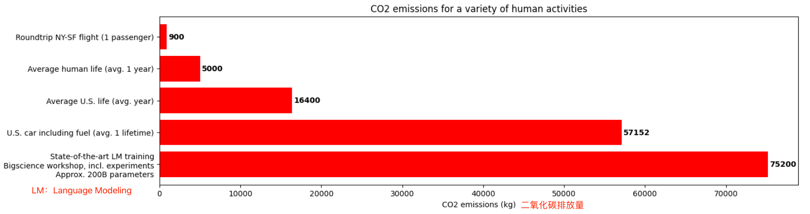
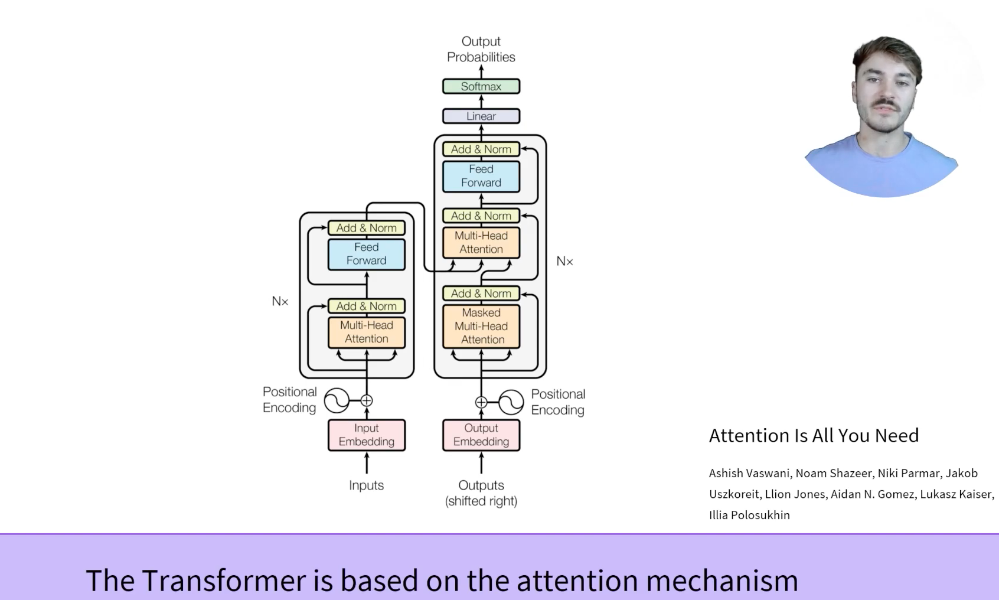

# 1.4 How do Transformers work?

在本节中，我们将从较高的层次了解Transformer模型的体系结构。

## 1.4.1 A bit of Transformer history
以下是Transformer模型（短期）历史中的一些参考点：

2017年6月，[Transformer architecture](https://arxiv.org/abs/1706.03762)(对应的论文是《Attention is All You Need》)被介绍提出。最初的研究重点是翻译任务。随后介绍了几个有影响力的模型，包括：

* 2018年6月：[GPT](https://cdn.openai.com/research-covers/language-unsupervised/language_understanding_paper.pdf)(对应论文《Improving Language Understanding by Generative Pre-Training》)，第一个预训练的Transformer模型，用于对各种NLP任务进行微调，并获取最先进的结果。

* 2018年10月：[BERT](https://arxiv.org/abs/1810.04805)(对应论文《BERT: Pre-training of Deep Bidirectional Transformers for Language Understanding》)，另一个大型的预训练模型，这个模型旨在生成更好的句子摘要。（下一章将对此进行更详细的介绍！）

* 2019年2月：[GPT-2](https://cdn.openai.com/better-language-models/language_models_are_unsupervised_multitask_learners.pdf)(对应论文《Language Models are Unsupervised Multitask Learners》)，一个改进的（更大的）GPT版本，由于道德问题没有立即公开发布。[补充内容](https://mp.weixin.qq.com/s?__biz=MzA5ODEzMjIyMA==&mid=2247496108&idx=1&sn=f4be9c0d0b404739942a3f58f9d876dc&source=41#wechat_redirect)

* 2019年10月：[DistilBERT](https://arxiv.org/abs/1910.01108)(对应论文《DistilBERT, a distilled version of BERT: smaller, faster, cheaper and lighter》)，一个经过提炼的BERT版本，速度快了60%，内存轻了40%，仍然保留了BERT97%的性能。

* 2019年10月：[BART](https://arxiv.org/abs/1910.13461)(对应论文《BART: Denoising Sequence-to-Sequence Pre-training for Natural Language Generation, Translation, and Comprehension》) 和 [T5](https://arxiv.org/abs/1910.10683)(对应论文《Exploring the Limits of Transfer Learning with a Unified Text-to-Text Transformer》)，使用与原始Transformer模型相同架构的连那个歌大型预训练模型（第一个这样做）

* 2020年5月：[GPT-3](https://arxiv.org/abs/2005.14165)(对应论文《Language Models are Few-Shot Learners》)，GPT-2的一个更大的版本，能够在不需要微调的情况下很好地执行各种任务（称为zero-shot learning）

这个列表还远远不够全面，只是为了强调几种不同类型的Transformer模型。大体上，它们可分为三类：

* GPT-like：也称为自回归的Transformer模型

* BERT-like：也称为自编码的Transformer模型

* BART/T5-like：也被称为sequence-to-sequence的Transformer模型

稍后我们将深度探讨这些类型

## 1.4.2 Transformers are language models
transformers是语言模型

上述的所有Transformer模型（GPT、BERT、BART、T5等）均已作为**语言模型（language models）**进行训练。这意味着它们已经以自我监督的方式接受了大量原始文本的培训。自监督学习是一种训练类型，其中的目标是根据模型的输入自动计算的。这意味着不需要人为数据添加标签！

这种类型的模型可以额从统计学上理解他所使用的语言，但是对于具体的实际任务来说，它不是很有用。因此，一般的预训练模型会经历一个称为迁移学习（transfer learning）的过程。在这个过程中，模型会以有监督的方式进行微调，也就是说，在给定的任务上使用人工标注的标签。

任务的一个例子是在阅读了前n个单词后预测句子中的下一个单词。这被称为因果语言建模，因为输入取决于过去和现在的输入，而不是未来而输入（所以被称为因果）

另一个例子是掩码语言建模，该模型预测句子中被mask了的词

## 1.4.3 Transformers are big models
除了一些例外（例如DistilBERT），实现更好性能一般策略是通过增加模型的大小以及预训练的数据量。

不幸的是，训练模型，特别是大型模型，需要大量数据。这在时间和计算资源方面变得非常昂贵。甚至可以转化为环境影响，如下图所示：

这展示了一个（非常大的）模型项目，由一个团队领导，有意识地试图减少预训练对环境的影响。运行大量试验以获得最佳超参数的足迹会更高。

想象一下，如果每次一个研究团队、一个学生组织或一家公司想要训练一个模型，它都是从头开始训练的。这将导致巨大的、不必要的全球成本！
这就是为什么共享语言模型至关重要的原因：共享经过训练的权重并在已经训练的权重之上构建，可以降低社区的总体计算成本和碳排放。

## 1.4.4 Transfer Learning
迁移学习

[视频：What is Transfer Learning?](https://youtu.be/BqqfQnyjmgg)

**视频学习总结：**

* Transfer learning is the act of initiallizing a model with another model's weights，如果从scratch开始训练的话，会消耗太多(from scratch 从零开始)

***

* Training From scratch requires more data and more compute to achieve comparable results，从这张图也可以看出，并不是和训练轮数有关系的那个感觉，也就是说迁移学习也有助于准确性的提升

***

* 在计算机视觉领域中：ImageNet is commonly used as a dataset for pretraining models in computer vision，label-supervised

***

* 在自然语言处理领域中：预测下一个单词是一个常见的预训练目标，self-supervised

  预测掩码单词的任务

***

* usually, transfer learning is applied by dropping the head of the pretrained model while keeping its body

***

* the pretraind model helps by transferring its knowledge but it also transfers the bias it may contain（可能需要使用针对某个国家或者某个场景的预训练模型） 

***

* OpenAI studied the bias predictions of its GPT-3 model

***

预训练是从头开始训练模型的行为：权重随机初始化，训练在没有任何先验知识的情况下开始。

这种预训练通常是在非常大量的数据上进行的。因此，它需要大量的数据语料和计算资源消耗，并且训练可能需要几周的时间。

另一方面，fine-tune是在对模型进行预训练**之后**进行的训练。要执行微调，首先需要获取一个经过预训练的语言模型，然后使用特定于任务的数据集执行额外的训练。等等，为什么不直接为最后的任务而训练呢？有几个原因：

* 预训练模型已经在与fine-tune（微调）数据集有一些相似之处的数据集上进行了训练。因此，微调过程能够利用初始模型在预训练期间获得的知识（例如，对于NLP问题，预训练模型将对您在任务中使用的语言有某种统计理解）

* 由于预训练的模型已经在大量数据上进行了训练，因此微调需要更少的数据就能得到令人满意的结果。

* 出于同样的原因，获得好结果所需的时间和资源要少得多。

例如，可以利用一个经过英语培训的预训练模型，然后在arXiv的语料库上对其进行微调训练，从而形成一个基于科学/研究的模型。微调只需要有限的数据量：预训练模型获得的知识是“迁移的”，因此称为**迁移学习**。

因此，微调模型具有较低的时间、数据、财务和环境成本。迭代不同的微调方案也更快更容易，因为训练比完全的预训练约束更少。

这个过程也会比从头开始的培训（除非你有很多数据）取得更好的效果，这就是为什么你应该总是尝试利用一个预培训的模型——一个尽可能接近你手头的任务的模型——并对其进行微调。

## 1.4.5 General architecture

在本节中，我们将介绍Transformer模型的一般架构。如果你不理解其中的一些概念，不要担心；下文将详细介绍每个组件。

### 1.4.5.1 视频学习笔记

[视频](https://youtu.be/H39Z_720T5s)学习笔记如下：

The Transformer architecture

Encoders, decoders, encoder-decoders

Transformers是在attention机制上建立的，开山派的论文是《Attention Is All You Need》

Transformers结构由两个部分组成，encoder和decoder

encoder将文本encode为一种数值化的表示形式（也被称为embeddings或者features）

decoder将编码器的表示进行decode

把两部分组合在一起被称为编码器-解码器，或者是一种sequence-to-sequence的transformer

### 1.4.5.2 Introduction

该Transformer模型主要由两个模块组成：

* Encoder（左侧）：编码器接收输入并构建其表示（其特征）。这意味着对模型进行了优化，以从输入中获得理解。

* Decoder（右侧）：解码器使用编码器的表示（特征）以及其他输入来生成目标序列。这意味着模型已经针对生成输出进行了优化

**这些部件中的每一个都可以独立使用，具体取决于任务**

自：这个是没有想到的，比较常见的应该还是encoder-decoder组合使用的方法吧，如果只用encoder那只能起到feature representation的作用，只用decoder没有输入感觉也不行，还要从之后的学习看一下

* **Encoder-only models**（只具有编码器的模型）：适用于需要理解输入的任务，例如文本分类（Text Classification）和命名实体识别（Named Entity Recognition）等

* **Decoder-only models**（只具有解码器的模型）：适用于生成类的任务，例如文本生成（Text Generation）

* **Encoder-decoder models** or **sequence-to-sequence models**：适用于需要输入的生成性任务（既需要理解，也需要生成？），例如翻译（Machine Translation）或者摘要（Summarization）

在后面的部分中，我们将独立的深入研究这些体系结构。

## 1.4.6 Attention layers
注意力机制层

Transformer模型的一个关键特性是，它们由称为attention layers的特殊层构建。事实上，介绍Transformer体系结构的文章的标题是《Attention is All You Need》。我们将在课程的后面探索attention layer的细节；现在，您需要知道的是，这一层将告诉模型在处理每个单词的表示时，要特别注意您传递给它的句子中的某些单词（并且或多或少的忽略其他单词）

考虑到这一点，考虑将文本从英语翻译成法语的任务。给定输入“You like this course”，翻译模型还需要注意相邻的单词“You”，以获得单词“like”的正确翻译，因为在法语中，动词“like”随主语的不同而变化。然而，句子的其余部分对于该词（like）的翻译没有用处。同样，在翻译“this”时，模型也需要注意“course”一词，因为“this”的翻译不同，取决于相关名词是阳性还是阴性。同样，句子中的其他单词对于“this”的翻译也不重要。对于更复杂的句子（以及更复杂的语法规则），模型需要特别注意可能出现在句子中更远位置的单词，以便正确的翻译每个单词。

自：attention的作用！

同样的概念也适用于与自然语言处理相关的任何任务：一个词本身有一个意义，但这个意义受语境的影响很大，语境可以是研究该词之前或之后的任何其他词（或多个词）。

现在您应该已经了解了attention layers的含义，然我们更仔细的研究Transformer架构。

## 1.4.7 The original architecture

Transformer架构最初是为翻译任务而设计。在训练期间，编码器接收特定语言的输入（句子），**而解码器接收所需目标语言的相同句子**。在编码器中，注意层可以使用一个句子中所有的单词（因为正如我们刚才看到的，给定单词的翻译可以取决于它在句子中的前后位置）。然而，解码器是按照顺序工作的，并且只能注意它已经翻译过的句子中的单词（因此，只有当前生成的单词之前的单词）。例如，当我们预测了翻译目标的前三个单词时，我们将它提供给解码器，然后解码器使用编码器的所有输入来尝试预测第四个单词。

为了在训练过程中加快速度（当模型对目标句子具有访问权限时），解码器会被输入整个目标句子，但不允许使用将来的单词（如果它在尝试预测位置2的单词时，可以访问位置2的单词，问题就不会很难了，那就成了通过答案直接填上去了）。例如，当试图预测第四个单词时，注意层只能访问位置1到3的单词。

最初的Transformer架构（Attention is All You Need）如下图所示，编码器位于左侧，解码器位于右侧：

注意，解码器块中的第一注意层关注到解码器所有（过去的）输入，但是第二注意层使用编码器的输出。因此，它可以访问整个输入句子，以最好地预测当前单词。这是非常有用的，因为不同语言可以有语法规则将单词按不同的顺序排列，或者句子后面提供的一些上下文可能有助于确定给定单词的最佳翻译。

*attetion mask*也可以额被用到编码器/解码器中，以防止模型注意某些特殊单词，例如当将句子分批处理在一起时，用于使所有输入长度相同的特殊填充词。

## 1.4.8 Architectures vs. checkpoints
结构 vs 检查点

在本课程中，当我们深度探讨Transformer模型时，您将看到提到的架构和检查点以及模型。这些术语的含义略有不同：

* Architecture：这是模型的骨架，每个层的定义和模型中发生的每个操作。

* Checkpoints：这些是将在给定体系结构中加载的权重。

* Model：这是一个不像“Architecture”和“Checkpoint”那样精确的总括术语：它可以指两者。本课程将指定Architecture或Checkpoints，以减少歧义。

举个例子，BERT是一个Architecture，而**bert-base-cased**，一个权重的set被Google团队使用最初版本的BERT进行训练是一个Checkpoint。但是一个人可以说“the BERT model”和“the **bert-base-cased** model”