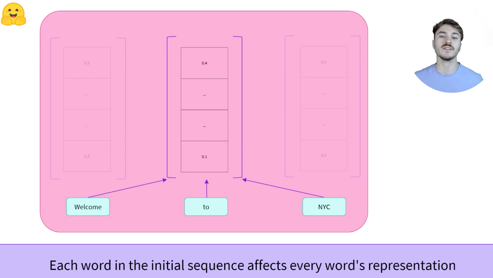

# 1.5 Encoder Models

## 1.5.1 [视频学习](https://youtu.be/MUqNwgPjJvQ)：Transformer models: Encoders

Encoders How do they work?

BERT是一个最常见的Encoder

The encoder outputs a numerical representation for each word used as input（convert）

can be called feature vector or feature tensor，以“Welcome to NYC”为例，每个单词被表示为768长度的vector（这个长度是由模型决定的，例如bert-base基本就是768的），而一个单词的feature vector将和上下文（context）有关，因此编码得到的向量也一般被称作上下文向量，这与self-attention机制相关！

为什么我们需要使用encoder
* Bi-directional：双向的，context from the left, and the right
* good at extracting meaningful information
* Sequence classification, question answering, masked language modeling
* NLU: Natural Language Understanding
* Example of encoders: BERT, RoBERTa, ALBERT

Encoders, 由于其具有的上下文双向向量，对于猜测一句话的中间单词很好

Encoders，对于猜测保留理解一句话，和单词关系、内部依赖很好用

## 1.5.2 其他综述

Encoder模型只使用Transformer模型的编码器部分。在每个阶段，注意层都可以访问初始句子中的所有单词。这些模型通常被描述为具有“双向”注意力，也通常被称为自动编码模型（Auto-encoder model）

这些模型的预训练通常围绕着以某种方式破坏给定的句子（例如，通过掩码其中的随机词），并让模型寻找或重建初始句子

**重点**

**编码器模型最适合于需要理解完整句子的任务，例如句子分类、命名实体识别（以及更普遍的单词词性分类等）和抽取式问答**

该系列的代表模型包括（未来自己使用的时候要慢慢的进行学习API）：

* [ALBERT](https://huggingface.co/transformers/model_doc/albert.html)
* [BERT](https://huggingface.co/transformers/model_doc/bert.html)
* [DistilBERT](https://huggingface.co/transformers/model_doc/distilbert.html)
* [ELECTRA](https://huggingface.co/transformers/model_doc/electra.html)
* [RoBERTa](https://huggingface.co/transformers/model_doc/roberta.html)