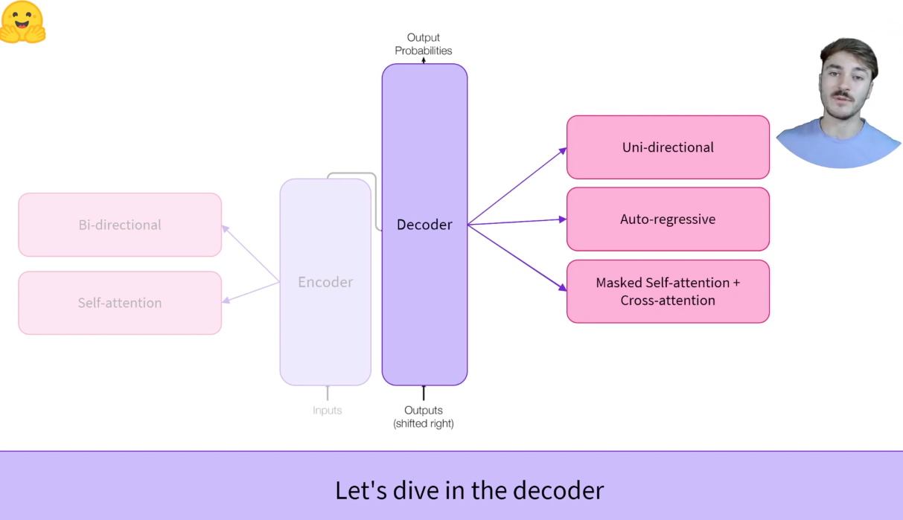
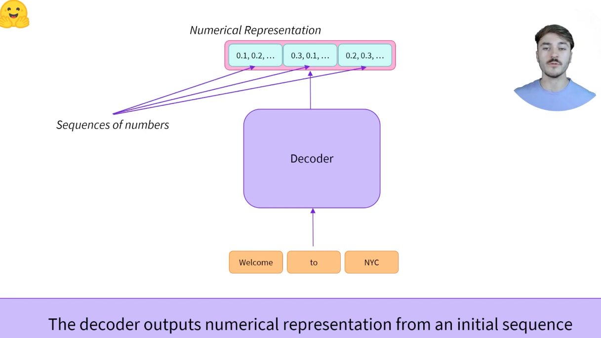
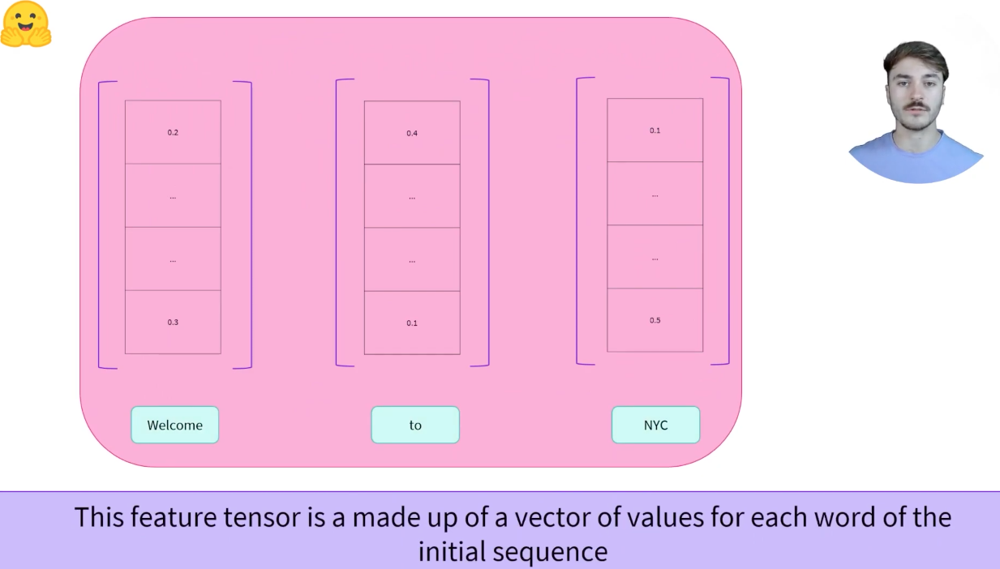
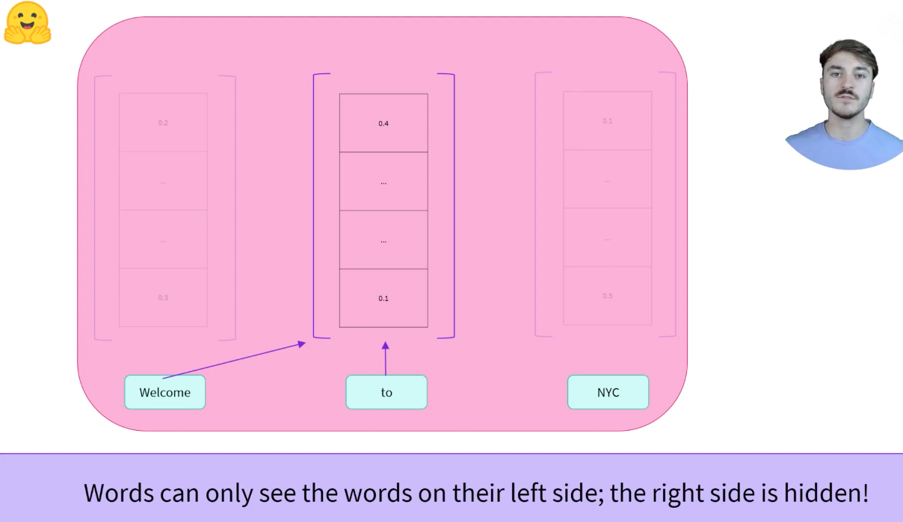
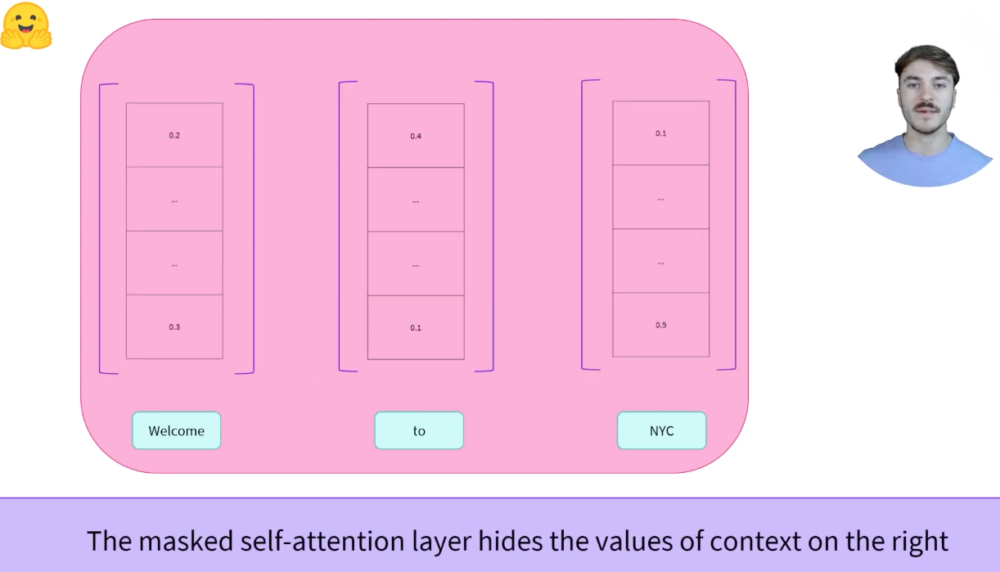
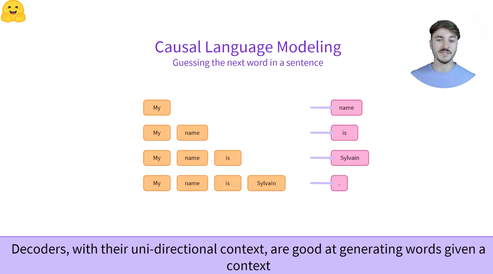

# 1.6 Decoder Models

## 1.6.1 [视频学习](https://youtu.be/d_ixlCubqQw)：Transformer models: Decoders

Decoders, How do they work

GPT-2是最典型的decoder

这里开始有不同，masked self-attention，words can only see the words on the left side, the right side is hidden. The masked self-attention layer hides the values of context on the right

When should I use a decoder:

* Unidirection(单向的)：access to their left(or right!) context
* Great at causal tasks; generating sequence
* NLG: Natural Language generation
* Example of decoders: GPT-2, GPT Neo

Decoders, with their uni-directional context, are good at generating words given a context,GPT-2最多1024的感觉好像

## 1.6.2 其他综述

decoder模型仅使用Transformer模型的decoder部分。在每个阶段，对于给定的单词，注意层只能访问句子中位于单词前面的单词。这些模型通常被称为自回归模型*auto-regression models*

解码器模型的预训练通常围绕句子中的下一个单词展开。

这些模型最适合于涉及文本生成的任务

该系列的代表性模型包括：

* [CTRL](https://huggingface.co/transformers/model_doc/ctrl.html)
* [GPT](https://huggingface.co/transformers/model_doc/gpt.html)
* [GPT-2](https://huggingface.co/transformers/model_doc/gpt2.html)
* [Transformer-XL](https://huggingface.co/transformers/model_doc/transformerxl.html)