# 1.7 Sequence-to-sequence models

## 1.7.1 [视频学习](https://youtu.be/0_4KEb08xrE)：Transformer models: Encoder-Decoders

Encoder-decoders How do they work? T5是一个代表性的模型

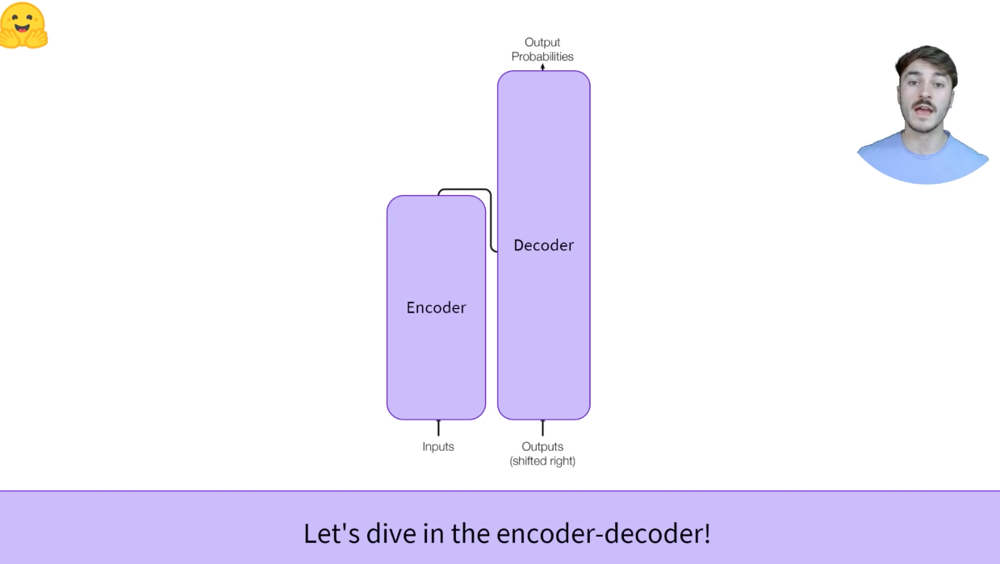

编码器转化出来一种数值化的表示
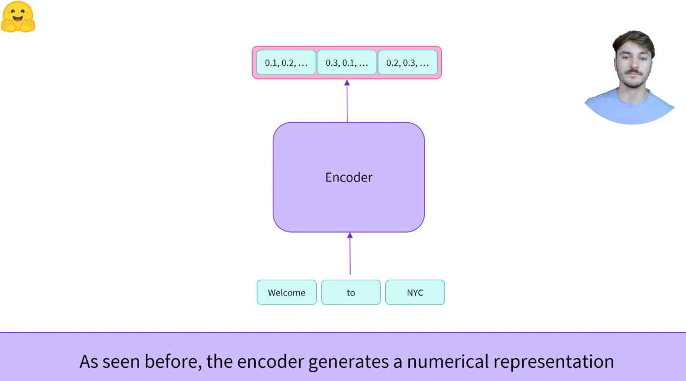

数值化表示的输出送入到decoder中，并且decoder额外输入了start of sequence word
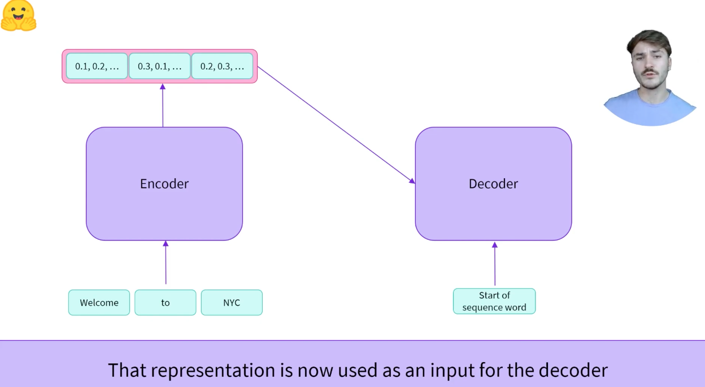
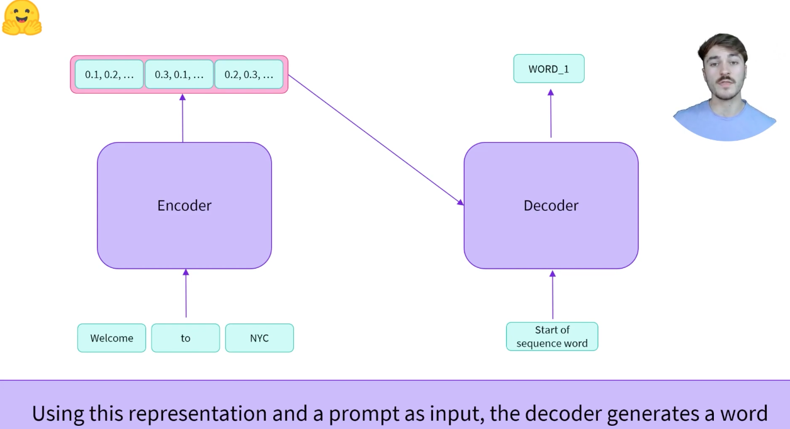

当我们有了编码器的数值表示后，编码器的前半个部分就不是很需要了，用第一个单词生成下一个单词
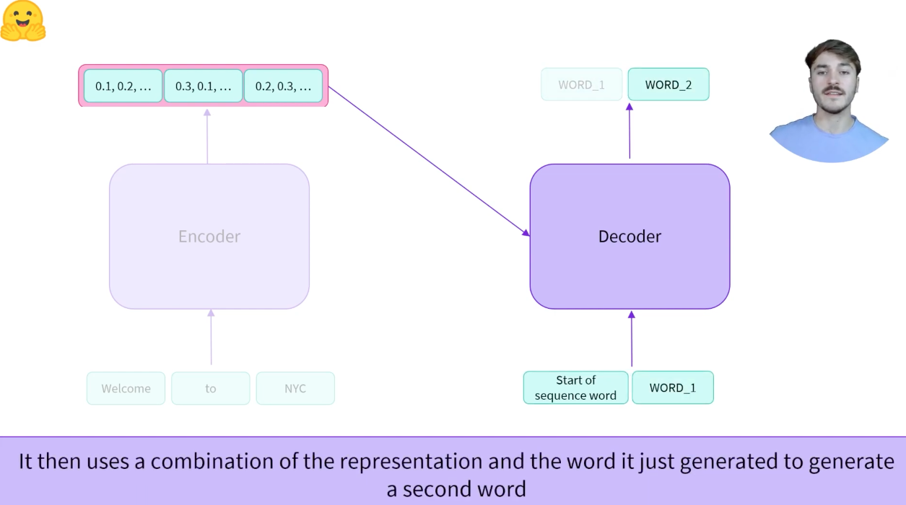
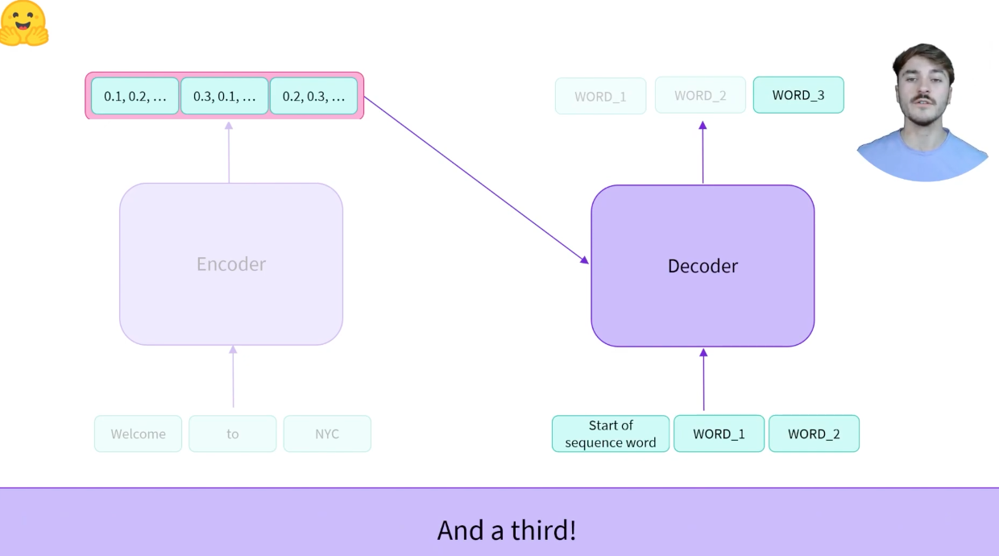

That's the encoder-decoder
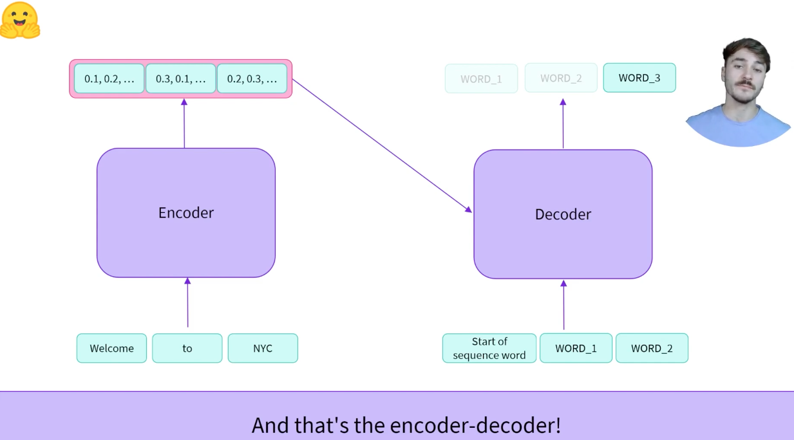

Translation example
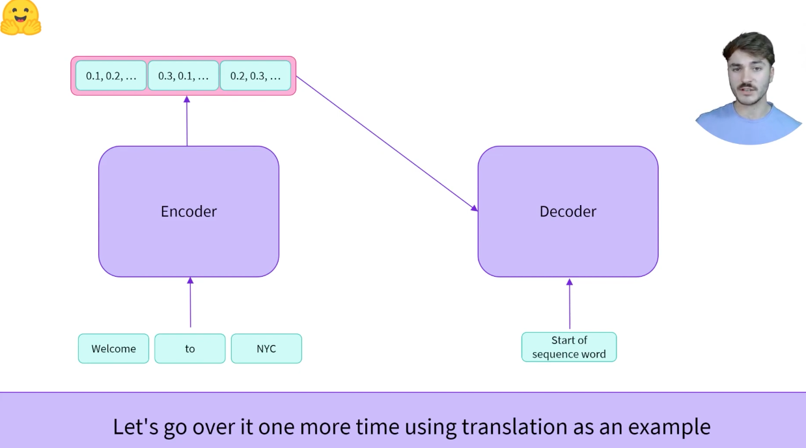
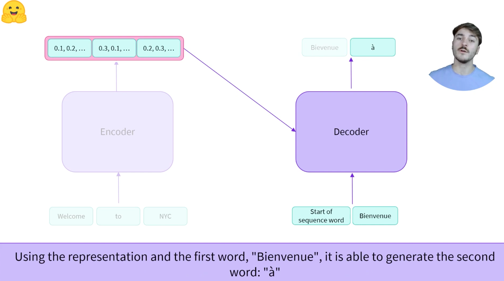
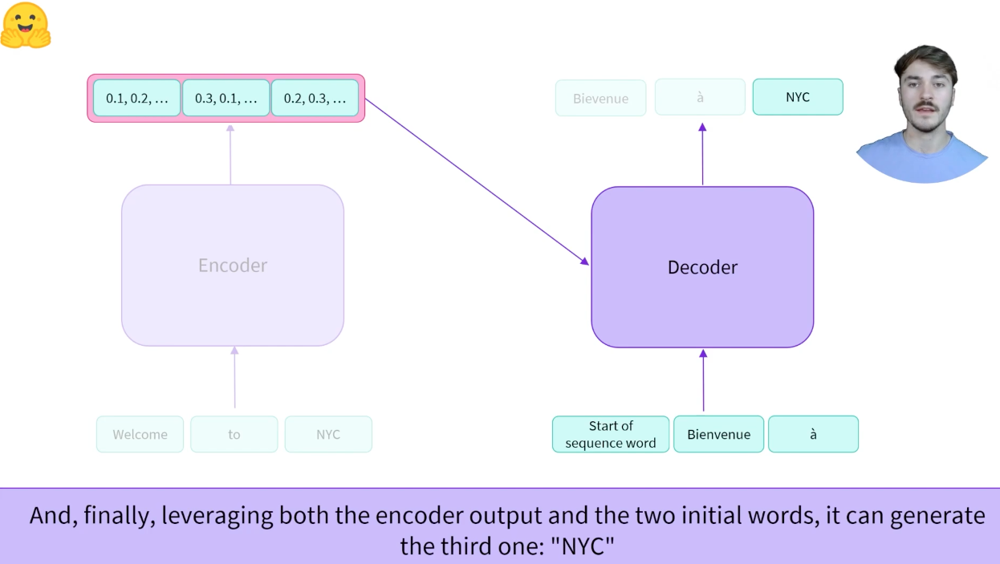

The encoder-decoder is interesting due to the separation between its two components，编解码网络结构的魅力正在于编码器和解码器的分离结构
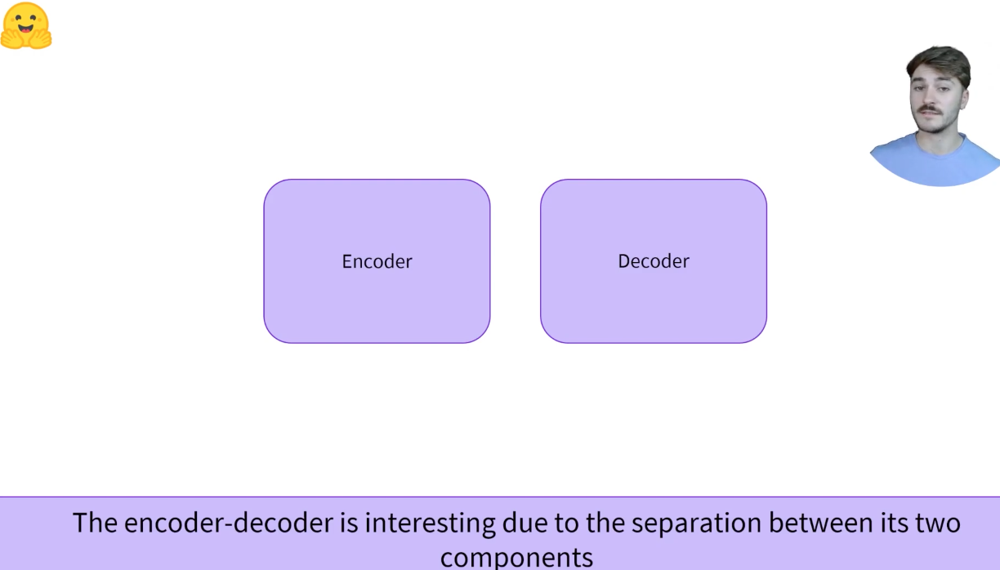
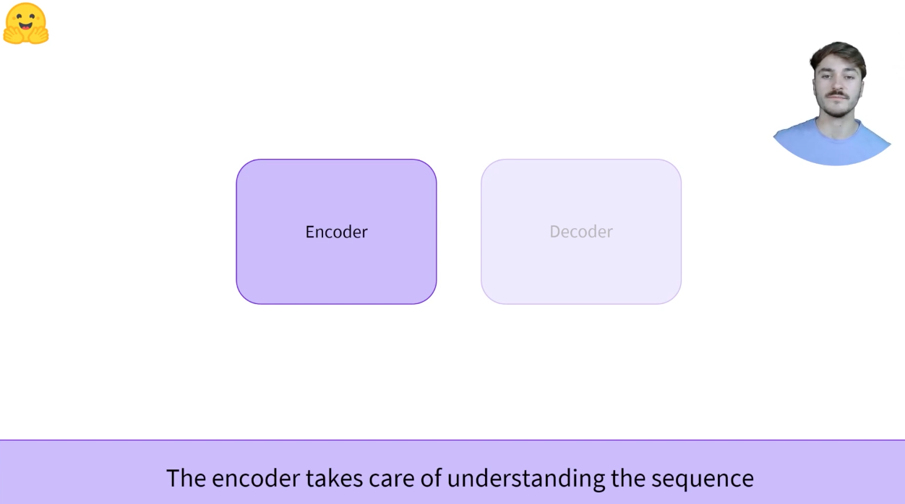
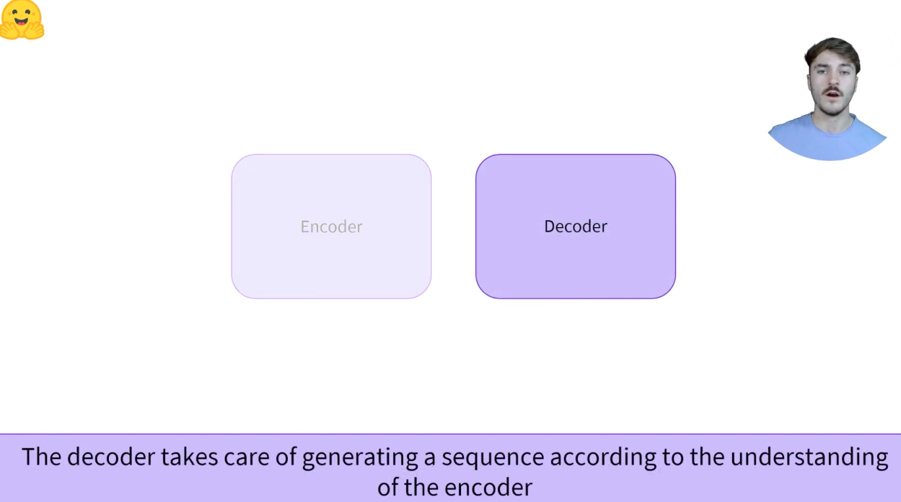

When should I use a sequence-to-sequence model?
* Sequence-to-sequence tasks; many-to-many; translation, summarization
* Weights are not necessarily shared across the encoder and decoder，权重不一定在编码器和解码器之间共享
* Input distribution different from output distribution，输入部分与输出分布不相同

Output length is independent of input length in encoder-decoder models
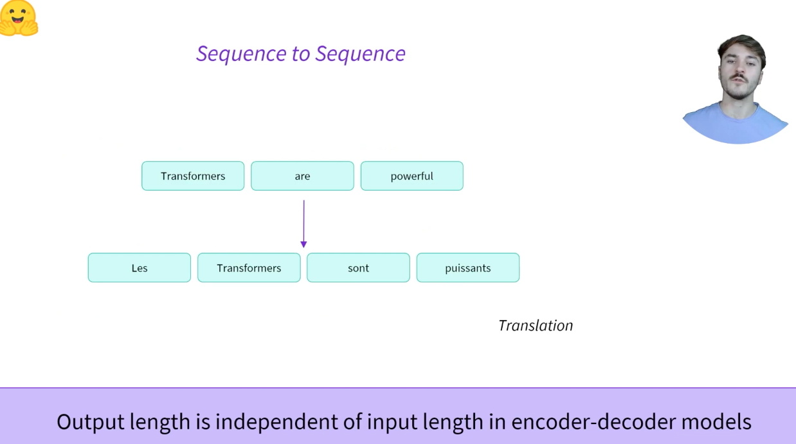

Seq2Seq language models handle varaiable output lengths
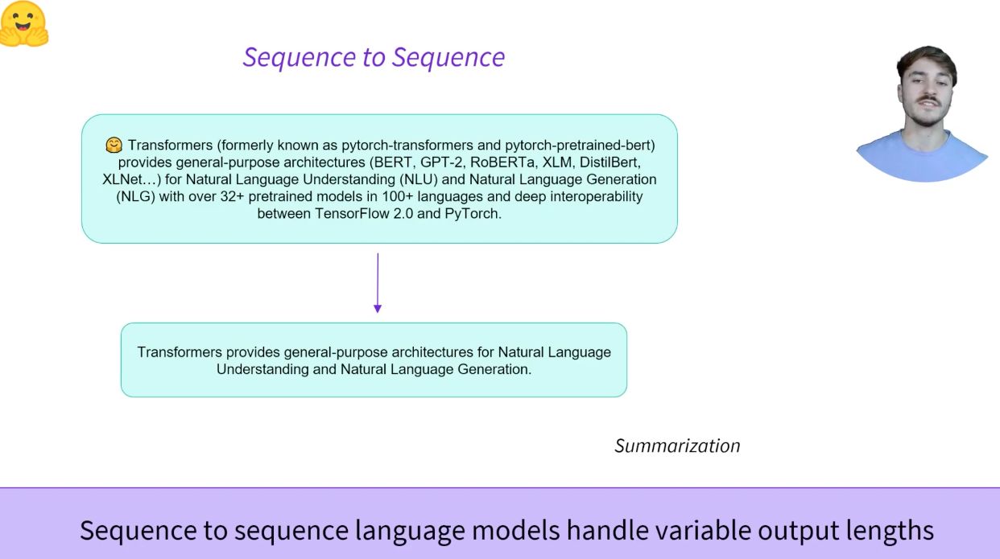

可以整体
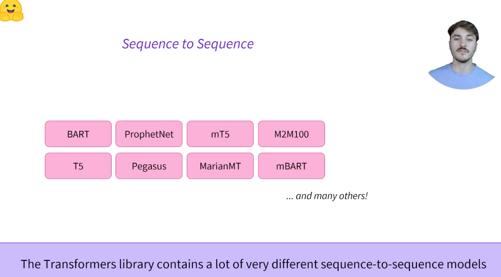
可以分离
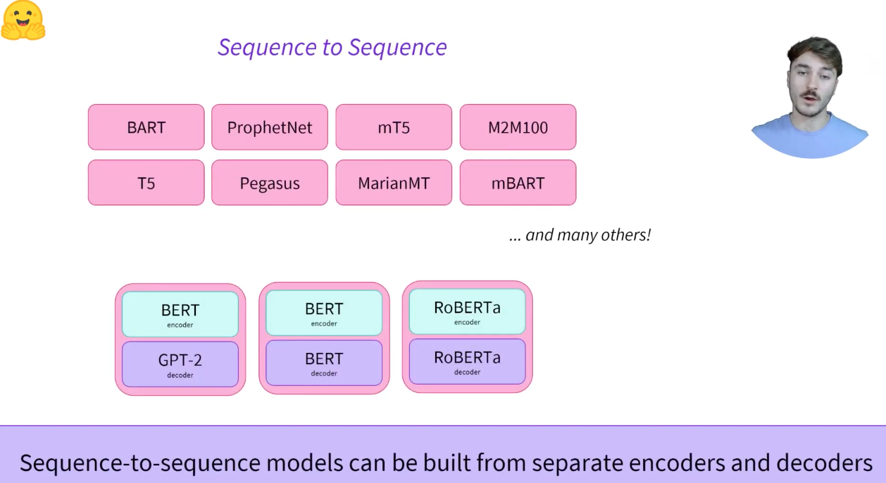

## 1.7.2 其他综述

Encoder-decoder模型（也被称作*sequence-to-sequence*模型）使用Transformer架构的两个部分。在每个阶段，编码器的注意层可以访问初始句子中的所有单词，而解码器的注意层只能访问位于输入中给定单词之前的单词。

这些模型的预训练可以使用编码器或解码器模型的目标来完成，但通常涉及更复杂的内容。例如，[T5](https://huggingface.co/t5-base)通过用一个掩码特殊单词替换文本的随机跨度（可以包含多个单词）进行预训练，然后目标是预测该掩码单词替换的文本。

序列到序列模型最适合于围绕根据给定输入生成新句子的任务，如摘要、翻译或生成性问答。

Representatives of this family of models include:

[BART](https://huggingface.co/transformers/model_doc/bart.html)
[mBART](https://huggingface.co/transformers/model_doc/mbart.html)
[Marian](https://huggingface.co/transformers/model_doc/marian.html)
[T5](https://huggingface.co/transformers/model_doc/t5.html)