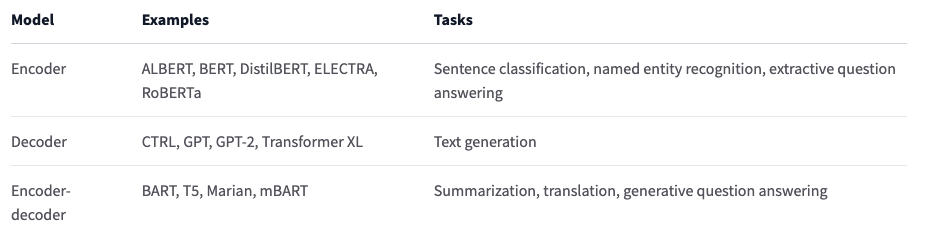

# 1.9 Summary

在本章中，您了解了如何使用高级语言处理不同的NLP任务Hugging Face Transformers API。您还了解了如何在中心中搜索和使用模型，以及如何使用推理API直接在浏览器中测试模型

我们讨论了Transformer模型如何在高级别上工作，并讨论了迁移学习和微调的重要性。一个关键方面是，您可以使用完整的体系结构，也可以仅使用编码器或解码器，具体取决于您要解决的任务类型。下表总结了这一点：

