# 2.2 Behind the pipeline

注：这是第一个需要区分使用PyTorch还是TensorFlow的章节，按照目前的积累来看肯定是根据PyTorch来了
代码见：
> HuggingFaceStartCourses/2_Using Hugging Face Transformers/2_2_Behind_the_pipeline.ipynb


## 2.2.1 [视频学习：What happens inside the pipeline function? (PyTorch)](https://youtu.be/1pedAIvTWXk)

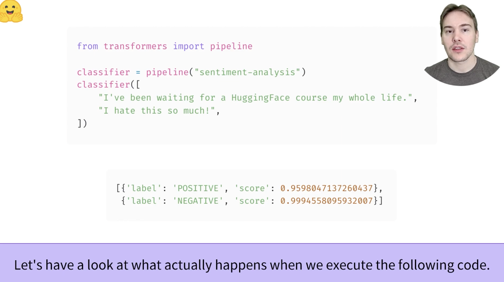

pipeline这个管道实际上由3个阶段组成。第1个阶段是Tokenizer，也就是将源语言转化为一种Input IDs；第2个阶段是Model，也就是将输入的IDs转化为一种输出Logits；第3个阶段是Post-processing，将预测得到的标签转化为predictions的label
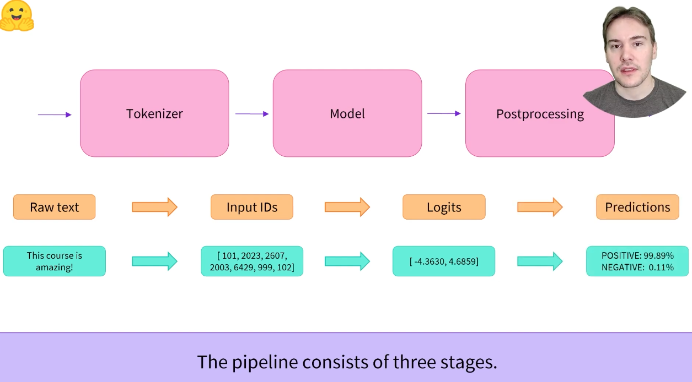

### stage1
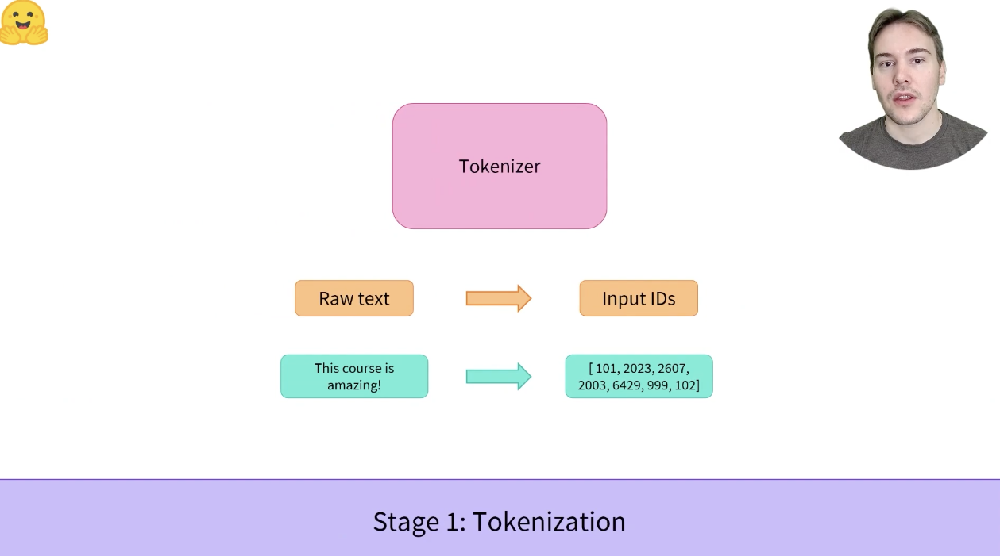

对于下边这个图的解释是，首先源文档按照一些方式被化为tokens（自：这个过程可能存在字符级别，单词级别等多个级别的。。），之后这些tokens会被加上一些任务指定，或者用来训练的tokens作为一种拼接，例如常见的[CLS]，[SEP]，最后这些special tokens经过一个mapping后（vocab.txt），转化为一个IDs（index的向量）
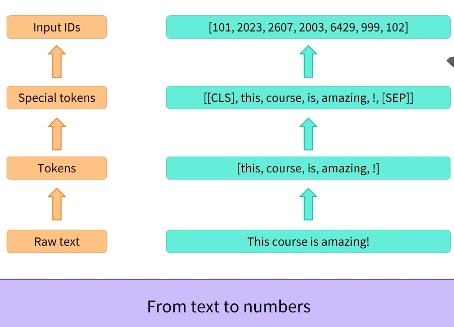

下图这里代码化的展示了这样一个过程，从transformers加载的AutoTokenizer可以随意加载checkpoint（AutoTokenizer.from_pretrained但大概也必须是这个平台的？这个也在models里去找吗，还是去类似BERT一类的找）。这里的raw_inputs被设置成了一个列表，有两句长段不一样的话。
```python
from transformers import AutoTokenizer

checkpoint = "distilbert-base-uncased-finetuned-sst-2-english" # get from https://huggingface.co/models
tokenizer = AutoTokenizer.from_pretrained(checkpoint)

raw_inputs = [
    "I've been waiting for a HuggingFace course my whole life.",
    "I hate this so much"
]
inputs = tokenizer(raw_inputs, padding=True, truncation=True, return_tensors="pt")

print(inputs)

>>> {'input_ids': tensor([[  101,  1045,  1005,  2310,  2042,  3403,  2005,  1037, 17662, 12172,
    2607,  2026,  2878,  2166,  1012,   102],
    [  101,  1045,  5223,  2023,  2061,  2172,   102,     0,     0,     0,
    0,     0,     0,     0,     0,     0]]), 'attention_mask': tensor([[1, 1, 1, 1, 1, 1, 1, 1, 1, 1, 1, 1, 1, 1, 1, 1],
    [1, 1, 1, 1, 1, 1, 1, 0, 0, 0, 0, 0, 0, 0, 0, 0]])}

```
注意空格是不算字符的！！而在这句话中，“I've”会被拆分成[I, ', ve]。“HuggingFace”一词则被拆分成了['hugging', '##face']，在之后，前边加上一个[CLS]，后边加上一个[SEP]，长度就会变成16了。padding置为True的时候，按照最长的来填充？<font color='red'>truncation参数还需要进一步理解</font>，padding后的attention mask会被搞成0，代表计算时忽略掉，只是为了搞成相同长度
vocat.txt见：https://huggingface.co/distilbert-base-uncased-finetuned-sst-2-english/blob/main/vocab.txt
注意vocat.txt是从1行开始数，而ids是从0开始数，所以角标会差上一个
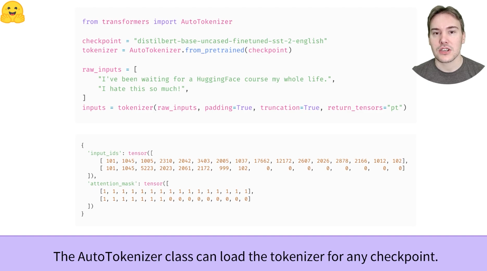


### stage2
步骤2是把输入的IDs转化为一种概率表示
```python
from transformers import AutoTokenizer, AutoModel

checkpoint = "distilbert-base-uncased-finetuned-sst-2-english" # get from https://huggingface.co/models
tokenizer = AutoTokenizer.from_pretrained(checkpoint)

raw_inputs = [
    "I've been waiting for a HuggingFace course my whole life.",
    "I hate this so much"
]
inputs = tokenizer(raw_inputs, padding=True, truncation=True, return_tensors="pt")


model = AutoModel.from_pretrained(checkpoint)
outputs = model(**inputs)

print(outputs.last_hidden_state.shape)
>>> torch.Size([2, 16, 768])，分别代表batch_size，序列长度（输入列表中最长的，加上CLS和SEP），还有hidden size（模型定的）
```
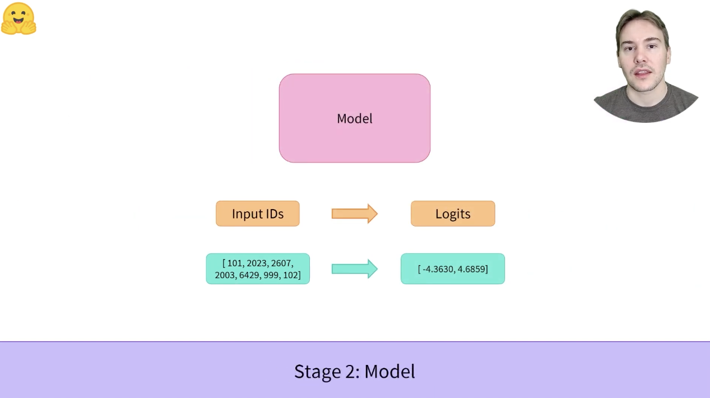
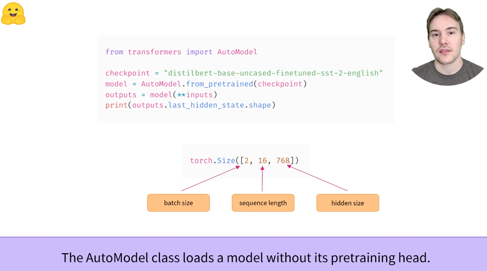

每个AutoModelForXxx的类加载一个适应于指定任务的模型
```python
from transformers import AutoTokenizer, AutoModelForSequenceClassification

checkpoint = "distilbert-base-uncased-finetuned-sst-2-english" # get from https://huggingface.co/models
tokenizer = AutoTokenizer.from_pretrained(checkpoint)

raw_inputs = [
    "I've been waiting for a HuggingFace course my whole life.",
    "I hate this so much"
]
inputs = tokenizer(raw_inputs, padding=True, truncation=True, return_tensors="pt")


model = AutoModelForSequenceClassification.from_pretrained(checkpoint)
outputs = model(**inputs)
print(outputs)
>>> SequenceClassifierOutput(loss=None, logits=tensor([[-1.5607,  1.6123],
    [ 4.2141, -3.4158]], grad_fn=<AddmmBackward>), hidden_states=None, attentions=None)

print(outputs.logits)
>>> tensor([[-1.5607,  1.6123],
    [ 4.2141, -3.4158]], grad_fn=<AddmmBackward>)
```
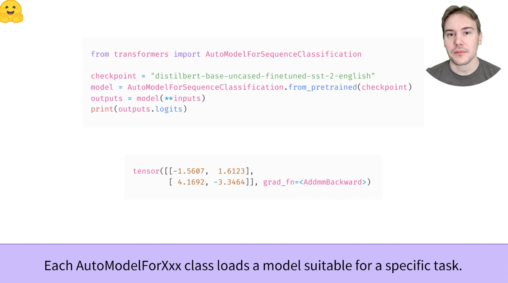


### stage3: 
pipeline的最后一个步骤是将logits转化为predictions（有一种向标签转化的感觉）
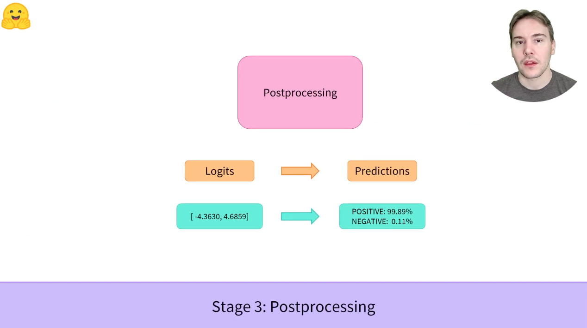

首先需要把tensor通过softmax的方式转化为一种概率表示<font color='red'>这里的dim为什么是-1需要理解下</font>，
```python
from transformers import AutoTokenizer, AutoModelForSequenceClassification
import torch

checkpoint = "distilbert-base-uncased-finetuned-sst-2-english" # get from https://huggingface.co/models
tokenizer = AutoTokenizer.from_pretrained(checkpoint)

raw_inputs = [
    "I've been waiting for a HuggingFace course my whole life.",
    "I hate this so much"
]
inputs = tokenizer(raw_inputs, padding=True, truncation=True, return_tensors="pt")


model = AutoModelForSequenceClassification.from_pretrained(checkpoint)
outputs = model(**inputs)

predictions = torch.nn.functional.softmax(outputs.logits, dim=-1) # 实际上用1也可以，因为dim0是句子A，句子B...，而dim1就是每个句子各个label的值了
print(predictions)
>>> tensor([[4.0195e-02, 9.5980e-01],
    [9.9951e-01, 4.8549e-04]], grad_fn=<SoftmaxBackward>)
```
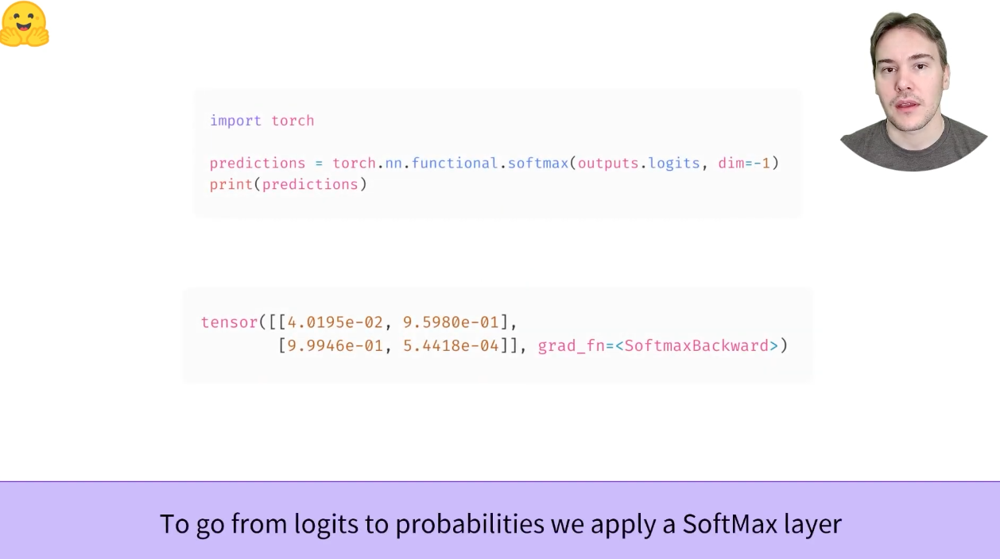

最后还需要向label转化一下，这种地方的话model的config会存了id2label

```python
print(model.config.id2label[0], float(predictions[0][0])) # 第0句话的0id的概率
>>> NEGATIVE 0.04019518569111824
```
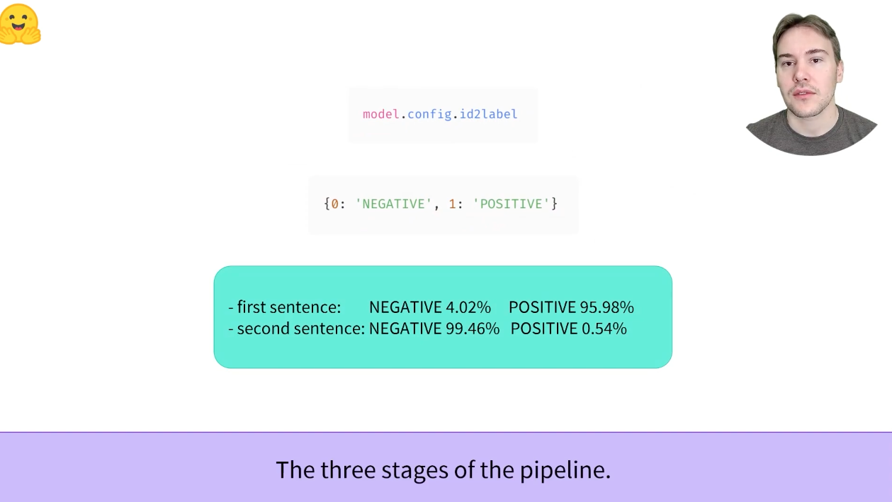

## 2.2.2 Preprocessing with a tokenizer
使用词符化器tokenizer进行预处理

与其他神经网络一样，Transformer模型无法直接处理原始文本，因此我们pipeline的第一步是将文本输入转化为模型能够理解的数字。为此，我们使用tokenizer，该tokenizer将负责：
* 将输入拆分为成为token的单词、子单词或符号（如标点符号）
* 将每个令牌token映射到一个整数
* 添加可能对模型有用的其他输入（例如CLS，SEP等）

所有这些预处理都需要以与模型预训练时完全相同的方式完成，因此我们首先需要从[模型中心](https://huggingface.co/models)下载这些信息。为此，我们使用**AutoTokenizer**类及其**from_pretrained**方法。使用我们模型的检查点名称，它将自动获取与模型的tokenizer相关联的数据并将其缓存（因此，它仅在您第一次运行下面的代码时下载）。

由于情绪分析pipeline的默认checkpoint是distilbert-base-uncased-finetened-sst-2-english（[model card](https://huggingface.co/distilbert-base-uncased-finetuned-sst-2-english)），因此我们运行以下操作：

```python
from transformers import AutoTokenizer

checkpoint = "distilbert-base-uncased-finetuned-sst-2-english"
tokenizer = AutoTokenizer.from_pretrained(checkpoint)
```

一旦我们有了tokenizer，我们就可以直接将我们的句子传递给它，然后我们就会得到一本字典，它可以提供给我们的模型！剩下要做的唯一一件事就是将输入ID列表(IDs)转换为张量(tensors)。

可以用Hugging Face Transformer，而不必担心哪个ML框架（这里指的是PyTorch，TensorFlow这些的）被用作后端。然而，transformers的模型只接受tensor作为输入。如果是第一次听说张量，可以把它们想象成NumPy数组，可以是标量0D，向量1D，矩阵2D或具有更多维度。它实际上是张量，其他ML框架的张量行为类似，通常与NumPy数组一样易于实例化

要指定要返回的张量类型（PyTorch、TensorFlow或plain NumPy），我们使用return_tensors参数：
```python
raw_inputs = [
    "I've been waiting for a HuggingFace course my whole life.", 
    "I hate this so much!",
]
inputs = tokenizer(raw_inputs, padding=True, truncation=True, return_tensors="pt")
print(inputs)
```
暂时不用关注padding和truncation参数的设置，稍后会对这些进行解释。这里要记住的主要事情是，可以传递一个句子或一组句子，还可以指定要返回的张量类型（如果没有传递return_tensors，将得到一组列表）

一下是PyTorch张量的结果：
```python
{
    'input_ids': tensor([
        [  101,  1045,  1005,  2310,  2042,  3403,  2005,  1037, 17662, 12172, 2607,  2026,  2878,  2166,  1012,   102],
        [  101,  1045,  5223,  2023,  2061,  2172,   999,   102,     0,     0,     0,     0,     0,     0,     0,     0]
    ]), 
    'attention_mask': tensor([
        [1, 1, 1, 1, 1, 1, 1, 1, 1, 1, 1, 1, 1, 1, 1, 1],
        [1, 1, 1, 1, 1, 1, 1, 0, 0, 0, 0, 0, 0, 0, 0, 0]
    ])
}
```

输出本身是一个包含两个键的字典，**input_ids** 和 **attention_mask**。input_ids包含两行整数（每个句子一行），它们是每个句子中标记的卫唯一标识符。我们将在本章的后续内容解释什么是**attention_mask**

## 2.2.3 Going through the model

我们可以像使用tokenizer一样下载预训练模型。🤗Transformers提供了一个AutoModel类，该类还具有from_pretrained方法：
```python
from transformers import AutoModel

checkpoint = "distilbert-base-uncased-finetuned-sst-2-english"
model = AutoModel.from_pretrained(checkpoint)
```
在这个代码片段中，我们下载了之前在管道中使用的相同检查点（它实际上应该已经被缓存），并用它实例化了一个模型。

这个架构只包含基本transformer模块：给定一些输入，它输出我们称之为隐藏状态hidden_state的东西，也称为特性features。对于每个模型输入，我们将检索表示Transformer模型对该输入的上下文理解的高维向量retrieve a high-dimensional vector。

虽然这些hidden_state本身可能很有用，但它们通常是模型另一部分（称为头部）的输入。在第1章中，不同的任务可以用相同的体系结构执行，但是每个任务都有一个与之相关联的不同头部。 <font color='red'>-> 这个head还是没怎么听说过，不是很完全明白这里的意思</font>

### 2.2.3.1 A high-dimensional vector?

Transformers的向量输出通常较大，通常具有3个维度（three dimensions）：
* Batch size：一次处理的序列数，在我们的示例中为2
* Sequence length：序列（一句话的）数值表示的长度（在我们的示例中为16）
* Hidden size：每个模型输入的向量维数（个人感觉一般由模型指定，比如bert的768）

由于最后的一个值，它被称为“高维”。hidden_state的大小可能非常大（以BERT来说，base的模型可能有768，而large的模型可能有3072或更大）

如果我们将预处理的输入输入到模型中，我们可以看到这一点：
```python
outputs = model(**inputs)
print(outputs.last_hidden_state.shape)
>>> torch.Size([2, 16, 768])
```
请注意🤗Transformers模型的行为类似于**namedtuple**s或Dicitionary。您可以通过outputs.last_hidden_state来访问，或者使用 **outputs["last_hidden_state"]** 进行访问。甚至如果非常清楚的话，甚至可以使用 **output[0]** 

### 2.2.3.2 Model heads: Making sense out of numbers
模型的heads（可以说是模型的输出头，有multi head那个意思），使得数字具有意义

模型头将隐藏状态的高维向量作为输入，并将其投影到不同的维度。它们通常由一个或几个线性层组成：
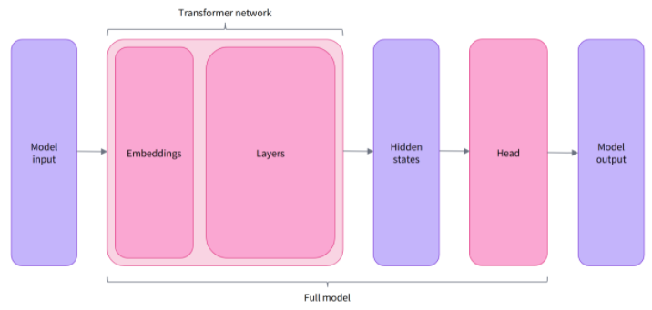

<font color='red'>对这张图自己描述一下：一个输入经过transformer架构后会得到一个hidden_state的输出，这个输出被输入到针对不同任务的head中，得到对不同任务的model output</font>

Transformer的输出直接发送到model head进行处理。

在此图中，模型由embedding层和后续层表示。embedding层将每个tokenized后的inputID转化为一组与token关联的向量。后续层使用注意力机制操纵这些向量，以生成句子最终表示。

在Hugging Face Transformer中，有很多不同的architecture，每一个都是围绕着完成一项特定任务而设计的，以下是一个非详尽的列表（示例：AutoModelForSequenceClassification）

* \*Model(retrieve the hidden states)
* \*ForCausalLM
* \*ForMaskedLM
* \*ForMultipleChoice
* \*ForQuestionAnswering
* \*ForSequenceClassification
* \*ForTokenClassification

对于我们的例子，我们需要一个带有序列分类头的模型（能够将句子分类为肯定或否定）。因此，我们实际上不会使用**AutoModel**类，而是**AutoModelForSequenceClassification**：
```python
from transformers import AutoModelForSequenceClassification

checkpoint = "distilbert-base-uncased-finetuned-sst-2-english"
model = AutoModelForSequenceClassification.from_pretrained(checkpoint)
outputs = model(**inputs)
```

现在，如果我们观察输入的形状，维度将低得多：模型头将我们之前看到的高维向量作为输入，并输出包含两个值的向量（每个标签一个）：
```python
print(outputs.logits.shape)
>>> torch.Size([2, 2])
```
因为我们只有两个句子和两个标签，所以我们从模型中得到的结果是2 x 2的形状。

## 2.2.4 Postprocessing the output

我们从模型中得到的输出值本身不一定有意义，take a look：

```python
print(outputs.logits)
>>> tensor([[-1.5607,  1.6123],
    [ 4.1692, -3.3464]], grad_fn=<AddmmBackward>)
```

我们的模型预测第一句为[-1.5607,1.6123]，第二句为[4.1692，-3.3464]。这些不是概率，而是logits，即模型最后一层输出的原始、未规范化的分数。要转换为概率，它们需要经过[SoftMax](https://en.wikipedia.org/wiki/Softmax_function)层。（所有Transformer模型输出logits，用于培训的损耗函数通常将最后的激活函数（如SoftMax）与实际损耗函数（如交叉熵）融合）

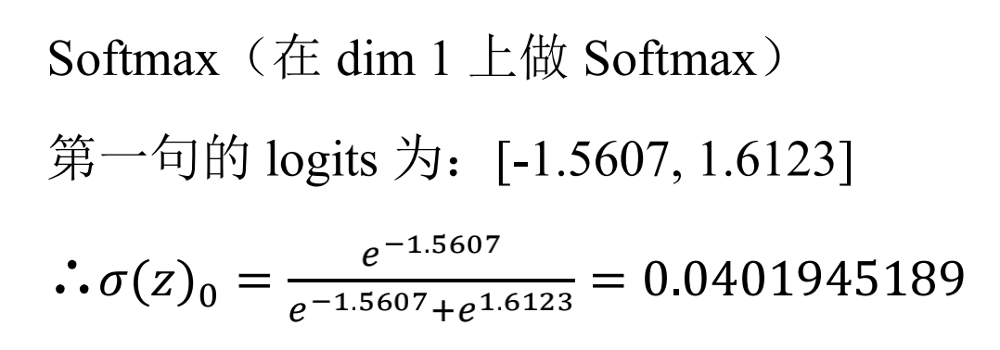
注：在dim 1上做softmax就是对每句话分别做softmax

```python
import torch

predictions = torch.nn.functional.softmax(outputs.logits, dim=-1)
print(predictions)
>>> tensor([[4.0195e-02, 9.5980e-01],
    [9.9946e-01, 5.4418e-04]], grad_fn=<SoftmaxBackward>)
```
现在我们可以看到，模型预测第一句为[0.0402,0.9598]，第二句为[0.9995,0.0005]。这些是可识别的概率分数。

为了获得对应于每个位置的标签，我们可以检查模型配置的**id2label**属性（下一节将对此进行详细介绍）：
```python
model.config.id2label
>>> {0: 'NEGATIVE', 1: 'POSITIVE'}
```

现在我们可以得出结论，该模型预测了以下几点：
* First sentence: NEGATIVE: 0.0402, POSITIVE: 0.9598
* Second sentence: NEGATIVE: 0.9995, POSITIVE: 0.0005

我们已经成功地复制了管道的三个步骤：使用标记化器（tokenizer）进行预处理、通过模型传递输入以及后处理！现在，让我们花一些时间深入了解这些步骤中的每一步。

## 2.2.5 Try it Out!

选择两个（或更多）你自己的文本，并通过情绪分析管道运行它们。然后自己复制在这里看到的步骤，并检查是否获得相同的结果！

文本选择
> Hello world, this is curious
Wow, I'm so happy about this tour guide!
So tired! I can't wait to take a break

pipeline，指定任务和模型就可以
```python
from transformers import pipeline

classifier = pipeline("text-classification", model="distilbert-base-uncased-finetuned-sst-2-english")
classifier([
    "Tony Tom Jerry Jim", # {'label': 'NEGATIVE', 'score': 0.7907747030258179}，置信度不足0.9的时候很可能就很不可靠了
    "Wow, I'm so happy about this tour guide!",
    "So tired! I can't wait to take a break"
])

>>> [{'label': 'NEGATIVE', 'score': 0.7907747030258179},
    {'label': 'POSITIVE', 'score': 0.9998595118522644},
    {'label': 'NEGATIVE', 'score': 0.9996296763420105}]
```

stage-by-stage，指定checkpoint，加载模型和tokenizer，输入输出得到logits，使用softmax分数化，格式化输出
```python
from transformers import AutoTokenizer, AutoModelForSequenceClassification
import torch  

tokenizer = AutoTokenizer.from_pretrained("distilbert-base-uncased-finetuned-sst-2-english")

model = AutoModelForSequenceClassification.from_pretrained("distilbert-base-uncased-finetuned-sst-2-english")

raw_inputs = [
    "Tony Tom Jerry Jim",
    "Wow, I'm so happy about this tour guide!",
    "So tired! I can't wait to take a break"
]
inputs = tokenizer(raw_inputs, padding=True, truncation=True, return_tensors='pt')
outputs = model(**inputs)
predictions = torch.nn.functional.softmax(outputs.logits, dim=1)

for i in range(len(raw_inputs)):
    print("Text:" + raw_inputs[i], end='\t')
    for key, value in model.config.id2label.items():
        print(value + '置信度：' + str(float(predictions[i][key])), end='\t')
    print("")

>>> Text:Tony Tom Jerry Jim	NEGATIVE置信度：0.7907747626304626	POSITIVE置信度：0.20922529697418213	
    Text:Wow, I'm so happy about this tour guide!	NEGATIVE置信度：0.0001404868089593947	POSITIVE置信度：0.9998594522476196	
    Text:So tired! I can't wait to take a break	NEGATIVE置信度：0.9996296167373657	POSITIVE置信度：0.00037032406544312835	
```