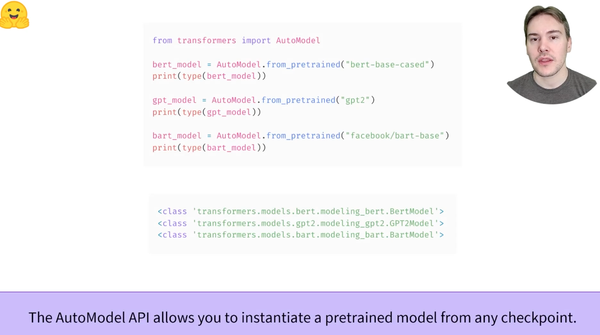
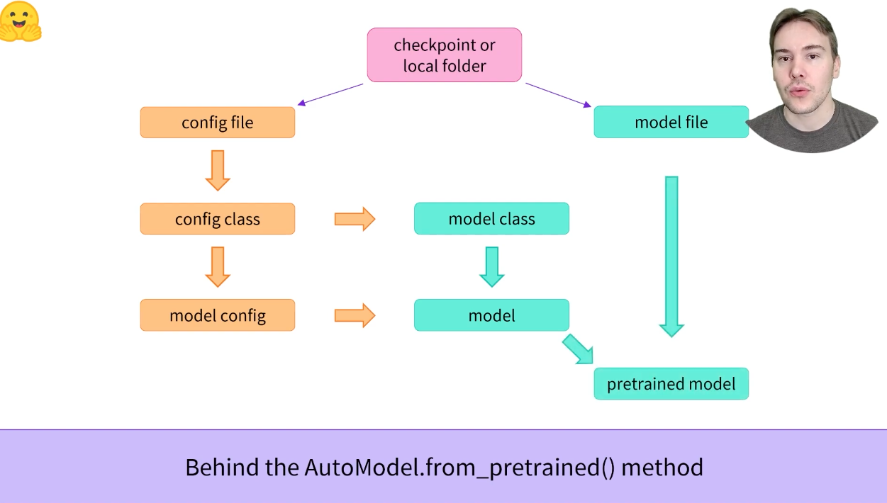
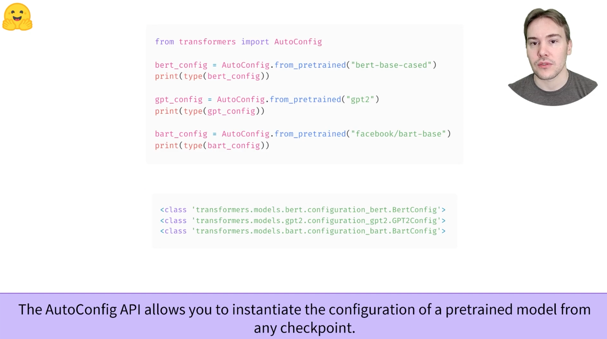
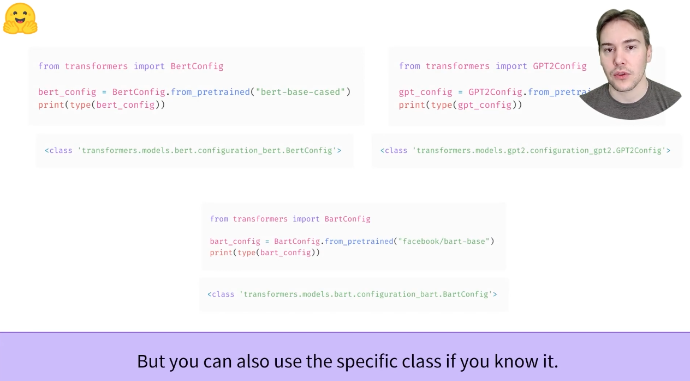
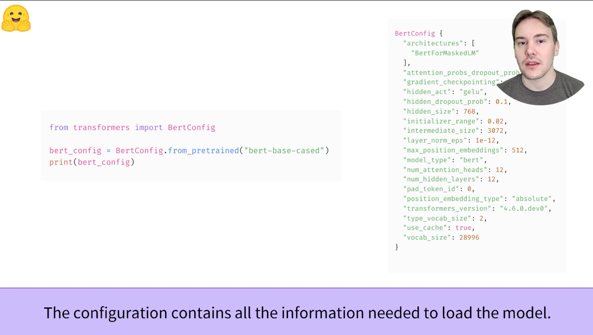
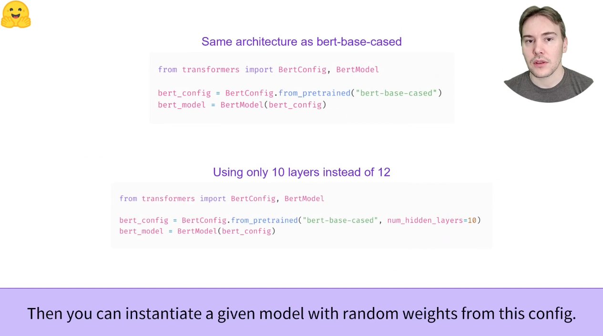
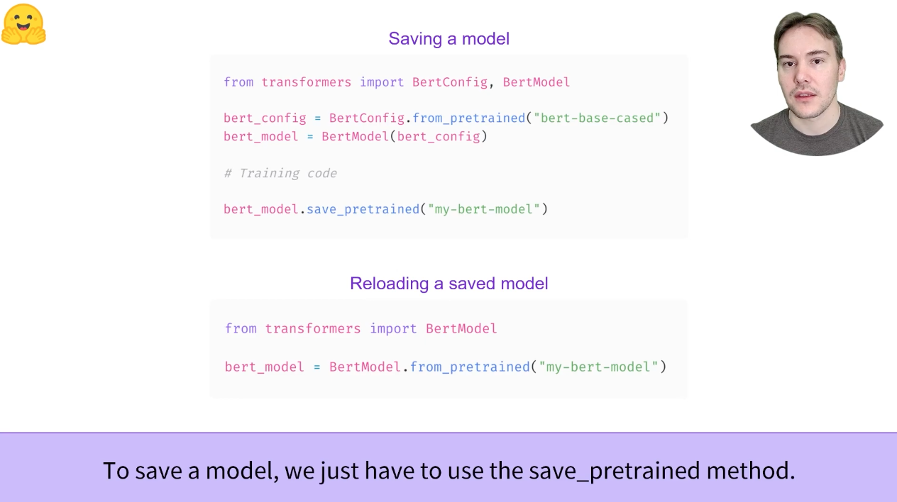

# 2.3 Models

代码见：
> 2-3_Models.ipynb

## 2.3.1 [视频学习](https://www.youtube.com/watch?v=AhChOFRegn4)：Instantiate a Transformers model (PyTorch)
实例化一个Transformer模型

如之前所见的，AutoModel的API允许实例化一个预训练模型从任意的checkpoint


在AutoModel.from_pretrained()方法的背后是这样一个过程


AutoConfig可以加载一个预训练模型的Config


也可以使用指定的Config，例如直接import BertConfig


如果不通过type打印，而是通过直接打印，就能看到config里的各个内容了


之后可以实例化一个模型，random weights from this config，灵活指定一些内部的参数等，这里感觉来说只使用了config，而不是像之前那样model直接加载checkpoint，类似弄出一个空的模型的感觉？


保存.save_pretrained("my-bert-model")
加载BertModel.from_pretrained("my-bert-model")


在本节中，我们将更详细的了解如何使用和创建模型。我们将使用**AutoModel**类，当您要想从任何checkpoint实例化任何模型时，它非常方便（自：通过type应该就可以查看了）

**AutoModel**类及其所有相关类实际上是对库中各种可用模型的简单包装。它是一个聪明的包装器，可以自动猜测checkpoint的适当模型体系结构，然后用该体系结构实例化模型

但是，如果您知道要使用的模型类型，则可以直接使用定义其体系结构的类。让我们看看这是如何和BERT模型一起工作的

## 2.3.2 Creating a Transformer
初始化BERT模型需要做的第一件事是加载配置对象
```python
from transformers import BertConfig, BertModel

config = BertConfig() # Building the config

model = BertModel(config) # Building the model from the config
```

configuration包含许多用于构建模型的属性：
```python
print(config)
>>> BertConfig {
        [...]
        "hidden_size": 768,
        "intermediate_size": 3072,
        "max_position_embeddings": 512,
        "num_attention_heads": 12,
        "num_hidden_layers": 12,
        [...]
    }
```
虽然您还没有看到所有这些属性的作用，但是您应该认识到其中的一些属性：hidden_size属性定义了hidden_states向量的大小，num_hidden_layers定义了Transformer模型的层数

### 2.3.2.1 Different loading methods

从默认配置创建模型会使用随机值对其进行初始化：
```python
from transformers import BertConfig, BertModel

config = BertConfig()
model = BertModel(config)

# Model is randomly initialized
```

该模型可以在这种状态下使用，但会输出胡言乱语；他需要首先的被训练。我们可以根据手头的任务从头开始训练模型，但正如在第一章所看到的，这需要很长的时间和大量的数据，并且会产生不可忽略的环境影响。为了避免不必要的重复工作，必须能够共享和重用已经训练过的模型

加载已经训练过的Transformer模型很简单-我们可以使用**from_pretrained**方法：
```python
from transformers import BertModel

model = BertModel.from_pretrained("bert-base-cased")
```
正如前边所看到的，我们可以用等效AutoModel类替换BertModel。从现在开始，我们将这样做，因为这将生成checkpoint-agnostic code。如果您的代码适用于一个checkpoint，那么它应该与另一个checkpoint无缝的工作。即使体系结构不同，这也适用，只要检查点是针对类似任务（例如，情绪分析惹怒）训练的。

在上面的代码示例中，我们没有适用BertConfig，而是通过"bert-case-cased"的标识符加载了一个预训练模型。这是一个模型的checkpoint，由BERT的作者自己训练；可以在[模型卡](https://huggingface.co/bert-base-cased)上找到更多的细节。

该模型现在使用检查点的所有权重进行初始化。它可以直接用于对训练过的任务进行推理，也可以对新任务进行fine-tune。通过预先训练weight而不是从头开始的训练，我们可以很快取得好的效果。

权重已下载并缓存在缓存文件夹中（因此将来对from_pretrained方法的调用将不会重新下载它们），该文件夹默认为~/.cache/huggingface/transformers。通过设置HF_HOME环境变量，可以自定义缓存文件夹。（自：如果在实验室服务器上进行操作的话，可能需要自定义一个缓存文件夹）

用于加载模型的标识符可以是模型中心上任何模型的标识符，只要它与BERT体系结构兼容。[这里](https://huggingface.co/models?filter=bert)可以找到可用的BERT检查点的完整列表。

### 2.3.2.2 Saving methods

保存模型与加载模型一样简单-我们使用**save_pretrained**方法，类似于**from_pretrained**方法：

```python
model.save_pretrained("directory_on_my_computer")
```

这会保存到两个文件到本地的磁盘目录下
```shell
ls directory_on_my_computer

config.json pytorch_model.bin
```

如果查看config.json文件，将认识到构建模型体系结构所需的属性。该文件还包含一些源数据，例如检查点的来源和内容，Hugging Face上次保存检查点时使用的Transformer版本

```json
{
  "architectures": [
    "BertModel"
  ],
  "attention_probs_dropout_prob": 0.1,
  "gradient_checkpointing": false,
  "hidden_act": "gelu",
  "hidden_dropout_prob": 0.1,
  "hidden_size": 768,
  "initializer_range": 0.02,
  "intermediate_size": 3072,
  "layer_norm_eps": 1e-12,
  "max_position_embeddings": 512,
  "model_type": "bert",
  "num_attention_heads": 12,
  "num_hidden_layers": 10,
  "pad_token_id": 0,
  "position_embedding_type": "absolute",
  "torch_dtype": "float32",
  "transformers_version": "4.9.1",
  "type_vocab_size": 2,
  "use_cache": true,
  "vocab_size": 28996
}
```
*pytorch_model.bin*文件称为状态字典：它包含模型的所有权重。这两个文件共同作用：配置是了解模型体系结构所必需的，而模型权重是模型的参数。

## 2.3.3 Using a Transformer model for inference

既然已经知道了如何加载和保存模型，那么让我们尝试使用它进行一些预测。Transformer模型只能处理数字——tokenizer生成的数字。但在我们讨论tokenizer前，先探讨模型接受哪些输入

tokenizer可以将输入转换为适当的框架张量（tensor），但为了帮助您了解发生了什么，我们将快速了解在将输入发送到模型之前必须做什么。

假设我们有几个序列：
```python
sequences = [
  "Hello!",
  "Cool.",
  "Nice!"
]
```

标记器将这些转换为词汇表索引，通常称为**input IDs**。每个序列现在都是一个数字列表！结果是：

```python
encoded_sequences = [
  [ 101, 7592,  999,  102],
  [ 101, 4658, 1012,  102],
  [ 101, 3835,  999,  102]
]
```

这是一个编码序列列表：一个列表列表。张量tensor只接受矩形（想想矩阵）。此“数组”已为矩形，因此将其转换为张量很容易：

```python
import torch

model_inputs = torch.tensor(encoded_sequences)
```

### 2.3.3.1 Using the tensors as inputs to the model

在模型中使用张量非常简单-我们只需将输入称为模型：

```python
output = model(model_inputs)
```

虽然模型接受许多不同的参数，但只需要输入ID。我们稍后将解释其他参数的作用以及何时需要它们，但首先我们需要更仔细地了解构建Transformer模型可以理解的输入的标记器。