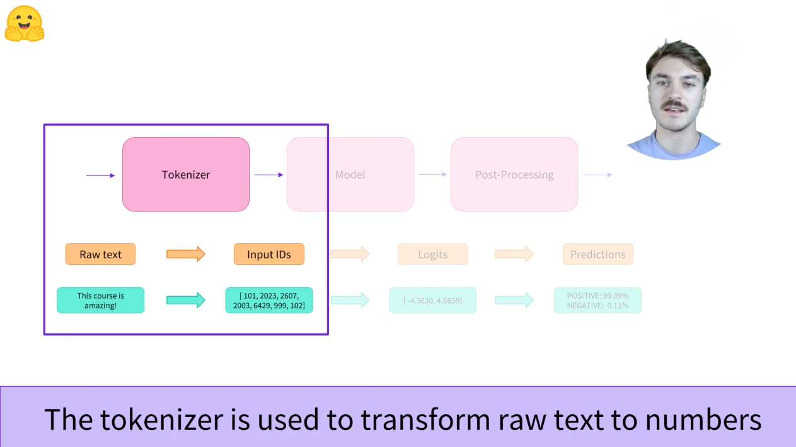
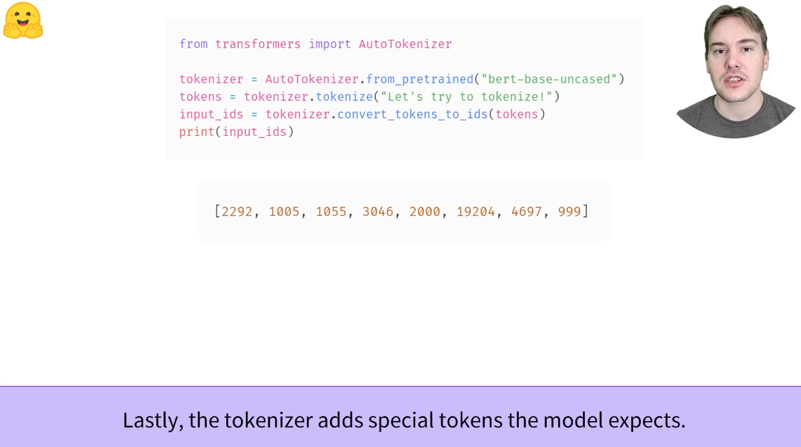

# 2.4 Tokenizers

<font color='red'>
相关代码见：

HuggingFaceStartCourses/2_Using Hugging Face Transformers/2_4_Tokenizers.ipynb
</font>  

综述&[视频](https://youtu.be/VFp38yj8h3A)学习
Tokenizers High level overview

在自然语言处理领域，绝大多数的数据是raw text


tokenizer被用来将原文本转化为一种数字



tokenizer的目标是站到对于原文本的一种有意义的表达


将从三种方法对tokenizer进行分析，分别是词级别，字符级别，subword级别


Tokenizers是NLP pipeline的核心组件之一。它们由一个目的：将文本转换为模型可以处理的数据。模型只能处理数字，因此标记器需要将文本输入转换为数字数据。在本节中，我们将详细探讨标记化管道中发生的情况

在NLP任务中，通常处理的数据是原始文本。以下是此类文本的一个示例：

> Jim Henson was a puppeteer

然而，模型只能处理数字，因此我们需要找到一种将原始文本转换为数字的方法。这就是Tokenizer所做的，有很多方法可以做到这一点。目标是找到最有意义的表示——也就是说，对模型最有意义的表示——以及，如果可能的话，找到最小的表示。

让我们看一些标记化算法的示例，并尝试回答一些关于标记化的问题。

## 2.4.1 Word-based
词级别的tokenizer方法，splitting a raw text into words

[视频学习](https://youtu.be/nhJxYji1aho)


2：一句文本以空格作为分隔符进行分隔


3：每一个单词有其特定的ID


4：非常相近的单词可能有着完全不同的含义


5：如果把所有词都加入词典的话，这个词典会非常大


6：大的词典带来的结果就是大重量的模型


7：我们可以限制我们加入词典中单词的数量，例如按照单词的出现频率进行加入


8：不在词表中的单词OOV会带来loss


9：gonna和malapromisms都不在词典中，IDs都变成了UNKNOWN这样相同的表示，在loss的计算中会有相应的处理


想到的第一种标记器是基于单词的。它通常非常容易设置和使用，只需要一些规则，并且通常会产生不错的结果。例如，在下图中，目标是将原始文本拆分为单词，并为每个单词找到数字表示：


分割文本的方法有很多种。例如，我们可以通过应用Python的**split**函数，使用空格将文本标记为单词：

```python
tokenized_text = "Jim Henson was a puppeteer".split(' ')
print(tokenized_text)

>>> ['Jim', 'Henson', 'was', 'a', 'puppeteer']

# 注：puppeteer，木偶演员
```

还有一些单词标记器的变体，他们对标点符号有额外的规则。使用这种标记器，我们可以得到一些相当大的“词汇表”，其中词汇表由我们在语料库中拥有独立标记的综述来定义。

每个单词都分配了一个ID，从0开始，一直到词汇表的大小。模型使用这些ID来识别每个单词。

如果我们想用基于单词的tokenizer完全覆盖一种语言，我们需要为语言中的每个单词都有一个标识符，这将生成大量的标记。例如英语中有超过50万个单词，因此要从每个单词到输入ID建立一个映射，我们需要跟踪这么多的ID。此外，像dog这样的词会与像dogs这样的词表示不同，模型最初无法知道dog和dogs是相似的：它会将这两个词识别为不相关的。这同样适用于其他类型的词，如run和running，模型最初不会认为它们相似的

最后，我们需要一个自定义标记来表示不在词汇表中的单词。这成为“unknown”token，通常用“[UNK]”或者“”来表示。如果您看到tokenizer正在生成大量这些标记，这通常是一个不好的迹象，因为它无法检索单词的合理表示，并且您正在丢失信息。制作词汇表时的目标是这样做，即标记器将尽可能少的单词标记为未知标记。

减少位置标记数量的一种办法是更进一步，使用基于字符级别的tokenizer

## 2.4.2 Character-based
字符级别的tokenizer方法

[视频学习](https://youtu.be/ssLq_EK2jLE)

1：Splitting a raw text into characters


2：


3：词典表会更小，例如英文+数字+特殊标记，可能只有几百个


4：更少的OOV


5：size会很大，一个tensor的size由其字符数决定


字符级别的tokenizer将文本拆分为字符，而不是单词。这有两个主要好处：
* 词典表会更小
* 更少的oov现象产生，因为每个单词都是由字符组成的

但这里也出现了一些关于空格和标点符号的问题：


这种方法也不完美。由于现在的表示方法是基于字符而不是单词，人们可以说，从直觉上看，它没有那么有意义：每个字符本身并不意味着什么，而单词就是一个含义。然而，这又因不同的语言有所不同，例如，在汉语中，每个字符比拉丁语中的一个字符承载更多的信息。（注：汉语的字符级别汉字本来就很多了，大大超过英语的26个）

另一个需要考虑的问题是，我们的模型将要处理大量的token，而一个单词只能是一个带有基于单词令牌的单一令牌，而当转换成字符时，它很容易编程10个或更多个token。

为了充分利用这两种方法，我们可以使用第三种结合了这两种方法的技术：子词标记化（*subword-tokenization*）。

## 2.4.3 Subword tokenization
子词级别的tokenization

[视频学习](https://youtu.be/zHvTiHr506c)

1：Splitting a raw text into subwords


2：单词级别和字符级别的tokenization各自有各自的问题


3：子词级别的tokenizer使用的思想是：频繁出现的词不应该被分割成更小的子词，而不常见的词应该被拆解为具有含义的subwords


4：例如常见的dog，不应该被字符级别的拆分拆分为d o g，而是应该一个整体的dog。dogs应该被拆分为dog s，这样更加能理解dog和dogs之间是有一定关系的


5：不常见的词，比如tokenization，应该被拆分为token和ization这两个具有一定含义的词


6：子词有助于对相同意思的单词产生相同的理解效果


7：在BERT所使用的的subword-tokenization中，被拆分后的词前边会用##进行区分（代表是一个结尾的词）

例如在之前的自我尝试中，Huggingface这样一个不常见的词，被拆分成为Hugging，##face


8：大多数现在的sota英语工作，都使用了这种子词级别的tokenization方法。其中细分还可以有不同的，例如WordPiece，Unigram，Byte-Pair Encoding


子词标记化算法所依据的原则是，频繁使用的词不应分割为较小的子词，但稀有词应分解为有意义的子词。

例如，“annonyingly”可能被认为是一个罕见的词，可以分解为“annonying”和“ly”。这两个词都可能更频繁地作为独立的子词出现，同时“annonyingly”的意思由“annonying”和“ly”的复合意思保留。

下面是一个示例，显示子词标记化算法如何标记序列“Let's do tokenization!”


这些子词最终提供了很多语义：例如，在上面的示例中，“tokenization”被分解成“token”和“ization”，这两个标记在节省空间的同时具有语义意义（只需要两个标记来表示一个长单词）。这使得我们能够对小型词汇表进行良好的覆盖，并且几乎没有未知的标记。

这种方法在粘着语言（如土耳其语）中特别有用，在这种语言中，您可以通过将子词串在一起形成（几乎）任意长的复杂单词。

### 2.4.3.1 And more!

毫不奇怪，还有更多的技术。举几个例子：
* 字节级BPE，如GPT-2中所用
* WordPiece，如BERT中所用
* SentencePiece or Unigram，用于多种语言模型

您现在应该对标记化器的工作方式有足够的了解，以便开始使用API。

## 2.4.4 Loading and saving

加载和保存tokenizer与加载和保存模型一样简单。实际上，它基于两种相同的方法，**from_pretrained**和**save_pretrained**。这些方法将加载或保存tokenizer所使用的的算法（有点像模型的architecture）及其词汇表（有点像模型的权重weights）。

加载和使用与BERT相同检查点训练的BERT标记器与加载模型的方式相同，只是我们使用**BertTokenizer**类
```python
from transformers import BertTokenizer

tokenizer = BertTokenizer.from_pretrained("bert-base-cased")
```


与**AutoModel**类似，**AutoTokenizer**类将根据检查点名称在库中获取适当的标记器类，并可直接用于任何检查点：
```python
from transformers import AutoTokenizer

tokenizer = AutoTokenizer.from_pretrained("bert-base-cased")
```

我们现在可以使用tokenizer，如前一节所示的那样：
```python
from transformers import AutoTokenizer

tokenizer = AutoTokenizer.from_pretrained("bert-base-cased")
tokenizer("Using a Transformer network is simple")

>>> {'input_ids': [101, 7993, 170, 13809, 23763, 2443, 1110, 3014, 102], 'token_type_ids': [0, 0, 0, 0, 0, 0, 0, 0, 0], 'attention_mask': [1, 1, 1, 1, 1, 1, 1, 1, 1]}
```

保存tokenizer与保存模型相同
```python
from transformers import AutoTokenizer

tokenizer = AutoTokenizer.from_pretrained("bert-base-cased")
tokenizer("Using a Transformer network is simple")
tokenizer.save_pretrained("/content/my-tokenizer") # 保存

>>> ('/content/my-tokenizer/tokenizer_config.json',
    '/content/my-tokenizer/special_tokens_map.json',
    '/content/my-tokenizer/vocab.txt',
    '/content/my-tokenizer/added_tokens.json',
    '/content/my-tokenizer/tokenizer.json')
```

我们将在第3章中更多地讨论token_type_ids，并且我们会在之后讨论attention_mask。首先，让我们看看input_ids是如何生成的。要做到这一点，我们需要查看标记器的中间方法。

## 2.4.5 Encoding
主要是tokenization这一个过程中的encoding过程

[视频学习]()：The tokenization pipeline

1：tokenzier很有用


2：tokenizer的几个步骤，拆分原句，加入special tokens，tokens转化为IDs作为一种数值的tensor输入


3：第一个步骤是把一句话拆分成为tokens，注意，不同的模型可能有不同的tokenizer方法


4：tokens转化为ids



5：input_ids再来一个tokenizer.prepare_for_model(input_ids)方法拼上开始的[CLS]和结尾的[SEP]


6：组合在一起，直接tokenizer，而不是调用tokenizer的各种方法


上述的过程可用如下一些代码进行描述：
拆分式
```python
from transformers import AutoTokenizer

tokenizer = AutoTokenizer.from_pretrained("bert-base-uncased")
tokens = tokenizer.tokenize("Let's try to tokenize!")
print("tokens: ", tokens)

input_ids = tokenizer.convert_tokens_to_ids(tokens)
print("input_ids: ", input_ids)

final_inputs = tokenizer.prepare_for_model(input_ids)
print("final_inputs: ", final_inputs)

# 简易的decode
print(tokenizer.decode(final_inputs['input_ids']))

>>> tokens:  ['let', "'", 's', 'try', 'to', 'token', '##ize', '!']
    input_ids:  [2292, 1005, 1055, 3046, 2000, 19204, 4697, 999]
    final_inputs:  {'input_ids': [101, 2292, 1005, 1055, 3046, 2000, 19204, 4697, 999, 102], 'token_type_ids': [0, 0, 0, 0, 0, 0, 0, 0, 0, 0], 'attention_mask': [1, 1, 1, 1, 1, 1, 1, 1, 1, 1]}
    [CLS] let's try to tokenize! [SEP]
```

组合式
```python
from transformers import AutoTokenizer

tokenizer = AutoTokenizer.from_pretrained("bert-base-uncased")
final_inputs = tokenizer("Let's try to tokenize!")

# 简易的decode
print(tokenizer.decode(final_inputs['input_ids']))

>>> [CLS] let's try to tokenize! [SEP]
```

将文本转换为数字称为编码。编码分两步进行：tokenize，然后转换为input_ids。

如我们所见，第一步是将文本拆分为单词（或部分单词、标点符号等），通常称为tokenize。有多个规则可以控制该过程，这就是为什么我们需要使用模型名称实例化标记器，以确保我们使用与模型预训练时相同的规则。

第二步是将这些token转化为数字，这样我们就可以用它们构建一个张量，并将他们数额到模型中。为此，tokenizer有一个词汇表，这是我们在使用**from_pretrained**方法实例化它时下载的部分。同样，我们需要使用与模型预训练时相同的词汇表

为了更好地理解这两个步骤，我们将分别探讨它们。注意，我们将使用一些单独执行部分标记化管道的方法来显示这些步骤的中间结果，但实际上，您应该直接在输入上调用标记器（如第2节所示）。

### 2.4.5.1 Tokenization

tokenization这一过程由tokenizer的tokenize方法来完成
```python
from transfromers import AutoTokenizer
tokenizer = AutoTokenizer.from_pretrained("bert-base-cased")

sequence = "Using a Transformer network is simple"
tokens = tokenizer.tokenize(sequence)

print(tokens)

>>> ['Using', 'a', 'transform', '##er', 'network', 'is', 'simple']
```
此标记器是一个子词标记器：它拆分单词，直到获得可以由其词汇表表示的标记。transformer就是这种情况，它被分成两个标记：transform和##er。

### 2.4.5.2 From tokens to input IDs

把tokens转化为IDs的过程由tokenizer的**convert_tokens_to_ids**方法完成：
```python
ids = tokenizer.convert_tokens_to_ids(tokens)
print(ids)

>>> [7993, 170, 11303, 1200, 2443, 1110, 3014]
```

这些输出一旦转换为适当的框架张量，就可以作为本章前面所述模型的输入。

## 2.4.6 Decoding

解码则相反：从词汇索引中，我们想要得到一个字符串。这可以通过以下**decode**方法完成：
```python
decoded_string = tokenizer.decode([7993, 170, 11303, 1200, 2443, 1110, 3014])
print(decoded_string)

>>> 'Using a Transformer network is simple'
```

请注意，decode方法不仅将索引转换回标记，而且还将属于同一单词的标记组合在一起，以生成可读的句子。当我们使用预测新文本的模型时，这种行为将非常有用（无论是从提示生成的文本，还是对于翻译或摘要等顺序到顺序的问题）。

到现在为止，您应该已经了解了标记器可以处理的原子操作：标记化、转换为ID以及将ID转换回字符串。然而，我们只是冰山一角。在下一节中，我们将探讨我们的方法的局限性，并看看如何克服它们。