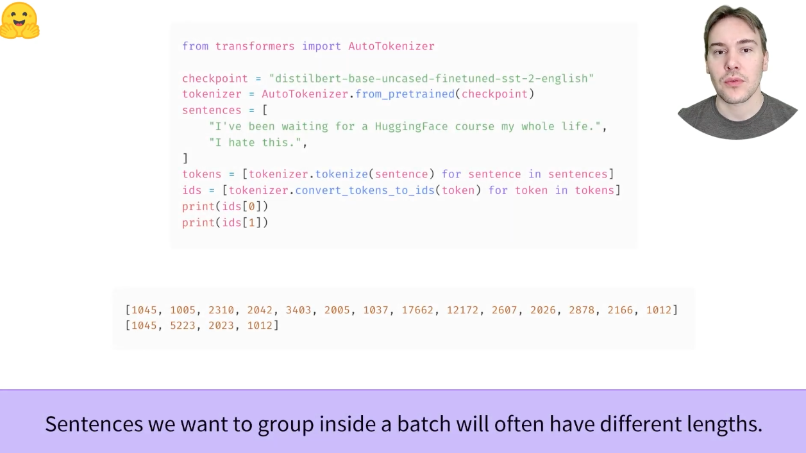

[toc]
# 2.5 Handling multiple sequences

## 2.5.1 Overview
部分代码见：
> HuggingFaceStartCourses/2_Using Hugging Face Transformers/2_4_Tokenizers.ipynb


开场引导&[视频](https://youtu.be/M6adb1j2jPI)学习

Batching inputs together(PyTorch)

How to batch inputs together? 

1：（这段代码值得学习）

```python
from transformers import AutoTokenizer

checkpoint = 'distilbert-base-uncased-finetuned-sst-2-english'
tokenizer = AutoTokenizer.from_pretrained(checkpoint)
sentences = [
    "I've been waiting for a HuggingFace course my whole life.",
    "I hate this."
]

tokens = [tokenizer.tokenize(sentence) for sentence in sentences]
ids = [tokenizer.convert_tokens_to_ids(token) for token in tokens]
print(ids[0])
print(ids[1])
```

2：pytorch的torch.tensor()方法的输入不接收不相同长度的列表

```python
from transformers import AutoTokenizer
import torch

checkpoint = 'distilbert-base-uncased-finetuned-sst-2-english'
tokenizer = AutoTokenizer.from_pretrained(checkpoint)
sentences = [
    "I've been waiting for a HuggingFace course my whole life.",
    "I hate this."
]

tokens = [tokenizer.tokenize(sentence) for sentence in sentences]
ids = [tokenizer.convert_tokens_to_ids(token) for token in tokens]
print(ids)
input_ids = torch.tensor(ids)
```

3：所以我们需要对较短的列表进行一个padding，可以看成都补成最长的那个列表。tokenizer实例化后的pad_token_id展示了应该用什么进行补全


补充：使用pad_token可以看是用什么token进行pad，也就是转换成id前的[PAD]这类的

4：但是如果只进行padding操作，输入到hugging face transformer model中是不行的，因为padding的0也被进入到模型的计算中去了，会导致不准确的现象产生

```python
from transformers import AutoModelForSequenceClassification

checkpoint = 'distilbert-base-uncased-finetuned-sst-2-english'
tokenizer = AutoTokenizer.from_pretrained(checkpoint)
sentences = [
    "I've been waiting for a HuggingFace course my whole life.",
    "I hate this."
]

tokens = [tokenizer.tokenize(sentence) for sentence in sentences]
ids = [tokenizer.convert_tokens_to_ids(token) for token in tokens]

tensor_ids0 = torch.tensor([ids[0]]) # 注意torch这里应该变成多个的输入，也就是[[]]二维列表
tensor_ids1 = torch.tensor([ids[1]])

print(tensor_ids0)
print(tensor_ids1)

tensor_idsall = torch.tensor(
    [[ 1045,  1005,  2310,  2042,  3403,  2005,  1037, 17662, 12172,  2607, 2026,  2878,  2166,  1012],
     [1045, 5223, 2023, 1012, 0, 0, 0, 0, 0, 0, 0, 0, 0, 0]]
)
print(tensor_idsall)

model = AutoModelForSequenceClassification.from_pretrained(checkpoint)
print(model(tensor_ids0).logits)
print(model(tensor_ids1).logits)
print(model(tensor_idsall).logits) # 可以看到这里对于ids1的得分计算实际上是错误的
```

5：应该在attention layer进行处理


6：为了去告诉attention层哪些应该是忽略的，我们应该把他们传入到一个attention_mask中


7：当有了具体的attention_mask后，就会得到相同的计算结果了


```python
from transformers import AutoModelForSequenceClassification

checkpoint = 'distilbert-base-uncased-finetuned-sst-2-english'
tokenizer = AutoTokenizer.from_pretrained(checkpoint)
sentences = [
    "I've been waiting for a HuggingFace course my whole life.",
    "I hate this."
]

tokens = [tokenizer.tokenize(sentence) for sentence in sentences]
ids = [tokenizer.convert_tokens_to_ids(token) for token in tokens]

tensor_ids0 = torch.tensor([ids[0]]) # 注意torch这里应该变成多个的输入，也就是[[]]二维列表
tensor_ids1 = torch.tensor([ids[1]])

print(tensor_ids0)
print(tensor_ids1)

tensor_idsall = torch.tensor(
    [[ 1045,  1005,  2310,  2042,  3403,  2005,  1037, 17662, 12172,  2607, 2026,  2878,  2166,  1012],
     [1045, 5223, 2023, 1012, 0, 0, 0, 0, 0, 0, 0, 0, 0, 0]]
)
print(tensor_idsall)

model = AutoModelForSequenceClassification.from_pretrained(checkpoint)
print("gt ids0的 logits", model(tensor_ids0).logits)
print("gt ids1的 logits", model(tensor_ids1).logits)
print("在model中不携带attention_mask参数：", model(tensor_idsall).logits) # 可以看到这里对于ids1的得分计算实际上是错误的

attention_mask = torch.tensor(
    [[1, 1, 1, 1, 1, 1, 1, 1, 1, 1, 1, 1, 1, 1],
     [1, 1, 1, 1, 0, 0, 0, 0, 0, 0, 0, 0, 0, 0]]
)
print("在model中带上attention_mask参数后：", model(tensor_idsall, attention_mask=attention_mask).logits)
```

8：在tokenizer的时候，使用padding=True参数，即可自动完成这一过程

```python
from transformers import AutoTokenizer

checkpoint = 'distilbert-base-uncased-finetuned-sst-2-english'
tokenizer = AutoTokenizer.from_pretrained(checkpoint)
sentences = [
    "I've been waiting for a HuggingFace course my whole life.",
    "I hate this."
]

input_ids = tokenizer(sentences, padding=True) # 注意这里是一个整体的过程，直接tokenizer()
print(input_ids) # 注意这种整体的过程如果作为输入，需要用**处理一下
```
在上一节中，我们探讨了最简单的用例：对一个小长度的序列进行推理。然而，一些问题已经出现：
* 我们如何处理多个序列？
* 我们如何处理不同长度的多个序列？
* 词汇索引是让模型正常用作的唯一输入吗？
* 是否存在序列太长的问题？

让我们看看这些问题会带来什么样的问题，以及我们如何使用🤗 transformer API。

## 2.5.2 Models expect a batch of inputs

在上一个练习中，您看到了序列如何转换为数字列表。让我们将此数字列表转换为tensor，并将其发送到模型
```python
from transformers import AutoTokenizer, AutoModelForSequenceClassification
import torch

checkpoint = "distilbert-base-uncased-finetuned-sst-2-english"
tokenizer = AutoTokenizer.from_pretrained(checkpoint)
model = AutoModelForSequenceClassification.from_pretrained(checkpoint)

sequence = "I've been waiting for a HuggingFace course my whole life."

tokens = tokenizer.tokenize(sequence)
ids = tokenizer.convert_tokens_to_ids(tokens)
# input_ids = torch.tensor(ids) # 会报错 IndexError: Dimension out of range (expected to be in range of [-1, 0], but got 1)
input_ids = torch.tensor([ids]) # 改成这样列表套列表就行了

model(input_ids)
```

以上代码中，我们尊重了第2节中的pipeline，但为什么错误了

问题是我们向模型发送了一个序列，而huggingface transformers模型默认情况下需要多个句子。在这里，当我们将tokenizer应用于序列时，我们尝试在幕后执行标记器所做的一切，但如果仔细观察，您会发现它不仅将ID列表转换为张量，而且在顶部添加了一个维度
```python
tokenized_inputs = tokenizer(sequence, return_tensors="pt")
print(tokenized_inputs["input_ids"])
>>> tensor([[  101,  1045,  1005,  2310,  2042,  3403,  2005,  1037, 17662, 12172,
    2607,  2026,  2878,  2166,  1012,   102]])
```

当我们也加入一个新的维度后，打印inputs_ids和logits，都能正常输出了：
```python
from transformers import AutoTokenizer, AutoModelForSequenceClassification # 简单情感分类的例子

checkpoint = "distilbert-base-uncased-finetuned-sst-2-english"
tokenizer = AutoTokenizer.from_pretrained(checkpoint)
model = AutoModelForSequenceClassification.from_pretrained(checkpoint)

sequence = "I've been waiting for a HuggingFace course my whole life." # 

tokens = tokenizer.tokenize(sequence)
ids = tokenizer.convert_tokens_to_ids(tokens)

input_ids = torch.tensor([ids])
print("input_ids: ", input_ids)
>>> input_ids:  tensor([[ 1045,  1005,  2310,  2042,  3403,  2005,  1037, 17662, 12172,  2607,
    2026,  2878,  2166,  1012]])

output = model(input_ids)
print("logits: ", output.logits)
>>> logits:  tensor([[-2.7276,  2.8789]], grad_fn=<AddmmBackward>)
```

批处理是一次通过模型发送多个句子的行为。如果你只有一句话，可以用一个序列构建一个批次
```python
batches_ids = [ids, ids]
```
批处理允许模型在输入多个句子时工作。使用多个序列就像使用单个序列构建批一样简单。不过，还有第二个问题。当试图将两个或更多句子组合在一起的时候，它们的长度可能不同。在张量的使用上其必须是矩形（自：也就是说在dim0上所有的tensor维度应该是统一的），因此无法将input_ids列表直接转化为tensor。为了解决这个问题，我们通常使用padding的方法填充输入。

## 2.5.3 Padding the inputs

如下的列表不能被转化为tensor：
```python
batched_ids = [
    [200, 200, 200],
    [200, 200]
]
```
为了解决这个问题，我们将使用填充使张量是一个矩形的形状。填充确保所有句子的长度相同，方法是在值较少的句子中添加一个称为填充标记的特殊单词。例如，如果您有10个10词的句子，和一个20词的句子，填充将确保所有句子都是20字。在我们的示例中，生成的张量如下所示：
```python
padding_id = 100

batched_ids = [
    [200, 200, 200],
    [200, 200, padding_id]
]
```
padding的token可以在tokenizer.pad_token中找到
padding的token id可以在tokenizer.pad_token_id中找到
```python
model = AutoModelForSequenceClassification.from_pretrained(checkpoint)

sequence1_ids = [[200, 200, 200]]
sequence2_ids = [[200, 200]]
batched_ids = [[200, 200, 200], [200, 200, tokenizer.pad_token_id]]

print(model(torch.tensor(sequence1_ids)).logits)
>>> tensor([[ 1.5694, -1.3895]], grad_fn=<AddmmBackward>)

print(model(torch.tensor(sequence2_ids)).logits)
>>> tensor([[ 0.5803, -0.4125]], grad_fn=<AddmmBackward>)

print(model(torch.tensor(batched_ids)).logits)
>>> tensor([[ 1.5694, -1.3895],
    [ 1.3373, -1.2163]], grad_fn=<AddmmBackward>)
```
我们批处理预测中的logit有点问题：第二行应该与第二句的logit相同，但我们得到了完全不同的值

这是因为Tranformer模型的关键特性是将每个标记上下文化的attention layer。这些将考虑填充标记，因为他们涉及序列的所有标记。为了在通过模型传递不同长度的单个句子，或传递应用了相同句子和填充的批次时获取相同的结果，我们需要告诉这些attention layer**忽略**填充标记。这些是通过attention_mask来实现的。

## 2.5.4 Attention masks
attention_mask是与input_ids tensor完全形状相同的tensor，用0和1填充：1表示应注意相应的标记，0表示不应注意相应的标记（即模型的attention layer应该忽略他们）

用attention_mask完成上一个示例
```python
batched_ids = [
    [200, 200, 200],
    [200, 200, tokenizer.pad_token_id]
]

attention_mask = [
    [1, 1, 1],
    [1, 1, 0]
]

outputs = model(torch.tensor(batched_ids), attention_mask=torch.tensor(attention_mask))
print(outputs.logits)
>>> tensor([[ 1.5694, -1.3895],
    [ 0.5803, -0.4125]], grad_fn=<AddmmBackward>)
```
现在我们得到了该批中第二个句子的相同logits
请注意，第二个序列的最后一个值是一个填充ID，他在attention_mask中是一个0值。

## 2.5.5 Longer sequences

对于transformer模型，我们可以我们可以通过模型的序列长度是有限的。大多数模型处理512个或者1024个token的序列，党要求处理更长的序列时模型就不能支持工作了。这种问题有两种解决方案：
* 使用支持的序列长度较长的模型
* 截断序列

模型有不同的支持序列长度，有些模型专门处理很长的序列。[Longformer](https://huggingface.co/transformers/model_doc/longformer.html)是一个例子，另一个是[LED](https://huggingface.co/transformers/model_doc/led.html)。如果您正在处理一项需要很长序列的任务，可以查看这些模型。

否则，建议通过指定max_sequence_length参数来截断序列：（这里是在最最开始，直接把input做截断）
```python
sequence = sequence[: max_sequence_length]
```