[toc]
# 2.8 End-of-chapter quiz

## 2.8.1 自选择+笔记

1：注意，首先拿到的是一些prediction，之后可能要再通过一次tokenizer才能转化为text
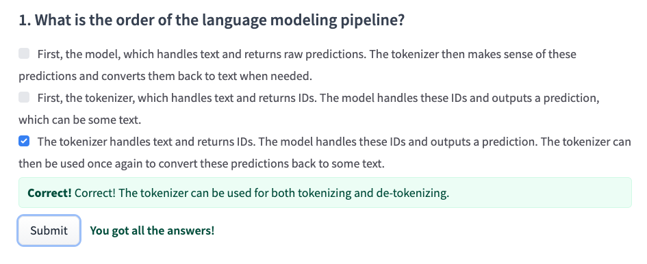

2：想一想那个[1, 14, 768]的例子，1是batch_size，14是长度，768是hidden_size
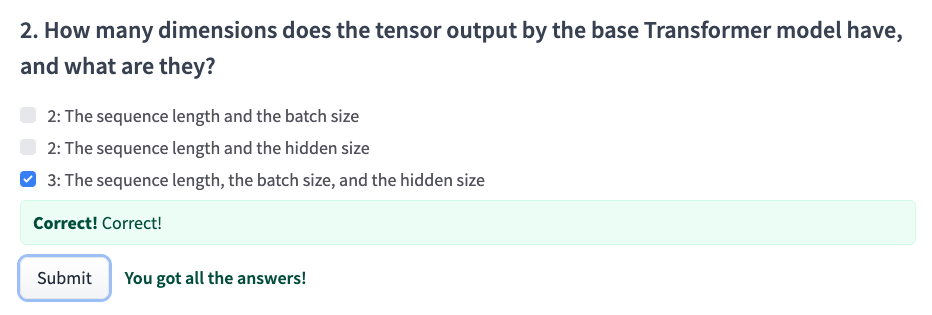

3：subword级别是现在最常用的，能综合一些优缺点，主要是弥补word级别的OOV等不足
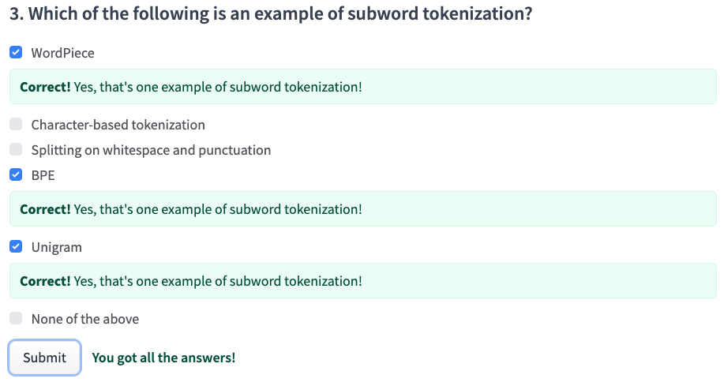

4：model head感觉可以理解为经过transformer后的，针对指定任务的一个head的感觉
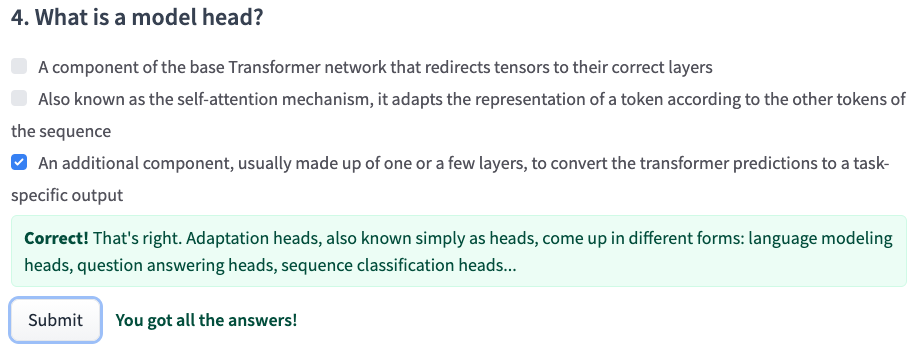

5：from transformers import AutoModel
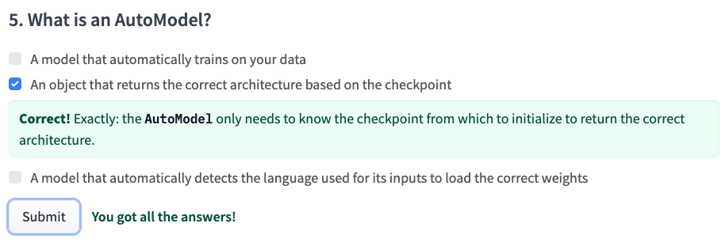

6：这里truncation也是一种方法，自己漏选了
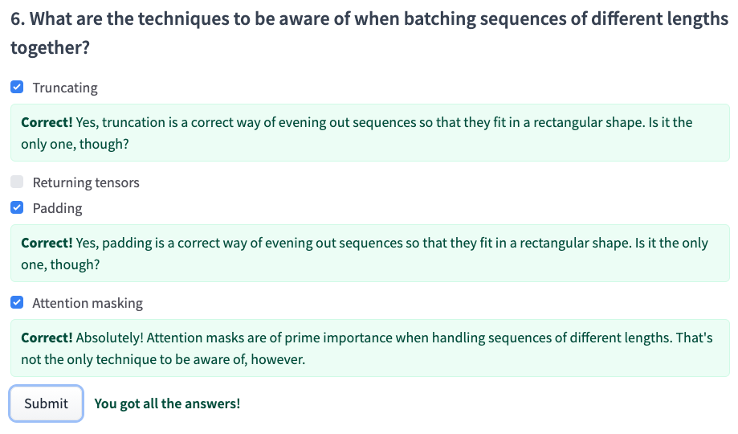

7：
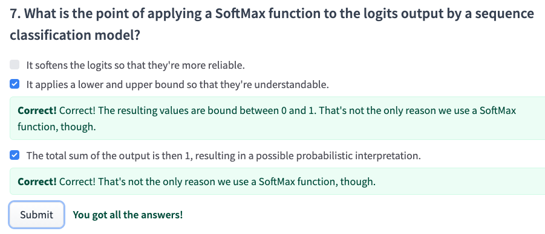

8：核心是直接调用tokenizer()
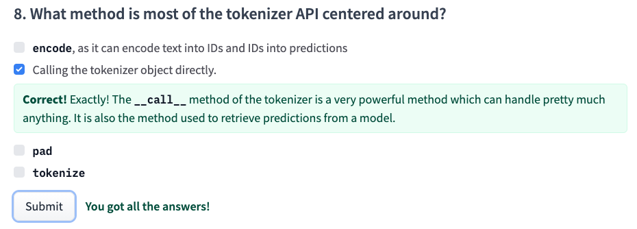

9：

10：对这个例子来说，输入是一句而不是一个batch
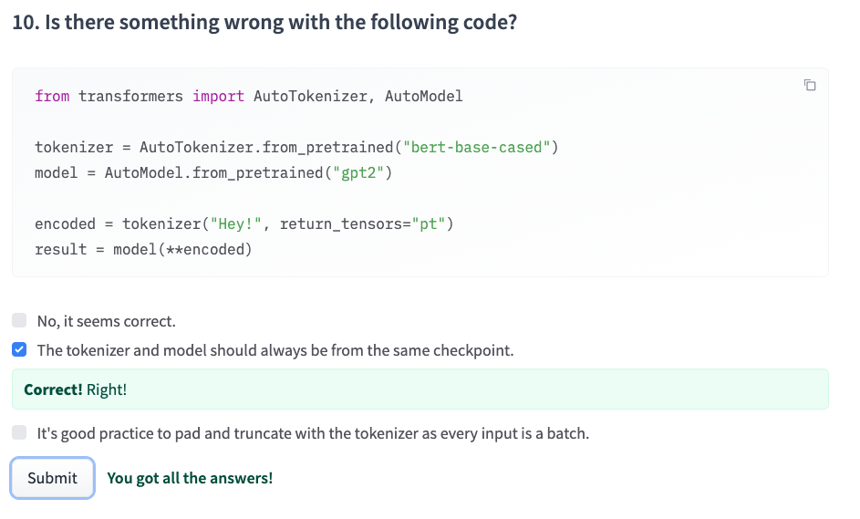

## 2.8.2 全部答案+说明截图

1：
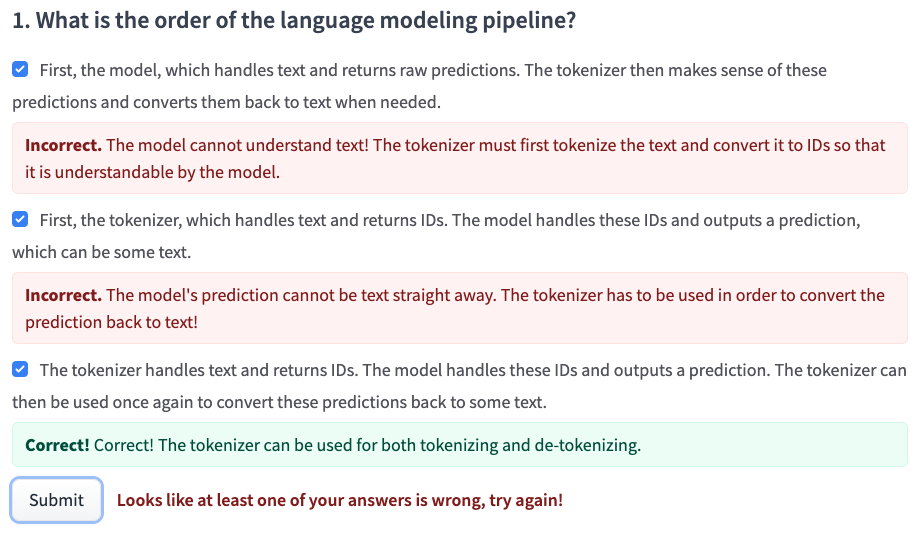

2：
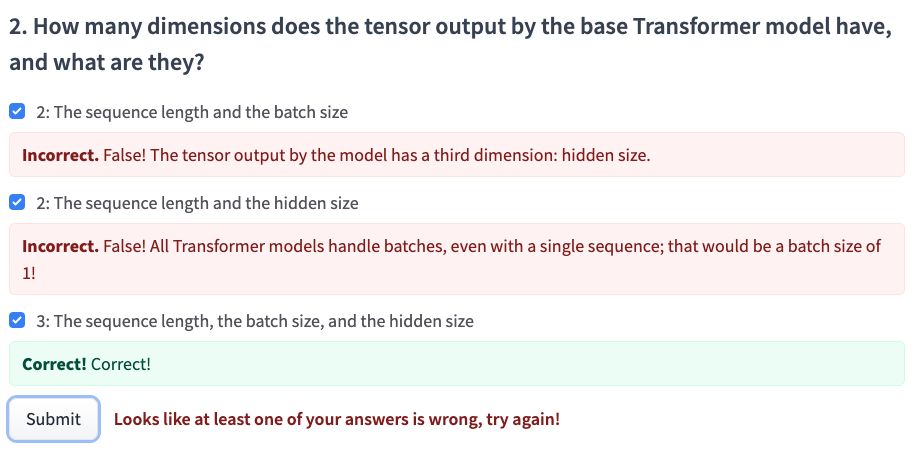

3：
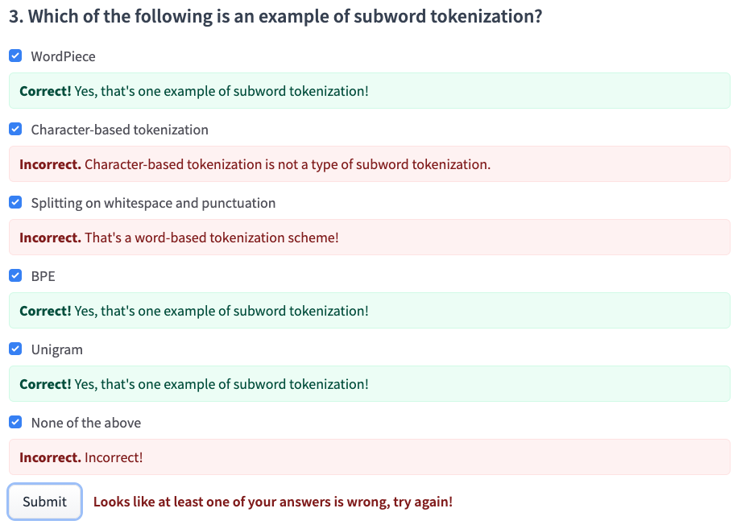

4：
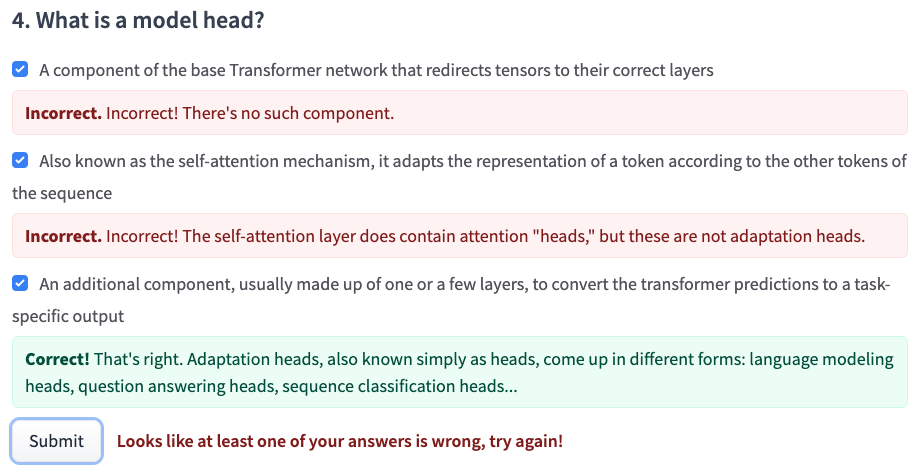

5：
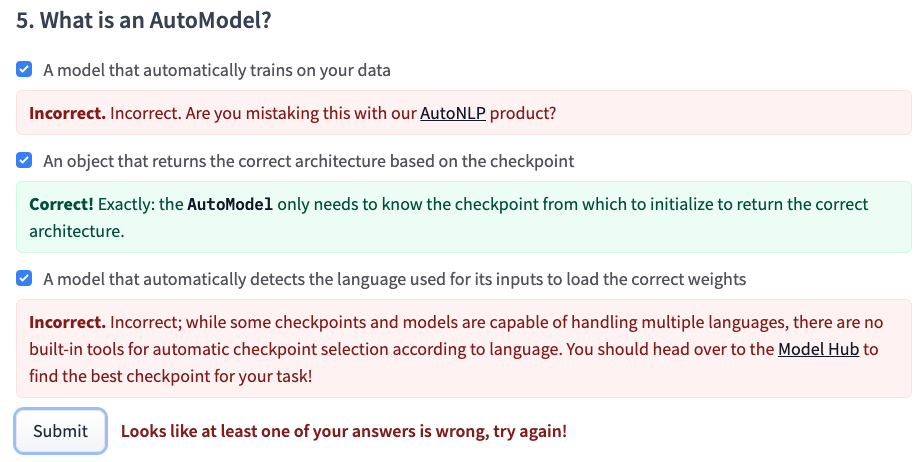

6：

7：
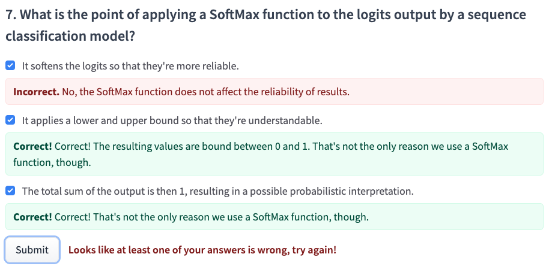

8：
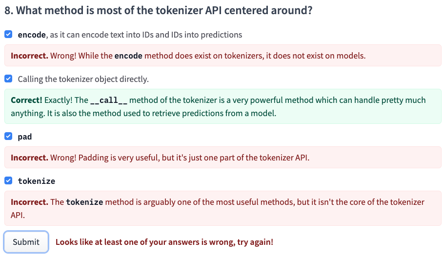

9：
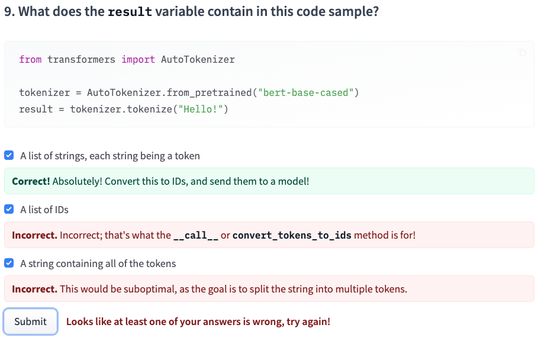

10：
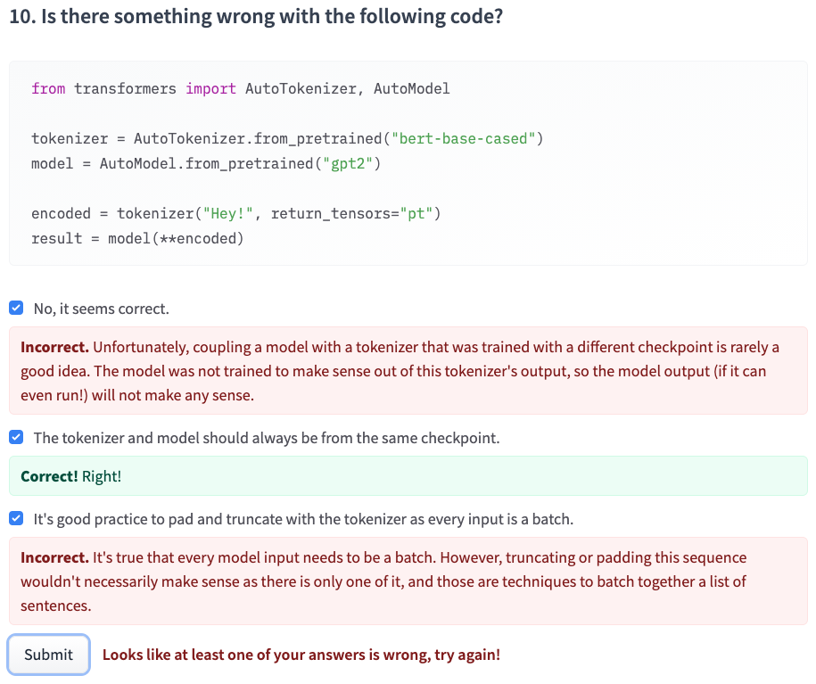

