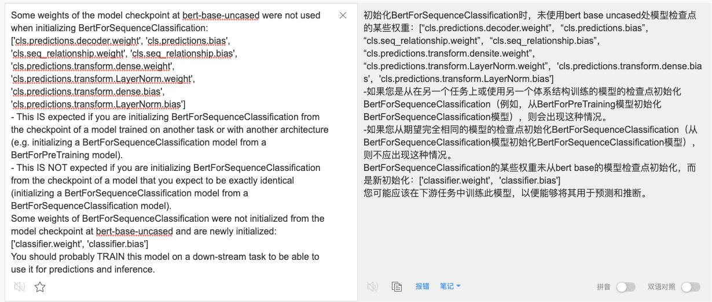
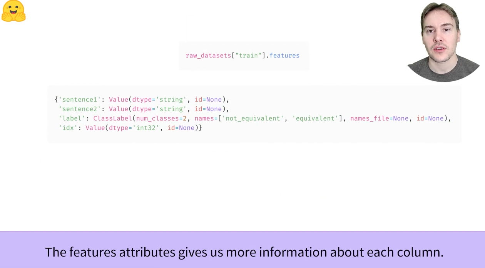
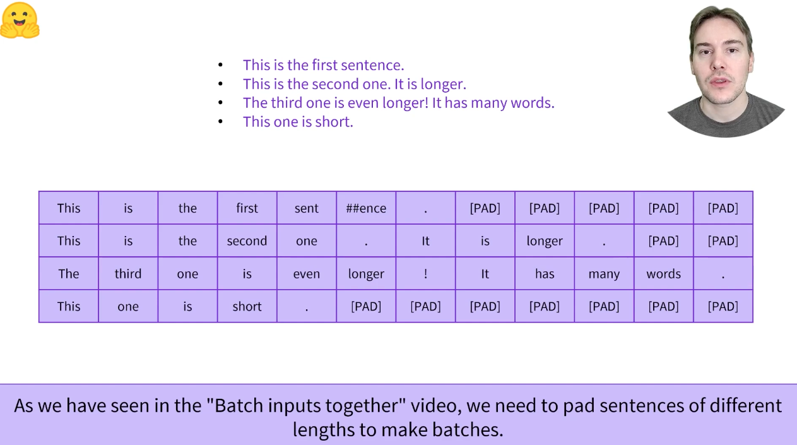

[toc]
# 3.2 Processing the data

代码见：
> 

## 3.2.1 Overview
继续上一章的示例，下面是我们如何在PyTorch中的一个batch上训练序列分类器：

```python
import torch
from transformers import AdamW, AutoTokenizer, AutoModelForSequenceClassification

# 和之前的一样
checkpoint = "bert-base-uncased"
tokenizer = AutoTokenizer.from_pretrained(checkpoint)
model = AutoModelForSequenceClassification.from_pretrained(checkpoint)

sequences = [
    "I've been waiting for a HuggingFace course my whole life.",
    "This course is amazing!",
]
batch_input_ids = tokenizer(sequences, padding=True, truncation=True, return_tensors="pt")

# 新内容！！！
batch_input_ids["labels"] = torch.tensor([1, 1])

optimizer = AdamW(model.parameters())
loss = model(**batch_input_ids).loss
loss.backward()
optimizer.step()
```


当然，仅仅用两句话训练模型不会产生很好的效果。为了获得更好的效果，您需要准备一个更大的数据集

在本节中，我们将以William B. Dolan等在一篇论文中介绍的MRPC(Microsoft Research Paraphrase Corpus)数据集为例。该数据集由5801对句子组成，带有一个标签，指示它们是否为直译（即，如果两个句子的意思相同）。我们在本章中选择了它，因为它是一个小数据集，所以很容易对它进行训练。
https://blog.csdn.net/weixin_43269174/article/details/106382651


## 3.2.2 Loading a dataset from the Hub

[视频学习](https://youtu.be/_BZearw7f0w)Datasets: A Quick Overview
1：这个datasets是一个库需要通过pip install安装。HuggingFace的Datasets library 可以让人更加容易的下载和缓存datasets


2：我们可以很容易的通过key来选择是train/validation/test，然后通过一个角标的index来访问其中的element，num_rows应该是总条目数的意思


```python
from datasets import load_dataset

raw_datasets = load_dataset("glue", "mrpc")

print(raw_datasets["train"])

print(raw_datasets["train"][0])
print(raw_datasets["train"][3667])
# print(raw_datasets["train"][3668]) # 报错了，因为一共就3668条
```

3：也可以通过[:5]的方式进行截断的输出

```python
from datasets import load_dataset

raw_datasets = load_dataset("glue", "mrpc")

print(raw_datasets["train"])

print(raw_datasets["train"][:5])
```

4：raw_datasets["train"]**.features**这个**元素**给了我们每列更加详细的信息



5：我们需要把目前的raw_dataset经过进一步的tokenize处理，使用raw_dataset.map()方法，传入的参数是一个function，代表进行的mapping处理

['sentence1', 'sentence2', 'label', 'idx', 'input_ids', 'token_type_ids', 'attention_mask'] 这里的各个feature意思分别是（可通过.features查看）：
* sentence1：第一句话
* sentence2：第二句话
* label：该组数据的label，按照之前的说法是是否相等的意思
* idx：原始的index
* input_ids：两句话组合在一起经过tokenizer共同处理后的
* token_type_ids是这里特有的用来区分第一句还是第二句的...
* attention_mask代表哪些是会被attention的部分


6：在map方法中， 用batched=True，可以加快处理效率


7：对这个tokenized_datasets再删除一些行并且重命名， 就可以用来训练了
```python
.remove_columns(["idx", "sentence1", "sentence2")
.rename_columns("label", "labels")
.with_format("torch")
```
（总结来看，这个datasets对象的方法非常多啊，另外由于这些方法可能不会修改原来的Datasets对象，所以可能要进行赋值类的调用）


8：从大的数据集可以进一步再划分一些小的数据集
```python
small_train_dataset = tokenized_dataset["train"].select(range(100))
```


以上视频学习的代码总结为：
```python
from datasets import load_dataset
from transformers import AutoTokenizer

# datasets加载
raw_datasets = load_dataset("glue", "mrpc")

# checkpoint, tokenizer, tokenize_function
checkpoint = 'bert-base-cased'
tokenizer = AutoTokenizer.from_pretrained(checkpoint)

def tokenize_function(example):
    return tokenizer(example["sentence1"], example["sentence2"], padding="max_length", truncation=True, max_length=128)

# 处理后的datasets
tokenized_datasets = raw_datasets.map(tokenize_function, batched=True)

# 删除一些行等
tokenized_datasets = tokenized_datasets.remove_columns(["idx", "sentence1", "sentence2"])
tokenized_datasets = tokenized_datasets.rename_column("label", "labels")
tokenized_datasets = tokenized_datasets.with_format("torch")

print(tokenized_datasets["train"]) # 打印查看特性
print(tokenized_datasets["train"].features) # 打印查看特性

small_train_dataset = tokenized_datasets["train"].select(range(100))
print(small_train_dataset)
```

HuggingFace的Hub并不只是包括模型，也有许多不同语言的多个数据集。可以在[此处](https://huggingface.co/datasets)浏览数据集。建议在阅读本节后尝试加载和处理新的数据集（请参阅[此处](https://huggingface.co/docs/datasets/loading_datasets.html#from-the-huggingface-hub)的常规文档）。但现在，让我们关注MRPC数据集，这是组成[GLUE基准](https://gluebenchmark.com/)的10个数据集之一，GLUE基准是一个学术基准，用于测量10个不同文本分类任务中ML模型的性能。

这个HuggingFace Datasets library提供了一个非常简单的命令来从Hub上下载数据集并缓存。我们可以像这样下载MRPC数据集
```python
from datasets import load_dataset

raw_datasets = load_dataset("glue", "mrpc")
raw_datasets

>>> DatasetDict({
        train: Dataset({
            features: ['sentence1', 'sentence2', 'label', 'idx'],
            num_rows: 3668
        })
        validation: Dataset({
            features: ['sentence1', 'sentence2', 'label', 'idx'],
            num_rows: 408
        })
        test: Dataset({
            features: ['sentence1', 'sentence2', 'label', 'idx'],
            num_rows: 1725
        })
    })
```
正如所看到的，我们得到了一个**DatasetDict**类型的对象，其中包括**训练集，验证集和测试集**。每一个都包含若干列（**sentence1**, **sentence2**, **label**, **idx**）和variable行数，这些行数是每个集合中的元素数（因此，训练集中有3668对句子，验证集中有408对句子，测试集中有1725对句子）

load_dataset("glue", "mrpc")这句命令下载并缓存数据集，默认情况下在~/.cache/huggingface/dataset目录下。回想与第2章相同的，可以通过设置HF_HOME环境变量自定义缓存文件夹。

我们可以通过索引（如使用字典）访问原始数据集对象中的每对句子：

自：这里DatasetDict对象也是一个dict，需要先用索引（train/validation/test）来找到对应的Dataset对象！！！
```python
raw_train_dataset = raw_datasets["train"]
raw_train_dataset[0]
>>> {'idx': 0,
    'label': 1,
    'sentence1': 'Amrozi accused his brother , whom he called " the witness " , of deliberately distorting his evidence .',
    'sentence2': 'Referring to him as only " the witness " , Amrozi accused his brother of deliberately distorting his evidence .'}
```

我们可以看到labels已经是整数了，所以我们不需要在那里做任何预处理。为了知道哪个整数对应于哪个标签，我们可以检查**raw_train_dataset**的**features**。这将告诉我们每列的类型：
```python
raw_train_dataset.features
>>> {'sentence1': Value(dtype='string', id=None),
    'sentence2': Value(dtype='string', id=None),
    'label': ClassLabel(num_classes=2, names=['not_equivalent', 'equivalent'], names_file=None, id=None),
    'idx': Value(dtype='int32', id=None)}
```
在这个输出的背后，**label**是**ClassLabel**类型，整数到label name的映射存储在其中的names列表中。0对应not_equivalent，1对应equivalent

## 3.2.3 Preprocessing a dataset

[视频学习](https://www.youtube.com/watch?v=0u3ioSwev3s)Preprocessing pairs of sentences
1：我们已经在之前的学习过程中，学习到了怎么把sequences的话batch的tokenize了


2：但是文本分类任务也可能是在一对句子上进行的


3：事实上，在GLUE基准的10个数据集任务上，有8个都关注的是一对句子


4：像BERT一类的模型在预训练的过程中，要关注前后句子之间的关系（例如是不是前后的两句话这样的）


5：tokenizer也像单句话的那样，接收两句话前后的输入


6：tokenizer加入了token_type_ids来标识哪句话是第一句话，哪句话是第二句


7：来处理多个句子对输入，只要把他们按照相同的顺序以list传入即可


8：tokenizer自动化的准备好了具体的token_type_ids和attention masks


9：总结来说，这些input就可以被送入到模型中


为了预处理数据集，我们需要将文本转化为模型能够理解的数字。正如您在上一章中所看到的，这是通过tokenizer完成的。我们可以向tokenizer输入一个句子或者一组句子，因此我们可以直接标记每对句子的，所有第一个句子和所有第二个句子，如下所示（这是一种类似分开tokenize的方法）：
```python
from datasets import load_dataset
from transformers import AutoTokenizer

raw_datasets = load_dataset("glue", "mrpc")

checkpoint = "bert-base-uncased"
tokenizer = AutoTokenizer.from_pretrained(checkpoint)
tokenized_sentences_1 = tokenizer(raw_datasets["train"]["sentence1"])
tokenized_sentences_2 = tokenizer(raw_datasets["train"]["sentence2"])
```

然而，我们不能仅仅将两个序列传递给模型，然后预测这两句话是否是同意。我们需要成对处理这两个序列，并应用适当的预处理。幸运的是，标记器还可以获取一对序列，并按照我们的BERT模型所期望的方式进行准备：
```python
inputs = tokenizer("This is the first sentence.", "This is the second one.")
print(inputs)
>>> { 
        'input_ids': [101, 2023, 2003, 1996, 2034, 6251, 1012, 102, 2023, 2003, 1996, 2117, 2028, 1012, 102],
        'token_type_ids': [0, 0, 0, 0, 0, 0, 0, 0, 1, 1, 1, 1, 1, 1, 1],
        'attention_mask': [1, 1, 1, 1, 1, 1, 1, 1, 1, 1, 1, 1, 1, 1, 1]
    }
```
我们在第2章中讨论了**input_ids**和**attention_mask**这两个key，但是我们推迟了对**token_type_ids**类型标识的讨论。在这个例子中，这就是告诉我们模型输入的哪一部分是第一句，哪一部分是第二句

```text
try it out: Take element 15 of the training set and tokenize the two sentences separately and as a pair. What’s the difference between the two results?

answer：分开的tokenize会被弄成两句话，而一次性tokenize，会组合成一句长的话，并且很有可能加入了token_type_ids的标识
```

如果我们将上边这个input_ids进行解码
```python
tokenizer.conver_ids_to_tokens(inputs["input_ids"])
```
我们会得到如下的输出：
```python
>>> ['[CLS]', 'this', 'is', 'the', 'first', 'sentence', '.', '[SEP]', 'this', 'is', 'the', 'second', 'one', '.', '[SEP]']
```
因此，我们看到，当有两个句子时，模型期望输入的形式为[CLS]语句1[SEP]语句2[SEP]。并将其与token_type_ids对齐给到我们：
```python
['[CLS]', 'this', 'is', 'the', 'first', 'sentence', '.', '[SEP]', 'this', 'is', 'the', 'second', 'one', '.', '[SEP]']
[0, 0, 0, 0, 0, 0, 0, 0, 1, 1, 1, 1, 1, 1, 1]
```
就像所看到的，与[CLS]语句1[SEP]相对应的输入部分的token_type_ids均为0，而与语句2[SEP]相对应的其他部分token_type_ids类型ID均为1

请注意，如果选择不同的checkpoint，则tokenized的inputs中不一定有token_type_ids（例如，如果使用DistilBERT模型，则不会返回这些ID）。只有当模型知道如何处理它们时，才会返回它们，因为它在预训练过程期间见过它们。

在这里，BERT使用token_type_ids进行训练，在我们[第1章](https://huggingface.co/course/chapter1)中讨论的masked语言建模（masked language modeling, MLM）目标的基础上，它还有一个额外的目标，称为下一个句子预测。这项任务的目标是建立成对句子之间的关系模型。

在下一个句子预测中，模型被提供成对的句子（带有随机屏蔽的标记），并被要求预测第二个句子是否紧跟第一个句子。为了使任务变得不平凡，一般的时间句子在原始文档中相互跟随，另一半的时间两个句子来自两个不同的文档

一般来说，您不需要担心tokenize的结果中是否包括token_type_ids，只要对标记器和模型使用相同的checkpoint，就会达到比较好的效果，因为标记器知道向其模型提供什么。

现在我们已经了解了标记器如何处理一对句子，我们可以使用它来标记整个数据集，就像在上一章中一样，我们可以通过给标记器提供第一个句子的列表，然后是第二个句子的列表，来给标记器提供一个句子对列表。这也与我们在第2章中看到的padding和truncation选项兼容，因此，预处理训练数据集的一种方法是：
```python
tokenized_train_dataset = tokenizer(
    raw_datasets["train"]["sentence1"],
    raw_datasets["train"]["sentence2"],
    padding=True,
    truncation=True
)
```

这个能够很好的工作，但它的缺点是返回字典（带有我们的keys
, input_ids, attention_mask, token_type_ids 以及[[]]的values）。只有在标记化过程中有足够的内存存储整个数据集的时候，它才会起作用（而HuggingFace数据集库是存储在磁盘上的Apache Arrow文件，因此您只保留请求加载到内存中的样本）

为了将数据保持为数据集，我们使用[Dataset.map](https://huggingface.co/docs/datasets/package_reference/main_classes.html#datasets.Dataset.map)方法。如果我们需要做更多的预处理而不仅仅是tokenize，那么这也给了我们一些额外的灵活性。map方法的工作原理是在数据集的每个元素上应用一个函数，因此让我们定义一个标记输入的函数
```python
def tokenize_function(example):
    return tokenizer(example["sentence1"], example["sentence2"], truncation=True)
```
这个函数获取一个字典（与数据集的项类似），并返回一个新字典，其中包含的键是input_ids, attention_mask, token_type_ids，请注意如果example字典包含多个示例（每个键作为一个句子列表），那么它也可以工作，因为标记器可以处理成对的句子列表，如前所示。这将允许我们在调用map时使用batched=True选项，这将大大加快tokenize的速度。tokenizer由来自[HuggingFace的tokenize库](https://github.com/huggingface/tokenizers)。这个tokenizer可以非常快，但前提是我们一次给它大量的输入。

请注意，我们现在在tokenize_function中省略了padding参数。这是因为将所有样本填充到最大长度是无效的：最好在构建批时填充样本，因为这样我们只需要填充到该批次中的最大长度，而不是整个数据集的最大长度，当输入具有非常可变的长度时，这可以节省大量时间和处理能力。

下面是我们如何在所有数据集上同时应用标记化函数。我们在调用map时使用batched=True，因此该函数一次应用于数据集的多个元素，而不是单独应用于每个元素。这允许更快的预处理。
```python
tokenized_datasets = raw_datasets.map(tokenize_function, batched=True)
tokenized_datasets
```
HuggingFace 数据集库用此处理的方式是向数据集**添加新字段**，预处理函数返回的字典中的每个键对应一个字段：
```python
DatasetDict({
    train: Dataset({
        features: ['attention_mask', 'idx', 'input_ids', 'label', 'sentence1', 'sentence2', 'token_type_ids'],
        num_rows: 3668
    })
    validation: Dataset({
        features: ['attention_mask', 'idx', 'input_ids', 'label', 'sentence1', 'sentence2', 'token_type_ids'],
        num_rows: 408
    })
    test: Dataset({
        features: ['attention_mask', 'idx', 'input_ids', 'label', 'sentence1', 'sentence2', 'token_type_ids'],
        num_rows: 1725
    })
})
```
<font color='red'>
似乎还是没有理解为padding这个步骤到底去哪了，貌似是在本3-2章最后的一部分说的，一个dynamic padding的方法
</font>

通过传递**num_proc**参数，甚至可以在对Dataset.map应用预处理函数时使用多处理。我们没有在这里这样做是因为HuggingFace Tokenizers库已经使用多个线程来凯苏tokenize我们的样本，但如果您不使用该库支持的快速tokenizer，这可能会加快预处理。

我们的tokenize_function返回一个包含key，input_ids, attention_mask，和token_type_ids的字典，所以这三个字段被**添加**到数据集的所有拆分中。**请注意，如果我们的预处理函数为我们应用map的数据集中的现有键返回一个新值，那么我们也可以更改现有字段。**

当我们将元素批处理在一起时，我们需要做的最后一件事是将所有example填充到最长元素的长度上 —— 我们称之为动态填充技术。

## 3.2.4 Dynamic padding

[视频学习](https://youtu.be/7q5NyFT8REg)What is dynamic padding?
1：就像我们之前所看到的，我们需要对不同长度的句子进行padding的操作，以保证其可以转化为tensor


2：第一种方法是把全部的数据集，统一padding到数据集中长度最大的句子的那个长度，优点是所有的batch会有相同的shape，缺点是很多的batch会有完全用不到的padding，特别是在长短分布不均匀的数据集中


3：在动态padding下，按照每个batch进行padding。优点是每个地方每个batch会具有其最短的padding，缺点是由于不同batch可能具有不同的shape，在一些TPU GPU加速器上可能不适用。


4：MRPC dataset的fixed padding


5：


6：动态padding中，不需要在tokenize_function中加入padding参数


7：而是使用DataCollartorWithPadding，在Dataloader对象的创建中，加入collate_fn=xxx参数


fixed padding的代码为：
```python
from datasets import load_dataset
from transformers import AutoTokenizer
from torch.utils.data import DataLoader

raw_datasets = load_dataset("glue", "mrpc")
checkpoint = "bert-base-cased"
tokenizer = AutoTokenizer.from_pretrained(checkpoint)

def tokenize_function(examples):
    return tokenizer(examples["sentence1"], examples["sentence2"], padding="max_length", truncation=True, max_length=128)

tokenized_datasets = raw_datasets.map(tokenize_function, batched=True)
tokenized_datasets = tokenized_datasets.remove_columns(["idx", "sentence1", "sentence2"])
tokenized_datasets = tokenized_datasets.rename_column("label", "labels")
tokenized_datasets = tokenized_datasets.with_format("torch")

# 首次接触到DataLoader，这里仅用来一个打印查看的作用
train_dataloader = DataLoader(tokenized_datasets["train"], batch_size=16, shuffle=True)
for step, batch in enumerate(train_dataloader):
    print(batch["input_ids"].shape)
    if step>5:
        break
```

dynamic padding的代码为：
```python
from datasets import load_dataset
from transformers import AutoTokenizer
from torch.utils.data import DataLoader
from transformers import DataCollatorWithPadding

raw_datasets = load_dataset("glue", "mrpc")
checkpoint = "bert-base-cased"
tokenizer = AutoTokenizer.from_pretrained(checkpoint)

def tokenize_function(example):
    return tokenizer(example["sentence1"], example["sentence2"], truncation=True)

tokenized_datasets = raw_datasets.map(tokenize_function, batched=True)
tokenized_datasets = tokenized_datasets.remove_columns(["idx", "sentence1", "sentence2"])
tokenized_datasets = tokenized_datasets.rename_column("label", "labels")
tokenized_datasets = tokenized_datasets.with_format("torch")

data_collator = DataCollatorWithPadding(tokenizer)
train_dataloader = DataLoader(tokenized_datasets["train"], batch_size=16, shuffle=True, collate_fn=data_collator) # 这里很关键DataLoader中的collate_fn项
for step, batch in enumerate(train_dataloader):
    print(batch["input_ids"].shape)
    if step>5:
        break
```

在PyTorch中，负责将一批的样本放在一起的函数称为collate function。这是一个在构建DataLoader过程中可以传递的参数，默认值是一个函数，它只会将示例转化为PyTorch张量并连接他们（如果元素是列表、元组或字典，则递归）。在我们的案例中，这是不可能的，因为我们的输入不会都是相同的大小。我们故意推迟了padding的这个过程，只在必要时在每个批次上应用它，并避免使用大量padding造成的过长输入。这将大大加快训练速度，但请注意，如果您在TPU上训练，由于TPU可能会更加适配到固定的shape上，这可能需要额外的填充。

要在实践中做到这一点，我们必须定义一个collate函数，该函数将对要在批处理在一起的数据集项应用正确的填充量。幸运的是，HuggingFace Transformers库通过**DataCollatorWithPadding**为我们提供了这样的一个函数。当实例化它时，他会接受一个标记器（以知道要使用哪个padding token，以及模型希望填充在输入的左侧还是右侧），并将执行您需要的所有操作：
```python
from transformers import DataCollatorWithPadding

data_collator = DataCollatorWithPadding(tokenizer=tokenizer)
```

为了测试这个DataCollatorWithPadding，让我们从数据集中选择一些我们想一起做batch的样本。在这里，我们删除idx sentence1, snetence2列，因为他们不被需要，并且包含字符串（我们不能用字符串创建张量），并查看批处理中每个条目的长度：

```python
from datasets import load_dataset
from transformers import AutoTokenizer

raw_datasets = load_dataset("glue", "mrpc")
checkpoint = "bert-base-cased"
tokenzier = AutoTokenizer.from_pretrained(checkpoint)

def tokenize_function(example):
    return tokenizer(example["sentence1"], example["sentence2"], truncation=True)

tokenized_datasets = raw_datasets.map(tokenize_function, batched=True)
tokenized_datasets = tokenized_datasets.remove_columns(["idx", "sentence1", "sentence2"])
tokenized_datasets = tokenized_datasets.rename_column("label", "labels")
tokenized_datasets = tokenized_datasets.with_format("torch")

samples = tokenized_datasets["train"][:8]
samples = {
    k: v for k, v in samples.items() if k not in ["idx", "sentence1", "sentence2"]
}
print([len(x) for x in samples["input_ids"]])
>>> [52, 59, 47, 69, 60, 50, 66, 32]
```

毫不奇怪，我们得到的样本长度从32到69不等。动态填充意味着该批次中的样本都应填充到67长度，即批次内的最大长度。如果没有动态填充，所有样本都必须填充到整个数据集中的最大长度，或者模型可以接受的最大长度。让我们再次检查我们的data_collator是否正确地动态填充批次：

```python
# 动态padding
data_collator = DataCollatorWithPadding(tokenizer=tokenizer)
batch = data_collator(samples)
print({k: v.shape for k,v in batch.items()})

>>> {'attention_mask': torch.Size([8, 69]), 'input_ids': torch.Size([8, 69]), 'labels': torch.Size([8]), 'token_type_ids': torch.Size([8, 69])}
```

看起来不错！现在，我们已经从原始文本到模型可以处理的批次，我们准备对其进行微调！