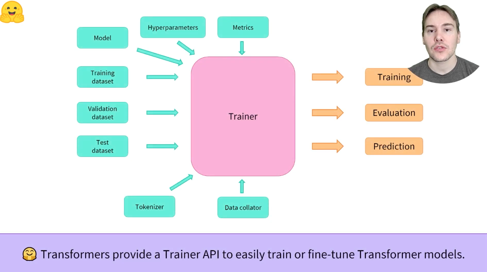
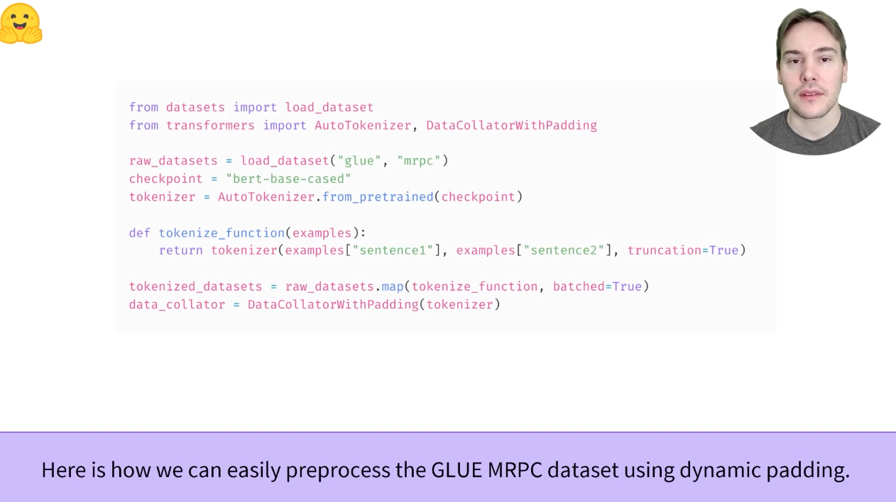
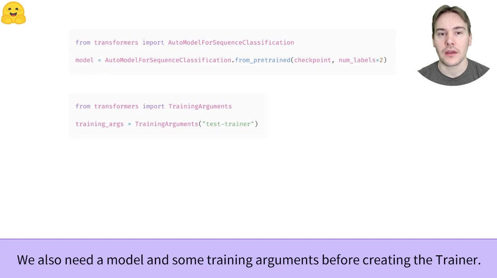
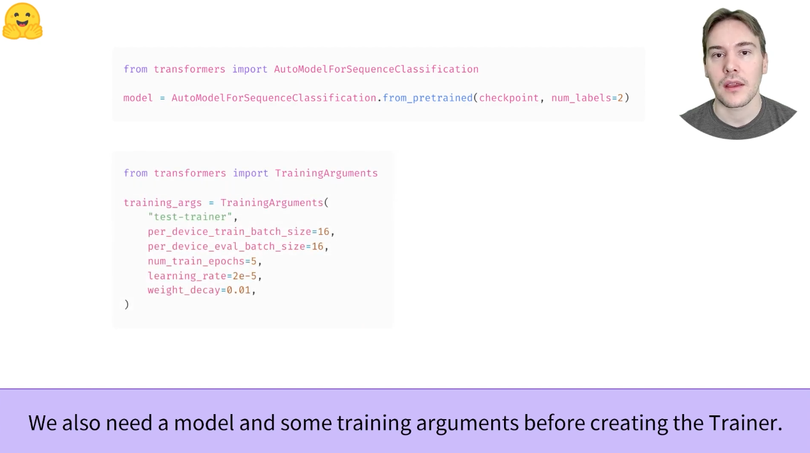
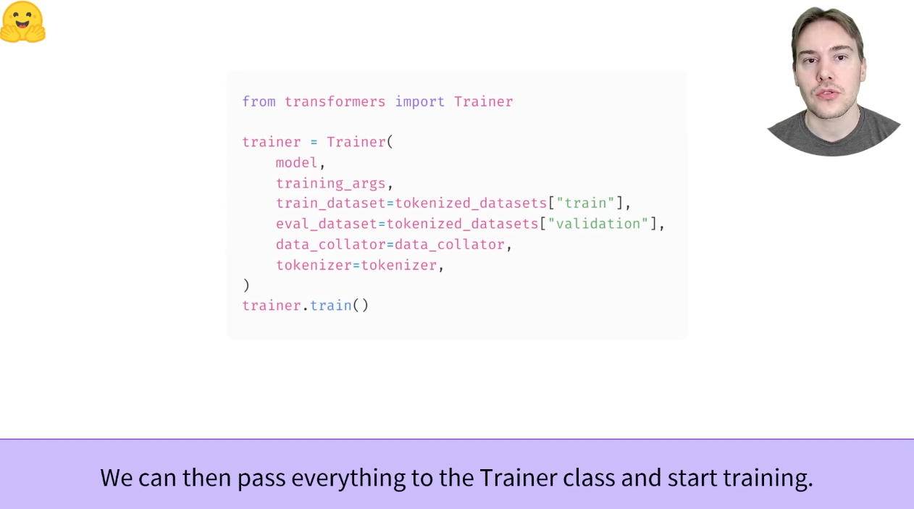
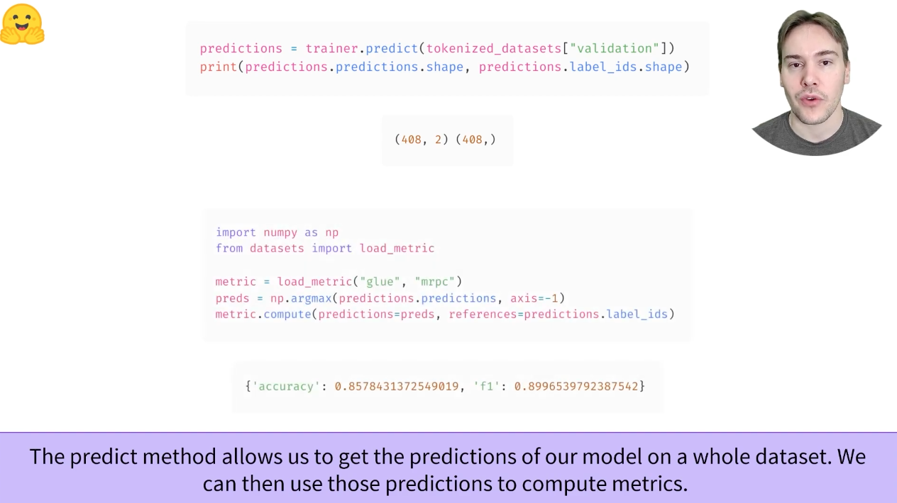
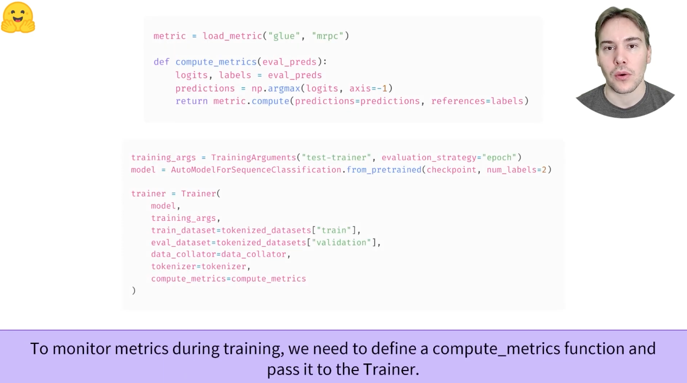
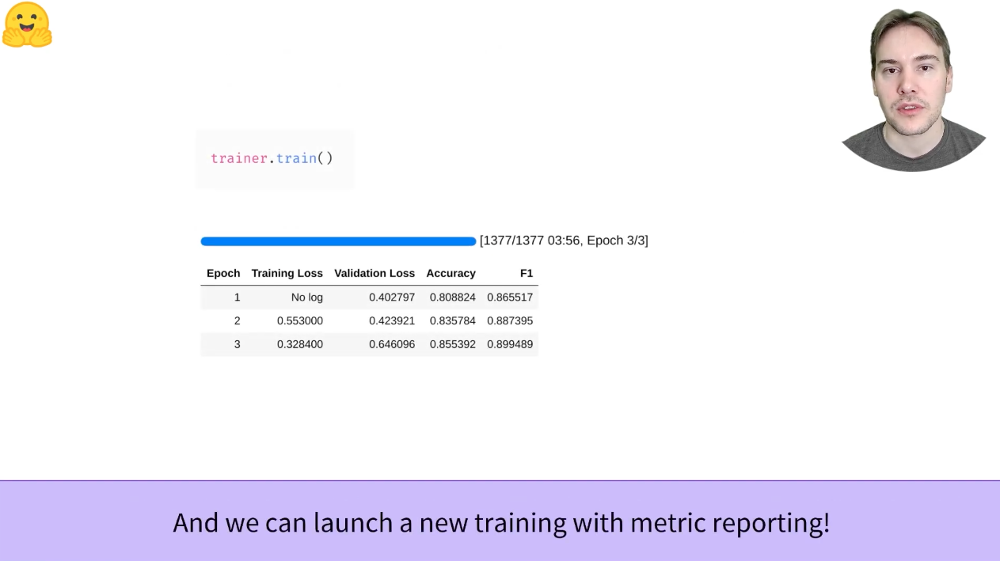

[toc]
# 3.3 Fine-tuning a model with the Trainer API

## 3.3.1 Overview

[视频学习](https://youtu.be/nvBXf7s7vTI) The Trainer API

1：HuggingFace Transformers提供了一个Trainer API，来简单的训练或者fine-tune Transformer的模型


2：这里展示了之前学习的，怎么预处理GLUE MRPC这个数据集（使用dynamic padding）


3：在构建一个Trainer对象前，我们还需要一些**训练参数**和**模型**，其中训练参数要通过一个比较新的类来构建
```python
from transformers import TrainingArguments
training_args = TrainingArguments("test-trainer") # 这个是只有一个参数比较简单的，实际上这里还可以指定学习率等多个超参数
```


4：这个是一个比较全面的TrainingArguments展示，具体每一项的理解可能要留到之后的详细阅读API文档来解决了


5：我们把所有之前准备好的东西传入到Trainer类中，然后开始training


6：load_metric方法用来评价，和加载数据集的方式很像


7：如果想要在训练过程中监测metrics，要定义一个compute_metrics的方法并将其传入到Trainer中


8：训练并查看训练过程中的validation集合准确率


```python
from datasets import load_dataset, load_metric # 加载数据集和度量方法
from transformers import AutoTokenizer, DataCollatorWithPadding, AutoModelForSequenceClassification # 从ckpt加载tokenizer和模型
from transformers import TrainingArguments, Trainer # 训练
import numpy as np
import torch

raw_datasets = load_dataset("glue", "mrpc")
checkpoint = "bert-base-cased"
tokenizer = AutoTokenizer.from_pretrained(checkpoint)

def tokenize_function(example):
    return tokenizer(example["sentence1"], example["sentence2"], truncation=True)

# 准备传入trainer的各项参数
tokenized_datasets = raw_datasets.map(tokenize_function, batched=True)
data_collator = DataCollatorWithPadding(tokenizer)
model = AutoModelForSequenceClassification.from_pretrained(checkpoint, num_labels=2) # 这里之前还多了一个num_labels参数
training_args = TrainingArguments(
    "test-trainer",
    per_device_train_batch_size=16,
    per_device_eval_batch_size=16,
    num_train_epochs=5,
    learning_rate=2e-5,
    weight_decay=0.01,
    evaluation_strategy="epoch" # 每个epoch都会测试一下
)

# 准备evaluate的一些过程
metric = load_metric("glue", "mrpc")
def compute_metrics(eval_preds):
    ''' 应该是对一个batch进行evaluate '''
    logits, labels = eval_preds
    predictions = np.argmax(logits, axis=-1)
    return metric.compute(predictions=predictions, references=labels)

# 构建一个trainer对象
trainer = Trainer(
    model,
    training_args,
    train_dataset=tokenized_datasets["train"],
    eval_dataset=tokenized_datasets["validation"],
    data_collator=data_collator,
    tokenizer=tokenizer,
    compute_metrics=compute_metrics
)
trainer.train() # 开始进行训练

# 训练后的预测(训练集，其它同理)
predictions = trainer.predict(tokenized_datasets["train"])
metric = load_metric("glue", "mrpc")
preds = np.argmax(predictions.predictions, axis=-1)
print("train set上的准确率和F1值是：", metric.compute(predictions=preds, references=predictions.label_ids))
```
HuggingFace Transformers 提供了**Trainer** class来帮助用户fine-tune数据集上提供的任何预训练模型。在完成上一节所有的数据预处理工作后，只剩下几个关键步骤来定义**Trainer**。最困难的部分可能是准备运行**Trainer.train()**的环境，因为它在CPU上运行非常缓慢。如果没有GPU设置，可以在Google Colab上使用免费的GPU。

下面的代码示例假定已经执行了上一节中学习的示例，下面是一个简短的总结来概述需要的内容
```python
from datasets import load_dataset
from transformers import AutoTokenizer, DataCollatorWithPadding

raw_datasets = load_dataset("glue", "mrpc")
checkpoint = "bert-base-uncased"
tokenizer = AutoTokenizer.from_pretrained(checkpoint)

def tokenize_function(example):
    return tokenizer(example["sentence1"], example["sentence2"], truncation=True)

tokenized_datasets = raw_datasets.map(tokenize_function, batched=True)
data_collator = DataCollatorWithPadding(tokenizer=tokenizer)
```

## 3.3.2 Training

定义Trainer之前的第一步是定义一个包含Trainer训练过程中用于训练和评估的所有超参数的TrainingArguments类。必须提供的唯一参数是一个**目录**（之前一直不知道这个参数是一个目录），用于保存经过训练的模型，以及沿途的checkpoint。对于所有其他内容，您可以保留默认值，这对于基本的fine-tune应该会比较有效
```python
from transformers import TrainingArguments

training_args = TrainingArguments("test-trainer") # 注意这里是一个目录
```

第二个步骤是定义我们的模型，与[前一章](https://huggingface.co/course/chapter2)一样，我们将使用AutoModelForSequenceClassification类，它有两个标签：
```python
from transformers import AutoModelForSequenceClassification

model = AutoModelForSequenceClassification.from_pretrained(checkpoint, num_labels=2)
```

会注意到，在实例化此预训练模型的时候，会收到一条warning。这是因为在对句子进行分类时未对BERT进行预训练，因此丢弃了预训练模型的head部分，而是添加了一个适合序列分类的新head。警告表明未使用某些weights（与去掉的pretraining head相对应的weight），而其他weight是随机初始化的（用于新head的weight）。最后它鼓励使用者训练模型，这正是我们现在要做的

一旦我们有了模型，我们就可以通过传递到目前为止构建的所有对象来定义Trainer - model，training_args，training and validation datasets，data_collator，tokenizer：
```python
from transformers import Trainer

trainer = Trainer(
    model,
    training_args,
    train_dataset=tokenized_datasets["train"],
    eval_dataset=tokenized_datasets["validation"],
    data_collator=data_collator,
    tokenizer=tokenizer
)
```
请注意，当您像我们在这里所做的那样传递tokenizer时，Trainer使用默认的data_collator就像是之前定义的一个默认的DataCollatorWithPadding类，因此可以跳过data_collator=data_collator类

来在我们的数据集上对模型进行fine-tune，我们只需要调用实例化Trainer对象的train()方法即可
```python
trainer.train()
```

这将启动fine-tune过程（在GPU上需要几分钟），并每500步报告一次训练的loss。他是，它不会告诉用户模型性能有多好（或差），这是因为：
* 我们没有告诉Trainer在训练期间将**evaluation_strategy**设置为 **"steps"**（每个训练step来评估一下）或者 **"epoch"**（在每个epoch后进行评估）
* 我们没有向Trainer提供**compute_metrics**函数，以便在所述的evaluate期间计算指标（否则评估将只打印损失函数，这不是一个非常直观的数字）


## 3.3.3 Evaluation

让我们看看如何构建一个有用的**compute_metrics**函数，并在下次训练时使用它。该函数必须接收一个**EvalPrediction**对象（这是一个带有predictions字段和label_ids字段的元组）并将返回一个字典，将字符串映射到floats。要从模型中获得一些预测，我们可以使用Trainer.predict命令：
```python
predictions = trainer.predict(tokenized_datasets["validation"])
print(predictions.predictions.shape, predictions.label_ids.shape)

>>> (408, 2) (408, )
```
Trainer.predict方法输出的是另一个命名的tuple，它有三个字段，predicts，label_id和metrics。metrics字段将只包含传递的数据集上的loss以及一些时间度量（总的和平均的预测时间）。完成compute_metrics函数并将其传递给Trainer后，该字段还将包含compute_metrics返回的指标

就像所看到的，predictions是形状为408 x 2的二维数组（408是我们使用的数据集中的元素数）。这些是我们传递给predict的数据集的每个元素的logits（正如在上一章中所看到的，所有Transformer模型都返回logit）。要将它们转化为可以与标签进行比较的预测，我们需要在第2个axis（也就是每个例子的axis）上取最大值的索引！
```python
import numpy as np
preds = np.argmax(predictions.preditions, axis=-1) # 返回的是索引值！
```

我们可以现在将这些preds与labels进行比较。为了构建我们的compute_metric函数，我们将依赖HuggingFace Datasets库。我们可以像加载数据集一样轻松地加载与MRPC数据集关联的度量，这一次使用load_metric函数。返回的对象有一个计算方法，我们可以使用该方法进行度量计算：
```python
from datasets import load_metric

metric = load_metric("glue", "mrpc")
metric.compute(predictions=preds, references=predictions.label_ids)
>>> {'accuracy': 0.8578431372549019, 'f1': 0.8996539792387542}
```

您得到的结果可能有不同，因为模型head的随机初始化可能会改变实现它的度量。在这里，我们可以看到我们模型在验证集上的准确率和F1-Score。这两个指标用于评估GLUE基准的MRPC数据集的结果。BERT论文中给出了88.9的F1值，这是使用uncased不区分大小写模型得到的，而我们现在使用的是cased的model，这解释了更好的结果。

把所有步骤打包在一起，得到了我们的compute_metrics方法：
```python
def compute_metrics(eval_preds):
    metric = load_metric("glue", "mrpc")
    logits, labels = eval_preds
    predictions = np.argmax(logits, axis=-1)
    return metric.compute(predictions=predictions, references=labels)
```

为了在每个epoch结束的时候报告指标的实际情况，下面是如何使用compute_metrics功能定义一个新的Trainer：
```python
training_args = TrainingArguments(
    "test-trainer",
    evaluation_strategy="epoch"
)
model = AutoModelForSequenceClassification.from_pretrained(checkpoint, num_labels=2)

trainer = Train(
    model,
    training_args,
    train_datasets=tokenized_datasets["train"],
    eval_datasets=tokenized_datasets["validation"],
    data_collator=data_collator,
    tokenizer=tokenizer,
    compute_metrics=compute_metrics
)
```

请注意，我们创建了一个新的TrainingArguments并将其evaluation_strategy设置为"epoch"，并创建了一个新模型 - 否则我们将对已经训练过的模型进行训练。为了启动新的训练，我们执行
```python
trainer.train()
```
这一次，我们在每个epoch结束的时候在train损失的基础上报告验证损失和度量。同样，由于模型的随机head初始化，您达到的准确度/F1分数可能与展示的有所不同，但应该是相同的范围内

Trainer在多个GPU和TPU上开箱即用，并提供许多选项，如mixed-precision training（使用fp16=True在training_args中），在第10章将进一步回顾。（目前此部分课程未开放）

这就结束了使用Trainer API进行微调的介绍，第7章将给出一个对大多数常见NLP任务执行此操作的示例，但让我们看看如何在纯PyTorch中执行相同的操作。