[toc]
# 3.4 A full training

代码见：
> 

## 3.4.1 Overview

主要是不使用Trainer API下，我们怎么更加自定义一个训练过程

[视频学习]()Write your training loop in PyTorch

1：一个训练循环过程的草图
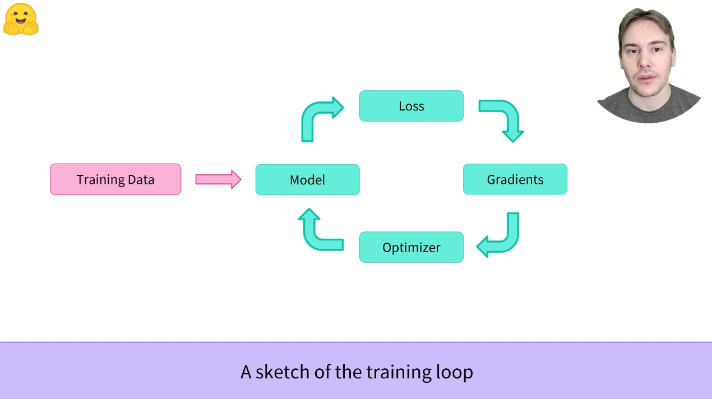

2：这是一个我们如何使用dynamic padding处理GLUE MRPC数据集的过程
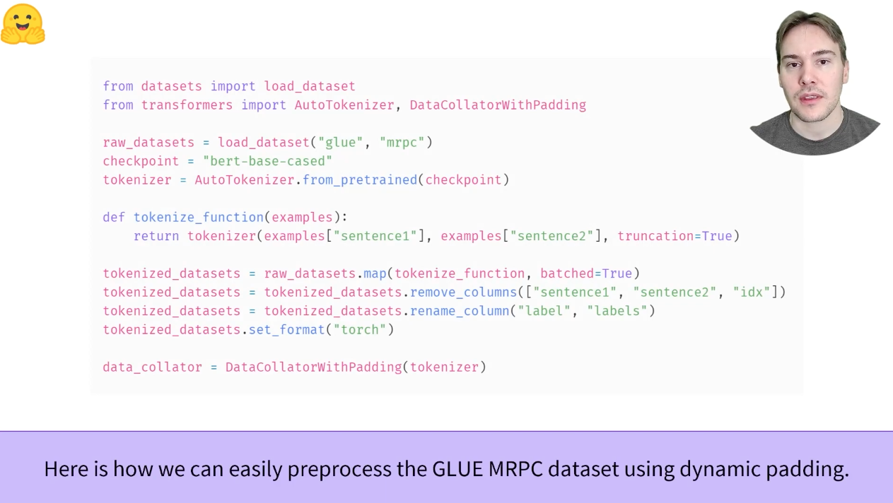

3：当数据被预处理后，我们需要去创建我们的DataLoader（这是使用pytorch的方法）
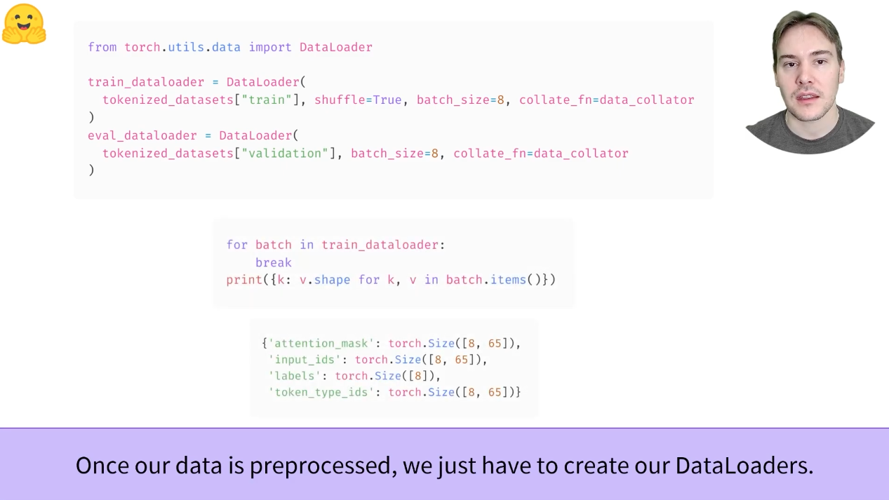

4：下一步是创建并送入到模型之中去
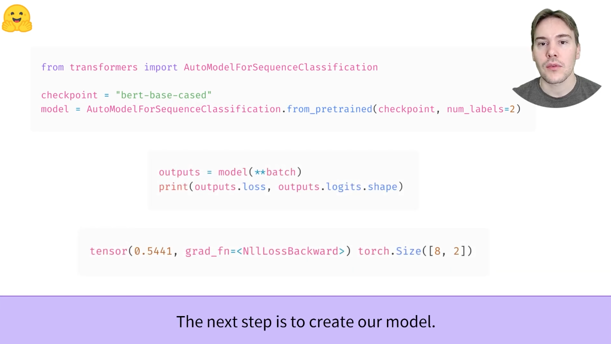

5：optimizer负责在训练过程中更新模型的权重
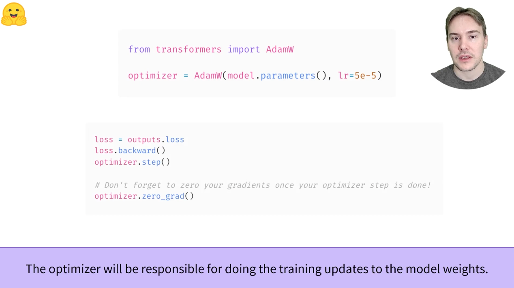

6：可以使用lr_scheduler来让学习率在训练过程不断减小
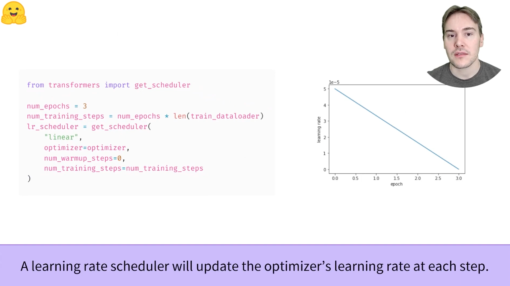

7：如果不使用GPU进行训练，那么训练过程会很慢
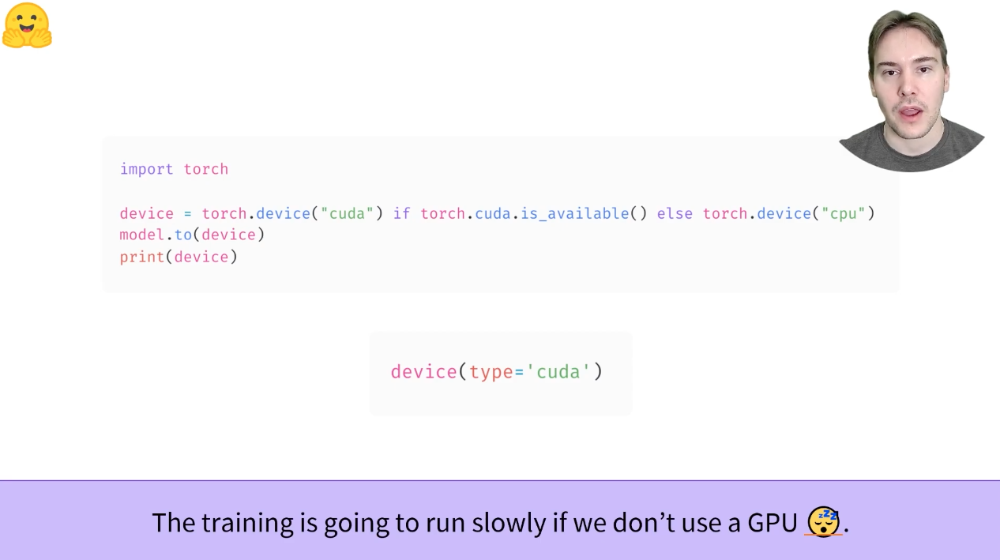

8：把所有东西组合在一起，加上tqdm，就变成了一个训练过程
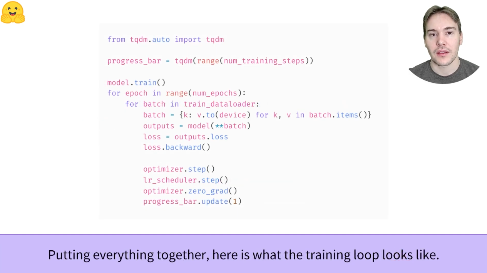

9：evaluation可以使用这个过程
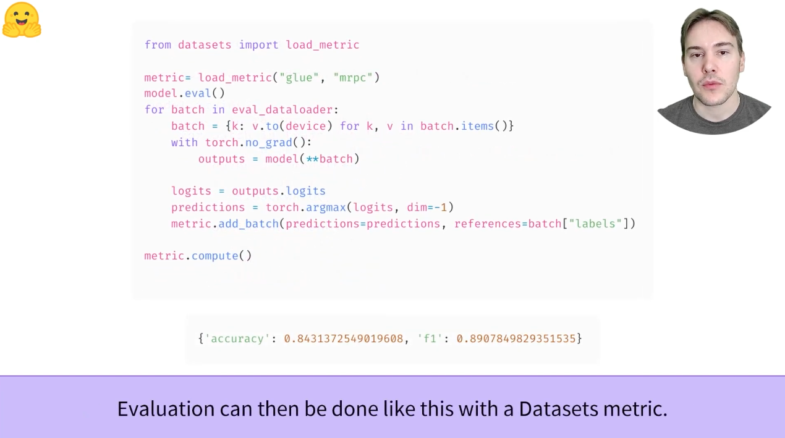

整理前的过程见colab notebook中，这里汇总一份整理后的PyTorch训练&预测全过程
```python
# 一个更加集合的过程
# import，各自有各自的作用
from datasets import load_dataset, load_metric
from transformers import AutoTokenizer, DataCollatorWithPadding
from transformers import AutoModelForSequenceClassification
from transformers import AdamW
from transformers import get_scheduler
import torch
from torch.utils.data import DataLoader
from tqdm.auto import tqdm

# 数据集预处理过程，之前尝试过几次了
raw_datasets = load_dataset("glue", "mrpc")
checkpoint = "bert-base-cased"
tokenzier = AutoTokenizer.from_pretrained(checkpoint)

def tokenize_function(example):
    return tokenizer(example["sentence1"], example["sentence2"], truncation=True)

tokenized_datasets = raw_datasets.map(tokenize_function, batched=True)
tokenized_datasets = tokenized_datasets.remove_columns(["sentence1", "sentence2", "idx"])
tokenized_datasets = tokenized_datasets.rename_column("label", "labels")
tokenized_datasets.set_format("torch")

data_collator = DataCollatorWithPadding(tokenizer)

# 构建DataLoader
train_dataloader = DataLoader(
    tokenized_datasets["train"], shuffle=True, batch_size=8, collate_fn=data_collator
)
eval_dataloader = DataLoader(
    tokenized_datasets["validation"], batch_size=8, collate_fn=data_collator
)

# GPU
device = torch.device("cuda") if torch.cuda.is_available() else torch.device("cpu")

# model，并转移到GPU上
model = AutoModelForSequenceClassification.from_pretrained(checkpoint, num_labels=2)
model.to(device)

# optimizer
optimizer = AdamW(model.parameters(), lr=5e-5)

# 学习率递减及一些超参数
num_epochs = 3
num_training_steps = num_epochs * len(train_dataloader)
lr_scheduler = get_scheduler(
    "linear",
    optimizer=optimizer,
    num_warmup_steps=0,
    num_training_steps=num_training_steps
)

# 总的实例化一次，看看和之前是否有区别，可能需要后期看看其他人是怎么写的
metrics = load_metric("glue", "mrpc")


progress_bar = tqdm(range(num_training_steps))
model.train()
for epoch in range(num_epochs):
    for batch in train_dataloader:
        # 转化为train
        model.train()

        batch = {k: v.to(device) for k,v in batch.items()}
        outputs = model(**batch)
        loss = outputs.loss
        loss.backward()

        optimizer.step()
        lr_scheduler.step()
        optimizer.zero_grad()
        progress_bar.update(1)

    # 在每个epoch上做一个输出
    model.eval()

    # training set
    # metric1 = load_metric("glue", "mrpc") # 需要查看一下，每次实例化和总实例化是否有区别？
    for batch in train_dataloader:
        model.eval()
        batch = {k: v.to(device) for k, v in batch.items()}
        with torch.no_grad():
            outputs = model(**batch)
        logits = outputs.logits
        predictions = torch.argmax(logits, dim=-1)
        metrics.add_batch(predictions=predictions, references=batch["labels"])
    print("epoch: " + str(epoch) + ", 训练集predict: " + str(metrics.compute()))

    # validation set
    # metric2 = load_metric("glue", "mrpc")
    for batch in eval_dataloader:
        model.eval()
        batch = {k: v.to(device) for k, v in batch.items()}
        with torch.no_grad():
            outputs = model(**batch)
        logits = outputs.logits
        predictions = torch.argmax(logits, dim=-1)
        metrics.add_batch(predictions=predictions, references=batch["labels"])
    print("epoch: " + str(epoch) + ", 测试集predict: " + str(metrics.compute()))
```

现在，我们将了解如何在不使用Trainer类的情况下，获取与上一节相同的结果。同样，我们假设您已经完成了第2节中的数据处理。下面是一个简短的总结，涵盖了您需要的所有内容（由于是需要用pytorch处理，所以需要删除掉一些sentence1这些的没有办法tensor化的，这个作者放在之后说了）
```python
from datasets import load_dataset
from transformers import AutoTokenizer, DataCollatorWithPadding

raw_datasets = load_dataset("glue", "mrpc")
checkpoint = "bert-base-uncased"
tokenizer = AutoTokenizer.from_pretrained(checkpoint)

def tokenize_function(example):
    return tokenzier(example["sentence1"], example["sentence2"], truncation=True)

tokenized_datasets = raw_datasets.map(tokenize_function, batched=True)
data_collator = DataCollatorWithPadding(tokenizer=tokenizer)
```

## 3.4.2 Prepare for training

在实际编写训练循环之前，我们需要定义几个对象。第一个是我们将用于在迭代批处理的dataloaders。但是在定义这些数据加载器之前，我们需要对tokenized_datasets进行一些post-process，就像Trainer API自动为我们做的一些事情一样。具体而言，我们需要：
* 删除与模型不期望的值对应的列（如sentence1, sentence2列）
* 将列标签的label重命名为labels（因为模型希望参数命名为labels）
* 设置数据集的格式，使其返回PyTorch的Tensor而不是列表

我们的tokenized_datasets对于这些步骤中的每一步都有一种方法：
```python
tokenized_datasets = tokenized_datasets.remove_columns(
    ["sentence1", "sentence2", "idx"]
)
tokenized_datasets = tokenized_datasets.rename_column("label", "labels")
tokenized_datasets.set_format("torch")

# 然后，我们可以检查结果是否只有我们的模型将接受的列：
print(tokenized_datasets["train"].column_names)
>>> ["attention_mask", "input_ids", "labels", "token_type_ids"]
```

至此，我们可以轻松定义数据加载器（dataloaders）：
```python
from torch.utils.data import DataLoader

train_dataloader = DataLoader(
    tokenized_datasets["train"], shuffle=True, batch_size=8, collate_fn=data_collator
)
eval_dataloader = DataLoader(
    tokenized_datasets["validation"], batch_size=8, collate_fn=data_collator
)
```

为了快速检查数据处理中是否存在错误，我们可以检查如下的batch：
```python
for batch in train_dataloader:
    break
print({k: v.shape for k, v in batch.items()})

>>> {'attention_mask': torch.Size([8, 65]),
    'input_ids': torch.Size([8, 65]),
    'labels': torch.Size([8]),
    'token_type_ids': torch.Size([8, 65])}
```

请注意，实际形状可能与不同的操作有关，因为我们为训练数据加载器设置了shuffle=True，并且在批处理中填充到最大长度。现在，我们已经完成了数据预处理（对于任何ML从业者来说，这是一个令人满意但难以实现的目标），让我们转向模型。我们在上一节中对其进行了实例化：
```python
from transformers import AutoModelForSequenceClassification

model = AutoModelForSequenceClassification.from_pretrained(checkpoint, num_labels=2)
```

为了确保训练期间一切顺利，我们将batch传递给此型号：
```python
outputs = model(**batch)
print(outputs.loss, outputs.logits.shape)
>>> tensor(0.5441, grad_fn=<NllLossBackward>) torch.Size([8, 2])
```

当提供标签时，所有的HuggingFace Transformers的模型都将返回loss，我们还将获取logits， 我们的批次中每次输入两个，因此大小为8x2

我们几乎准备好编写训练循环了，我们只是缺少两样东西：一个**optimizer**和一个**learning rate scheduler**。由于我们试图复制Trainer手工操作的内容，因此我们将使用相同的默认设置。Trainer使用的optimizer是AdamW，与Adam相同，但对权重衰减正则化有一个扭曲。(see [“Decoupled Weight Decay Regularization”](https://arxiv.org/abs/1711.05101) by Ilya Loshchilov and Frank Hutter)
```python
from transformers import AdamW

optimizer = AdamW(model.parameters(), lr=5e-5)
```

最后，默认情况下使用的学习速率计划程序只是从最大值5e-5到0的线性衰减。要正确定义它，我嫩需要知道我们将采取的训练步骤数，及我们的要运行的epoch数乘以训练batch的次数（即dataloader的长度）。Trainer默认使用3个epoch，因此我们将遵循：
```python
from transformers import get_scheduler

num_epochs = 3
num_training_steps = num_epochs * len(train_dataloader)
lr_scheduler = get_scheduler(
    "linear",
    optimizer=optmizer,
    num_warmup_steps=0,
    num_training_steps=num_training_steps
)
print(num_training_steps)
>>> 1377
```


## 3.4.3 The training loop

最后一件事，如果我们可以在GPU上训练（在CPU上，训练可能需要几个小时而不是几分钟），我们将希望使用GPU，为此，我们定义了一个**device**，将我们的模型和批次放在上面
```python
import torch

device = torch.device("cuda") if torch.cuda.is_available() else torch.device("cpu")
model.to(device)

print(device)
>>> device(type='cuda')
```

我们现在准备好训练了！为了了解训练何时结束，我们使用**tqdm**库在训练过程中添加一个进度条：
```python
from tqdm.auto import tqdm

progress_bar = tqdm(range(num_training_steps))

model.train()
for epoch in range(num_epochs):
    for batch in train_dataloader:
        batch = {k: v.to(device) for k, v in batch.items()}
        outputs = model(**batch)
        loss = outputs.loss
        loss.backward()

        optimizer.step()
        lr_scheduler.step()
        optimizer.zero_grad()
        progress_bar.update(1)
```
您可以看到，培训循环的核心与介绍中的核心非常相似。我们没有要求任何报告，所以这个培训循环不会告诉我们任何关于模型运行情况的信息。我们需要为此添加一个评估循环。

## 3.4.4 The evaluation loop

正如前面所看到的，我们将使用HuggingFace datasets library，我们已经看到了metric.compute的方法，胆识胆你给我们使用**add_batch**方法遍历预测循环时，metrics实际上可以为我们积累批次。积累所有批次后，我们可以使用metric.compute()获取最终结果。以下是如何在评估循环中实现所有这些：
```python
from datasets import load_metric

metric = load_metric("glue", "mrpc")
model.eval()
for batch in eval_dataloader:
    batch = {k: v.to(device) for k, v in batch.items()}
    with torch.no_grad():
        outputs = model(**batch)
    logits = outputs.logits
    predictions = torch.argmax(logits, dim=-1)
    metric.add_batch(predictions=predictions, references=batch["labels"])

metric.compute()
>>> {'accuracy': 0.8431372549019608, 'f1': 0.8907849829351535}
```
同样，由于模型头部初始化和数据洗牌的随机性，您的结果将略有不同，但它们应该在相同的范围内。

## 3.4.5 Supercharge your training loop with HuggingFace Accelerate

<font color='red'>
这个部分主要是分布式训练相关的，在初期感觉可以忽略一下这个部分
</font>

[视频学习](https://youtu.be/s7dy8QRgjJ0)Supercharge your PyTorch training loop with Accelerate，使用Accelerate为PyTorch训练循环“增压”

1：
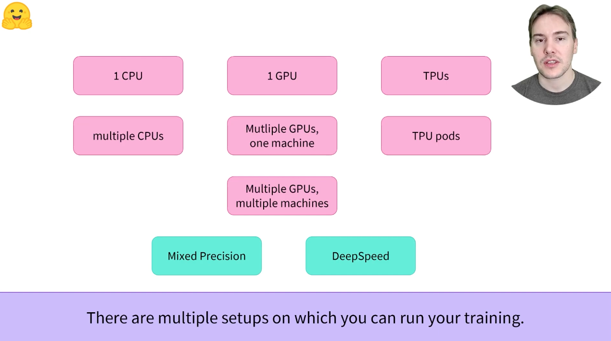

2：
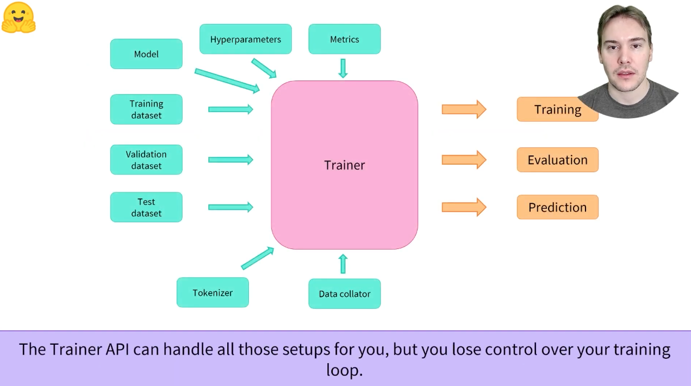

3：
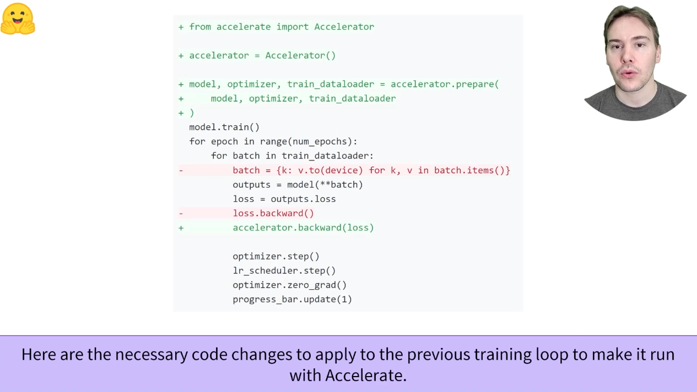

4：
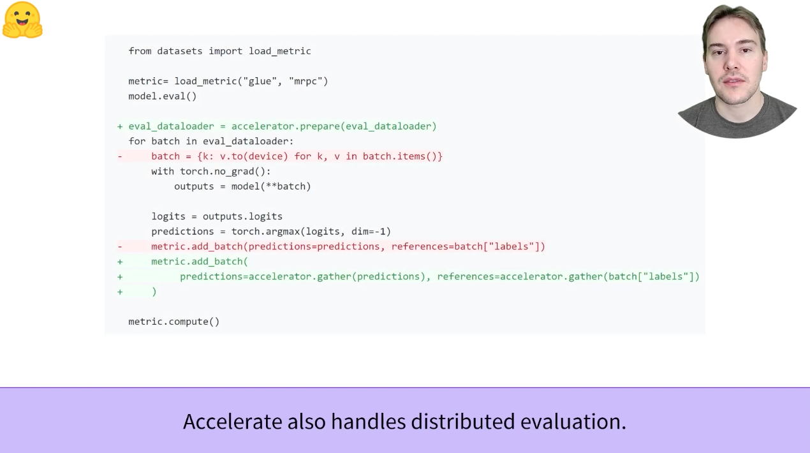

5：
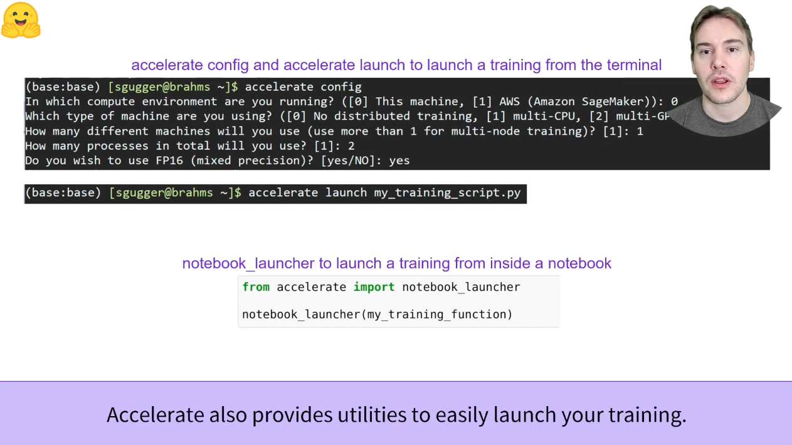