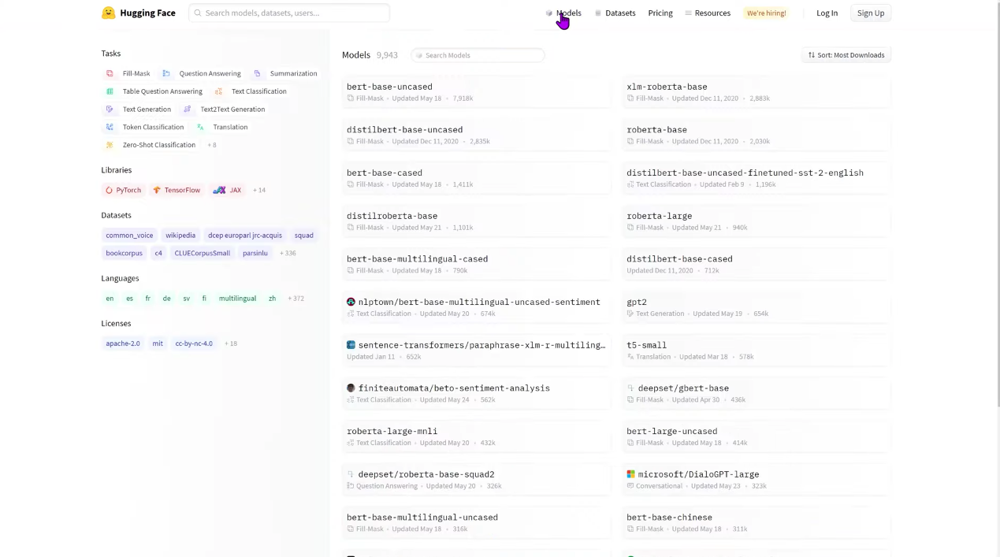
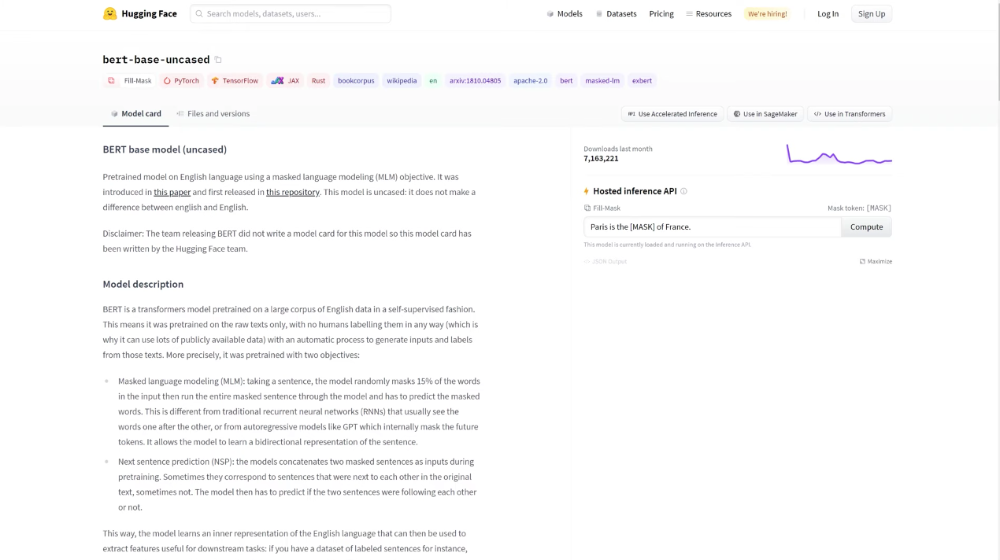

# 4.1 The Hugging Face Hub

[Hugging Face Hub](https://huggingface.co/)，我们的主网站，是一个中心平台，任何人都可以发现、使用和贡献最先进的模型和数据集。它拥有各种各样的model，超过10000种可以公开使用。我们将重点关注本章中的模型，并查看第5章中的数据集。（2021.8.12目前课程只开放到前4章）

在中心中的模型不仅仅限于Hugging Face Transformers和NLP模型。有[Flair](https://github.com/flairNLP/flair)和[AllenNLP](https://github.com/allenai/allennlp)的NLP模型，[Asteroid](https://github.com/asteroid-team/asteroid)和[pyannote](https://github.com/pyannote/pyannote-audio)的语音模型，timm的计算机视觉模型等等。

这些模型中的每一个都作为git存储库托管，它允许版本控制和复现性。在Hub上共享模型意味着向社区开放模型，并使任何希望轻松使用模型的人都可以访问模型，从而消除他们自己训练模型的需要，并简化了共享和使用。

此外，在中心上共享模型会自动为该模型部署托管推理API。社区中的任何人都可以使用自定义输入和适当的小部件直接在模型页面上进行测试。

最棒的是，在Hub上共享和使用任何公共模型都是完全免费的，如果您希望私下共享模型，则还存在付费计划。

下面的视频演示了如何navigate the Hub。

视频主要是一个对huggingface.co中Hub的介绍

[视频学习](https://youtu.be/XvSGPZFEjDY)
1：

2：
