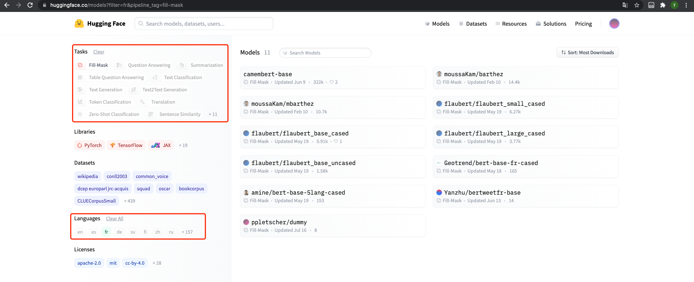
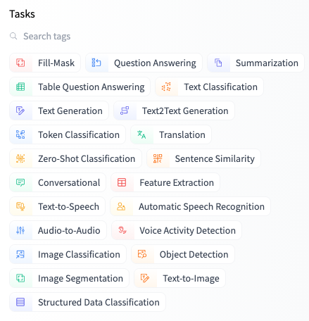

# 4.2 Using pretrained models

（这一节实际上在前边已经操作过一些步骤了，所以比较熟悉）

模型中心使选择合适的模型变的简单，因此在任何下游库中使用它只需几行代码即可完成。让我们看看如何实际使用其中一种模型，以及如何为社区做出贡献。

比如说，我们正在寻找一款基于法语的mask filling模型：


我们选择其中的**camembert-base** checkpoint进行测试。标识符camemebert-base是我们开始使用它所需要的全部！如前几章所述，我们可以使用pipeline对其进行实例化：
```python
from transformers import pipeline

camembert_fill_mask = pipeline("fill-mask", model="camembert-base")
results = camembert_fill_mask("Le camembert est <mask> :)")

>>> [
        {'sequence': 'Le camembert est délicieux :)', 'score': 0.49091005325317383, 'token': 7200, 'token_str': 'délicieux'}, 
        {'sequence': 'Le camembert est excellent :)', 'score': 0.1055697426199913, 'token': 2183, 'token_str': 'excellent'}, 
        {'sequence': 'Le camembert est succulent :)', 'score': 0.03453313186764717, 'token': 26202, 'token_str': 'succulent'}, 
        {'sequence': 'Le camembert est meilleur :)', 'score': 0.0330314114689827, 'token': 528, 'token_str': 'meilleur'}, 
        {'sequence': 'Le camembert est parfait :)', 'score': 0.03007650189101696, 'token': 1654, 'token_str': 'parfait'}
    ]
```

如您所见，在pipeline中加载模型非常简单。您需要注意的唯一一件事是，所选择的检查点适合它将要用于的任务。例如，这里我们正在填充掩码管道中加载camembert-base检查点，这是完全正确的。但是，如果我们将这个检查点加载到文本分类pipeline中，结果将毫无意义，因为camembert-base不适合此任务。我们建议使用Hugging Face Hub中的任务选择器来选择适当的检查点。



您还可以直接使用模型体系结构实例化检查点（不使用auto，使用更具体的）：
```python
from transformers import CamembertTokenizer, CamembertForMaskedLM

tokenizer = CamembertTokenizer.from_pretrained("camembert-base")
model =  CamembertForMaskedLM.from_pretrained("camembert-base")
```

但是，我们建议改用AutoXxx类，因为它们与设计架构无关。虽然前面的代码示例将用户限制为可在camembert体系结构中加载的检查点，但使用AutoXxx类使得切换检查点变的简单：
```python
from transformers import AutoTokenizer, AutoModelForMaskedLM

tokenizer = AutoTokenizer.from_pretrained("camembert-base")
model = AutoModelForMaskedLM.from_pretrained("camembert-base")
```

当使用预先训练的模型时，一定要检查它是如何训练的，在哪些数据集上，它的限制和它的偏差。所有这些信息都应在其型号卡上注明。